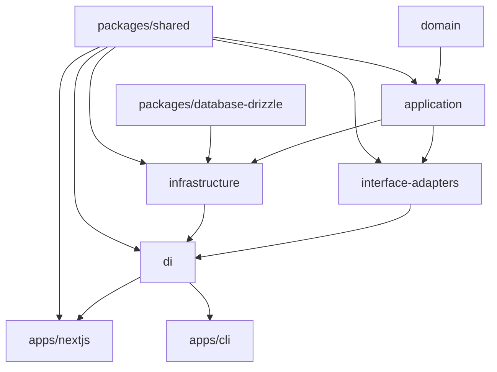

# 🧱 Clean Architecture Template for TypeScript Monorepos

[](https://github.com/thaitype/typescript-clean-architecture/actions/workflows/test-and-build.yml)

This is a **Clean Architecture starter template** designed for monorepos using **Turborepo** + **pnpm** + **TypeScript**. It's simple enough to get started quickly and scalable enough to grow into a large production system.

---

## ⚡ Quick Start

```bash
git clone https://github.com/your-org/your-repo.git
cd your-repo
pnpm install
pnpm dev
```

Read all document in [docs](./docs) folder.

---

## 🧠 What is Clean Architecture?

**Clean Architecture** is a way to structure your application so that:

- Business logic is **independent** from frameworks (e.g. Express, Next.js)
- Code is **testable**, **modular**, and easy to **extend**
- Dependencies always point **inward**, from outer layers toward the core

## 🤔 Why This Project Helps You

By leveraging Clean Architecture, this template enables you to:

- ✨ Write framework-agnostic business logic
- 🧪 Test use cases in isolation (no DB or HTTP server needed)
- 🧱 Structure your code for long-term maintainability
- 🧩 Easily swap implementations (e.g. Mongo → Postgres, REST → GraphQL)
- 👥 Onboard teammates faster with a predictable, layered system

---

## 🛠 Usage (Root-Level Scripts)

The root `package.json` includes common scripts powered by `turbo`:


### Script Descriptions

- `dev`: Run all development servers/command in parallel,
- `build`: Build all packages respecting their dependency graph
- `test`: Run tests across all workspaces, including coverage test
- `test:watch`: Watch and re-run tests interactively
- `lint:check`: Run lint and type checks
- `lint:fix`: Automatically fix lint issues
- `format`: Check Prettier formatting
- `format:fix`: Auto-format using Prettier
- `test:coverage-report`: Run Show summary coverage report for all packages

## How to run package in specific package

For example to run only `cli` package:

```bash
pnpm run dev --filter=cli
```

---

## 🔰 Template Project Overview

This project follows a modular monorepo layout:

```bash
.
├── apps/                    # Applications (UI, CLI, etc)
│   ├── nextjs/              # Next.js frontend (App Router)
│   └── cli/                 # CLI tools (e.g., for batch scripts)
│
├── core/                   # Clean architecture layers
│   ├── domain/             # Business entities, value objects
│   ├── application/        # Use cases, interfaces
│   ├── interface-adapters/ # Controllers, adapters, presenters
│   ├── infrastructure/     # Implementations (e.g., repositories)
│   └── di/                 # Dependency injection setup
│
├── packages/               # Modular services
│   ├── database-drizzle/   # DB setup with Drizzle ORM
│   └── shared/             # Cross-cutting shared utils
│
├── configs/                # Centralized configuration presets
│   ├── config-eslint/      # Shared ESLint config
│   ├── config-typescript/  # Shared TSConfig presets
│   └── config-vitest/      # Shared Vitest setup
│
├── tools/                  # Toolchain scripts and helpers
│   ├── db/                 # DB migration + seed tooling
│   ├── mono/               # CLI wrapper for build/test/lint/dev
│   └── template/           # Reusable project template package
│
├── turbo.json              # Task orchestration config
└── pnpm-workspace.yaml     # Defines workspace structure
```

---

## 📦 Template Generator

To create a new package, copy and rename the `tools/template` folder:

```bash
cp -r tools/template core/new-package
```

This includes:
- Preconfigured build/dev/test scripts
- Standard tooling via `mono`
- `tsconfig`, `eslint`, `vitest` setup
- Minimal boilerplate with `lib` + test examples

Just update the package name in `package.json` and start coding!

---

## 🔧 Build Tooling with Turborepo + Mono

### 🧩 Centralized Toolchain via `tools/mono`

We built a custom toolchain named `mono` to easily manage and control the build process across all packages.

Instead of installing build tools like `esbuild`, `vitest`, and `eslint` in every package, we centralize them via:

- `tools/mono`: Unified CLI for commands like `dev`, `test`, `build`
- `configs/*`: Shared config presets for linting, TS, and testing

Example `mono` script:
```ts
const scripts: MonoScripts = {
  'lint:check': 'eslint src',
  'lint:fix': 'eslint src --fix',
  'test': 'vitest run',
  'test:watch': 'vitest watch',
  'build': 'esbuild ./src/index.ts --bundle --minify --platform=node --outfile=dist/index.js',
  'dev': 'tsx watch ./src/index.ts',
  'start': 'tsx ./src/index.ts',
  'check-types': 'tsc --noEmit',
};
```

### 🧪 How packages use `mono`

Each package reuses the `mono` CLI by mapping local scripts:

```json
{
  "scripts": {
    "dev": "mono dev",
    "start": "mono start",
    "build": "mono build",
    "test": "mono test",
    "test:watch": "mono test:watch",
    "lint:check": "mono lint:check",
    "lint:fix": "mono lint:fix",
    "check-types": "mono check-types"
  },
  "devDependencies": {
    "@kubricate/mono": "workspace:*",
    "@kubricate/config-eslint": "workspace:*",
    "@kubricate/config-typescript": "workspace:*",
    "@kubricate/config-vitest": "workspace:*"
  }
}
```

### 🛠 Root `package.json` dependencies

Tools are only installed once at the root:

```json
{
  "devDependencies": {
    "turbo": "^2.4.4",
    "@vitest/coverage-istanbul": "^3.0.9",
    "typescript": "^5.8.2",
    "eslint": "^9.22.0",
    "esbuild": "^0.25.1",
    "prettier": "^3.5.3",
    "vitest": "^3.0.9"
  }
}
```

### 🧠 Workspace definition

```yaml
# pnpm-workspace.yaml
packages:
  - "apps/*"
  - "core/*"
  - "packages/*"
  - "configs/*"
  - "tools/*"
```

---

## 🔗 High-Level Dependency Diagram



---

## 🧠 Dependency Injection

This template uses [`@thaitype/ioctopus`](https://www.npmjs.com/package/@thaitype/ioctopus) — a simple, metadata-free IoC container for TypeScript that works across runtimes (Node, Edge, etc). 

However, this project use a forked version of `ioctopus` when the original package is fully support type-safety, this project will switch back to the original package, see [issue#3](https://github.com/thaitype/ioctopus/issues/3)

To resolve any service:

```ts
import { getInjection } from "@kubricate/di";
const userController = getInjection("UserController");
```

---

Happy coding! ✨ Let your architecture evolve, not collapse. 🏗️

---

## Read More
- Basic Concept of Monorepo by Turborepo: <https://turbo.build/repo/docs/guides/tools/typescript>
- Clean Architecture: <https://blog.cleancoder.com/uncle-bob/2012/08/13/the-clean-architecture.html>

## References

Some codes template bring the idea from those repositories:
- Drizzle Turbo Repo Template: <https://github.com/htsh-tsyk/turbo-drizzle>
- Next.js Clean Architecture: <https://github.com/nikolovlazar/nextjs-clean-architecture>
- Next.js 15 on turborepo template: <https://github.com/vercel/turborepo/tree/c59da312df134cc1aaf7c269bc3cd0b78c073b07/examples/basic>
- Vitest on Turbo Repo: <https://github.com/vercel/turborepo/tree/c59da312df134cc1aaf7c269bc3cd0b78c073b07/examples/with-vitest>