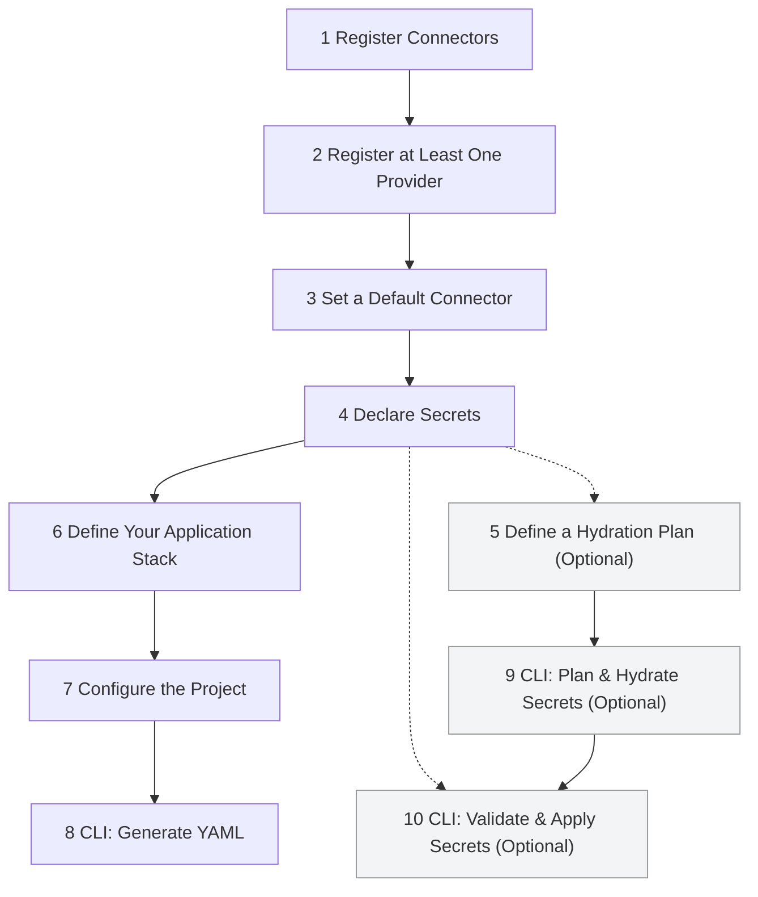

<p align="center">
  <a href="https://github.com/thaitype/kubricate">
    
  </a>
</p>

<h2 align="center">Kubricate</h2>

<p align="center">
  A TypeScript framework for building reusable, type-safe Kubernetes infrastructure — without the YAML mess.
</p>

<!-- Helm chart compatibility: Add later, see in https://github.com/thaitype/kubricate/issues?q=is%3Aissue%20state%3Aopen%20helm -->

<p align="center">
  <a href="https://github.com/thaitype/kubricate/actions/workflows/test-and-build.yml">
    
  </a>
  <a href="https://codecov.io/gh/thaitype/kubricate" > 
     
 </a>
  <a href="https://www.npmjs.com/package/kubricate">
    
  </a>
  <a href="https://www.npmjs.com/package/kubricate">
    
  </a>
</p>

> Kubricate is preparing to release its first stable version as v1 release soon. API will be not changed

## ✨ Features

- **📦 Type-safe Kubernetes Manifest Generation**: 
  - Define Kubernetes resources using fully-typed TypeScript objects — with support for reuse, composition, and validation in your IDE.

- **🧱 Stack-Based Architecture**: 
  - Group related resources together into reusable **Stacks** — such as `Deployment + Service`, or `Namespace + RoleBinding`. Easily parameterize and extend them across environments.

- **🔐 Declarative Secret Management**: 
  - Declare secrets with `addSecret({ name })`, and hydrate them from multiple backends like `.env`, Azure Key Vault, 1Password, or Vault — all within your CI/CD pipeline.

<!-- ### 🔄 Secret Hydration Plans  
Define **hydration plans** to control where secrets come from and where they go — perfect for syncing between `.env` → Azure KV or Vault → K8s Secrets. -->

- **♻️ Connectors and Providers**: 
  - Use **Connectors** to read/write secrets from systems, and **Providers** to convert secrets into Kubernetes-native resources (like `Secret`, `ConfigMap`, or `ExternalSecret`).

- **🚀 CLI-Friendly & GitOps Ready**: 
  - Run `kubricate generate` <!--,  `kubricate secrets hydrate`, --> and `kubricate secrets plan` to validate, sync, and render your infrastructure as YAML — without running anything in your cluster.

- **🧪 First-Class Dev Experience**: 
  - Enjoy full IDE autocomplete, refactor support, type checking, and linting across your entire platform configuration — all in TypeScript.


## 🧭 Motivation

### 💥 The Problem

Secret management in Kubernetes is fragmented, repetitive, and error-prone. In production environments, teams often deal with:

- Manually duplicating `Secret` manifests across environments
- Templating secret references with Helm or Kustomize
- Managing complex `ExternalSecret` or `Vault` annotations spread across YAML files
- Relying on runtime injectors or sidecars with unclear debugging paths
- No clear way to track which secrets are used, where they come from, or who owns them

These patterns result in:

- ❌ Too much untyped YAML
- ❌ Difficult-to-test deployments
- ❌ Poor visibility into secret flow
- ❌ Secrets being treated as runtime config, not infrastructure

### 🔍 Existing Solutions (and Limitations)

| Tool                                | Strengths                              | Weaknesses                                              |
| ----------------------------------- | -------------------------------------- | ------------------------------------------------------- |
| **External Secrets Operator (ESO)** | Reconciles secrets from cloud backends | Heavy YAML usage, CRDs, hard to reuse or test           |
| **Vault Agent Injector**            | Dynamic injection at runtime           | Requires sidecars, annotations, Vault policy setup      |
| **SOPS / Sealed Secrets**           | GitOps-safe encryption                 | Complex rotation/versioning, no unified source of truth |
| **Helm values + `.env`**            | Familiar templating                    | No type safety, validation, or traceability             |


### 💡 Kubricate’s Approach

Kubricate doesn't replace those tools — it replaces the **YAML, glue logic, and guesswork** needed to make them work.

Instead of defining secrets across many `values.yaml`, CRDs, and annotations, Kubricate gives you:

- ✅ Type-safe secret declarations in code: `addSecret({ name: 'API_KEY' })`
- ✅ Secret hydration plans that describe where secrets come from and where they go
- ✅ Plug-in **Connectors** to load secrets from `.env`, 1Password, Vault, or any backend
- ✅ The ability to generate YAML, `ExternalSecret` CRDs, or annotations with confidence

Kubricate focuses on **design-time control**, not runtime magic:
- You define the truth in TypeScript
- You hydrate secrets as part of your pipeline
- You generate manifests, not YAML by hand

Whether you're using ArgoCD, ESO, Vault, or no controller at all — Kubricate makes the configuration safe, testable, and understandable by everyone on your team.

---

## Getting Started

```bash
npm install -D kubricate
npm install @kubricate/core
```

If you want Kubernetes resource types in TypeScript, install `kubernetes-models`. It helps generate fully-typed resource objects.

```bash
npm install -D kubernetes-models
```

Then, create your first Kubricate Stack. Kubricate Stacks help you define, reuse, and manage Kubernetes resources in a clean, declarative way.

### 1. 🧱 Example: Creating a Namespace Stack

```ts
// File: src/my-stack.ts
import { createStack, ResourceComposer } from '@kubricate/core';
import { Namespace } from 'kubernetes-models/v1';

// Step 1: declare data schema
interface MyInput {
  name: string;
}

// Step 2: define stack shape for reusable work
const MyStack = createStack('MyStack', (data: MyInput) =>
  new ResourceComposer().addClass({
    id: 'namespace',
    type: Namespace,
    config: {
      metadata: { name: data.name },
    },
  })
);

// Usage: configure the stack with your own input
envexport const myStack = MyStack.from({
  name: 'my-namespace',
});
```

### 2. ⚙️ Configure with `kubricate.config.ts`

Create a `kubricate.config.ts` file at the root of your project:

```ts
import { defineConfig } from 'kubricate';
import { myStack } from './src/MyStack';

export default defineConfig({
  stacks: {
    myStack,
  },
});
```

### 3. 🚀 Generate Kubernetes Resources

```bash
npx kubricate generate
```

This will generate Kubernetes YAML files in the `.kubricate` folder:

```bash
✔ YAML file successfully written to:
  ~/with-custom-stack/.kubricate/stacks.yml
```

See the full working example: [`with-custom-stack`](https://github.com/thaitype/kubricate/tree/main/examples/with-custom-stack)

Kubricate offers a type-safe developer experience for building Kubernetes manifests. It works with your existing resources, supports secret injection through connectors like `EnvConnector`, and prevents exposing secrets in YAML.

---

## 🧠 Architecture & Workflow

Kubricate is a framework for **defining, composing, and generating Kubernetes manifests** in TypeScript — with optional **secret hydration and syncing** across environments.

It gives you full control of infrastructure and secrets **before deployment**, with a type-safe, CLI-first developer experience.

### 🔁 Step-by-Step Workflow

1. ### **Register Connectors**
   Connect to external secret systems such as `.env`, Azure Key Vault, 1Password, or Vault.

   ```ts
   // ./src/setup-secrets.ts
   export const secretManager = new SecretManager()
     .addConnector('Env', new EnvConnector())
     .addConnector('AzureKV', new AzureKeyVaultConnector());
   ```

2. ### **Register at Least One Provider**
   Providers define how secrets will be injected into Kubernetes (e.g., as `Secret`, `ConfigMap`, or annotations).

   ```ts
   // ./src/setup-secrets.ts
   secretManager.addProvider(
     'OpaqueSecretProvider',
     new OpaqueSecretProvider({ name: 'secret-application' })
   );
   ```

3. ### **Set a Default Connector**
   When multiple connectors are registered, you must set the default one to be used during hydration.

   ```ts
   // ./src/setup-secrets.ts
   secretManager.setDefaultConnector('AzureKV');
   ```

   > ℹ️ **If multiple providers are registered**, you must also set:

   ```ts
   secretManager.setDefaultProvider('OpaqueSecretProvider');
   ```

4. ### **Declare Secrets**
   Centralize your secrets and optionally map them to a provider.

   ```ts
   // ./src/setup-secrets.ts
   secretManager.addSecret({ name: 'my_app_key' });
   ```

5. ### **Define a Hydration Plan (Optional)**
   Describe how secrets should flow from one system to another (e.g. `.env` → Azure KV).

   ```ts
   // ./src/setup-secrets.ts
   secretManager.addHydrationPlan('EnvToKV', {
     from: 'Env',
     to: 'AzureKV',
     options: { conflictStrategy: 'overwrite' },
   });
   ```

   > ⚠️ **Note:** Hydration Plan support is in progress. See [Issue #75](https://github.com/thaitype/kubricate/issues/75)

6. ### **Define Your Application Stack**
   Use existing reusable stacks like `AppStack`, and inject secrets from providers.

   ```ts
   // ./src/compose-stacks.ts
   export const myApp = new AppStack()
     .from({
       imageName: 'nginx',
       name: 'my-app',
     })
     .useSecrets(secretManager, (c) => {
       c.secrets('my_app_key').forName('ENV_APP_KEY').inject();
     });
   ```

7. ### **Configure the Project**
   Wire everything together in `kubricate.config.ts`.

   ```ts
   import { defineConfig } from 'kubricate';
   import { myApp } from './src/compose-stacks'; // import your stack
   import { secretManager } from './src/setup-secrets'; // import your secret manager

   export default defineConfig({
     stacks: {
        app: myApp,
     },
     secrets: {
        manager: secretManager,
     }
   });
   ```

8. ### **CLI: Generate YAML**
   Render Kubernetes manifests from all defined stacks.

   ```bash
   kubricate generate
   ```

9. ### **CLI: Plan & Hydrate Secrets (Optional)**
   Run secret hydration workflows to sync secrets between systems.

   ```bash
   kubricate secret plan     # Preview hydration actions
   kubricate secret hydrate  # Execute hydration
   ```

   > ⚠️ **Note:** Hydration Plan support is in progress. See [Issue #75](https://github.com/thaitype/kubricate/issues/75)


10. ### **CLI: Validate & Apply Secrets (Optional)**
    Validate that all declared secrets exist and apply them to providers if needed.

    ```bash
    kubricate secret validate     # Validate connector/provider state
    kubricate secret apply        # Apply secrets to target provider (e.g. Azure KV, Kubernetes)
    ```

### 🗺️ Workflow Diagram

Kubricate separates infrastructure and secret management into clear, declarative steps — from configuration to CLI execution. This diagram shows the full lifecycle from connecting secret sources to generating Kubernetes YAML and applying secrets.

Required steps follow a linear flow. Optional steps (gray) are used when you hydrate or validate secrets.



> 💡 **Legend:**
> - Steps **1–8** are part of the core Kubricate workflow
> - Steps **5, 9, 10** are **optional** — used for secret hydration, previewing, or applying secret changes via CLI
> - This separation reflects Kubricate's design: *declarative configuration first, execution via CLI only when needed*

---

### 🖇️ CLI Alias: `kbr`

Kubricate now supports a shorter CLI alias: `kbr`  
This is functionally identical to `kubricate`, making it quicker to type in scripts and terminals.

```bash
kbr generate
kbr secret plan
kbr secret hydrate
```

> See [PR #77](https://github.com/thaitype/kubricate/pull/77) for details.

--- 

## Documentation & Examples

Documentation is in progress, please explore the [`examples`](https://github.com/thaitype/kubricate/tree/main/examples) directory for real-world usage patterns and advanced features.

---

## Packages

- `kubricate` – CLI for configuration and manifest generation
- `@kubricate/core` – Core framework for creating and managing stacks
- `@kubricate/plugin-env` – Secret connector for `.env` and environment variables
- `@kubricate/plugin-kubernetes` – Kubernetes connectors
- `@kubricate/stacks` – Official reusable stack definitions
- `@kubricate/toolkit` – Utility functions for custom stack authors

## Version Compatibility

Ensure the following packages are always on the same version when upgrading:

- `kubricate`
- `@kubricate/core`
- `@kubricate/plugin-env`
- `@kubricate/plugin-kubernetes`
- `@kubricate/stacks`

## Development

To develop Kubricate:

```bash
pnpm install
pnpm build
pnpm dev
```

This installs dependencies and starts TypeScript in watch mode.

To run the examples run with

```sh
pnpm --filter=@examples/with-custom-stack kubricate generate
```

## How to Publish

1. Run `pnpm changeset` and select the packages to version
2. Commit and push the changes
3. GitHub Actions will open a release PR
4. Review and approve the PR
5. The packages will be published to NPM automatically
