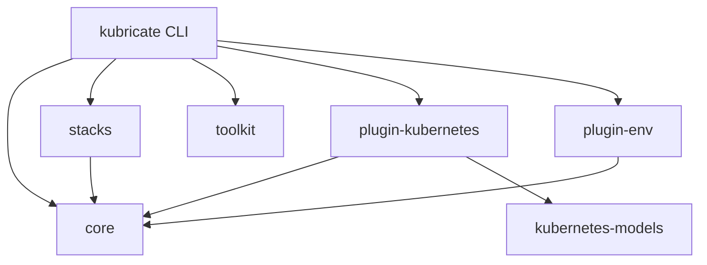
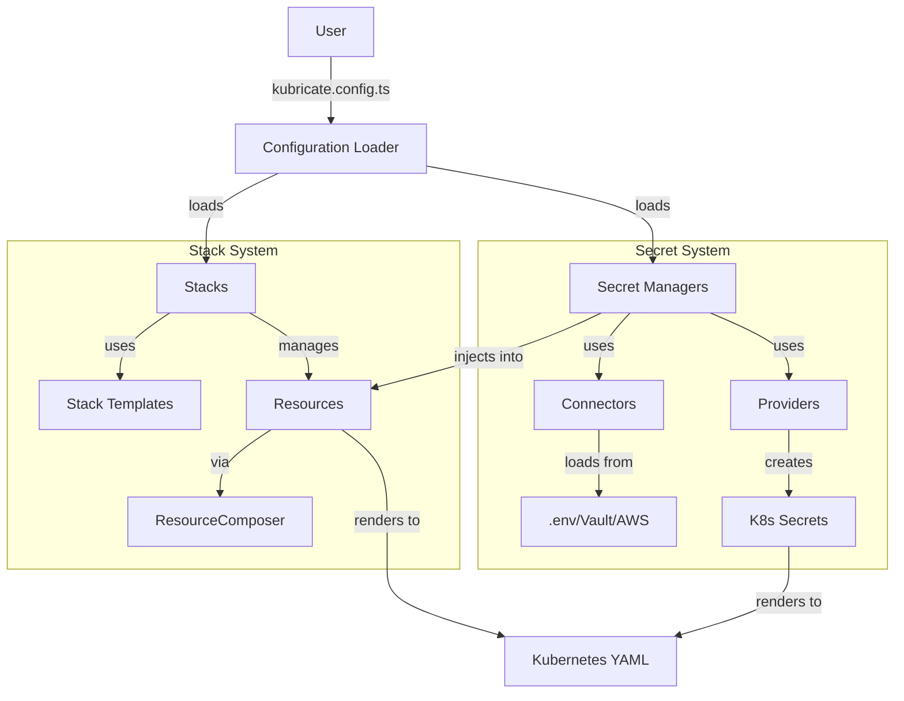
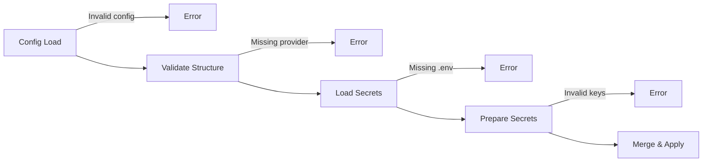
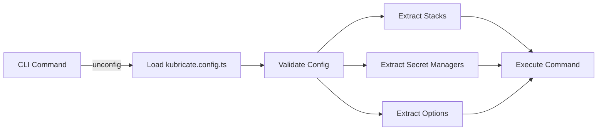
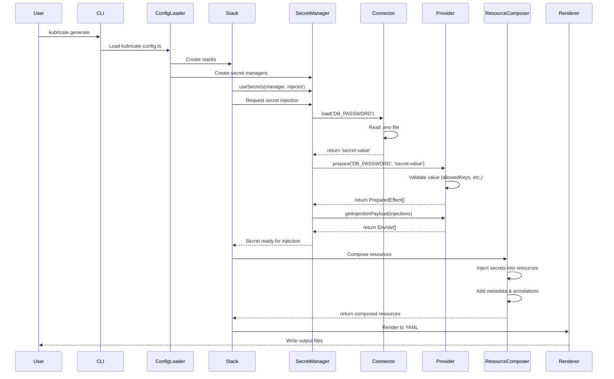

# 🏗️ Architecture Overview

This document provides a comprehensive overview of Kubricate's architecture, explaining how the framework is organized and how its components interact.

## Table of Contents

- [Monorepo Structure](#monorepo-structure)
- [Package Dependencies](#package-dependencies)
- [Core Architecture](#core-architecture)
- [Design Principles](#design-principles)
- [Key Patterns](#key-patterns)

## Monorepo Structure

Kubricate is organized as a **pnpm workspace monorepo** using **Turbo** for build orchestration.

```
kubricate-3/
├── packages/               # Core packages
│   ├── kubricate/         # CLI + orchestration
│   ├── core/              # Base classes & types
│   ├── stacks/            # Official stack templates
│   ├── toolkit/           # Utility functions
│   ├── plugin-env/        # .env connector
│   ├── plugin-kubernetes/ # K8s secret providers
│   └── kubernetes-models/ # K8s TypeScript types
├── examples/              # Usage examples
│   ├── with-stack-template/
│   ├── with-secret-manager/
│   └── with-custom-type-secret/
├── tools/                 # Build tools
│   └── mono/              # Build wrapper
└── configs/               # Shared configs
    ├── config-eslint/
    ├── config-typescript/
    └── config-vitest/
```

### Package Responsibilities



| Package | Responsibility | Exports |
|---------|---------------|---------|
| `kubricate` | CLI, commands, orchestration | `Stack`, `SecretManager`, `defineConfig` |
| `@kubricate/core` | Base classes, types, interfaces | `BaseProvider`, `BaseConnector`, types |
| `@kubricate/stacks` | Reusable stack templates | `simpleAppTemplate`, `namespaceTemplate` |
| `@kubricate/plugin-kubernetes` | K8s secret providers | `OpaqueSecretProvider`, `CustomTypeSecretProvider` |
| `@kubricate/plugin-env` | .env file connector | `EnvConnector` |
| `@kubricate/toolkit` | Utility functions | Helper functions |
| `@kubricate/kubernetes-models` | K8s TypeScript types | Type definitions |

## Package Dependencies

### Fixed Versioning
These packages **must always be on the same version**:
- `kubricate`
- `@kubricate/core`
- `@kubricate/stacks`

### Independent Versioning
Plugins can have independent versions:
- `@kubricate/plugin-*`
- `@kubricate/toolkit`

### Dependency Rules

**Runtime dependencies** (`dependencies`):
- Use when you import and execute code from the package
- Example: `kubricate` depends on `@kubricate/core`

**Peer dependencies** (`peerDependencies` + `devDependencies`):
- Use for type-only dependencies
- Prevents nested version conflicts
- Example: Providers depend on `@kubricate/core` as peer

## Core Architecture

### High-Level Overview



### Layer Architecture

Kubricate follows a **layered architecture**:

```
┌─────────────────────────────────────────────────┐
│            CLI Layer (bin.mjs)                   │
│  - Argument parsing (yargs)                      │
│  - Command routing                               │
└─────────────────┬───────────────────────────────┘
                  │
┌─────────────────▼───────────────────────────────┐
│         Command Layer (commands/)                │
│  - SecretCommand (validate, apply)               │
│  - GenerateCommand                               │
│  - ConfigLoader                                  │
└─────────────────┬───────────────────────────────┘
                  │
┌─────────────────▼───────────────────────────────┐
│      Orchestration Layer (orchestrators/)        │
│  - SecretsOrchestrator                           │
│  - SecretManagerEngine                           │
│  - Stack composition logic                       │
└─────────────────┬───────────────────────────────┘
                  │
┌─────────────────▼───────────────────────────────┐
│         Domain Layer (stack/, secret/)           │
│  - Stack                                         │
│  - SecretManager                                 │
│  - ResourceComposer                              │
└─────────────────┬───────────────────────────────┘
                  │
┌─────────────────▼───────────────────────────────┐
│       Plugin Layer (plugins/)                    │
│  - Connectors (EnvConnector)                     │
│  - Providers (OpaqueSecretProvider, etc.)        │
│  - Stack Templates (simpleAppTemplate)           │
└──────────────────────────────────────────────────┘
```

## Design Principles

### 1. **Type Safety First**

Every API is fully typed using TypeScript:

```typescript
// Good: Type-safe provider
class CustomTypeSecretProvider
  implements BaseProvider<CustomTypeSecretProviderConfig, SupportedStrategies> {
  // TypeScript enforces correct implementation
}

// Provider ensures injection strategies are valid
.inject('env', { key: 'api_key' })  // ✓ Type-checked
.inject('invalid', { })              // ✗ Compile error
```

### 2. **Separation of Concerns**

Each component has a single, clear responsibility:

| Component | Responsibility | Does NOT |
|-----------|---------------|----------|
| Connector | Load secret values | Format or validate values |
| Provider | Format and validate values | Load from sources |
| SecretManager | Orchestrate connectors & providers | Know about Kubernetes |
| Stack | Compose resources | Render YAML directly |
| ResourceComposer | Manage resource metadata | Know about secrets |

### 3. **Pluggability**

Users can extend the framework without modifying core code:

```typescript
// Custom connector
class VaultConnector extends BaseConnector {
  async load(name: string) {
    return await vault.getSecret(name);
  }
}

// Custom provider
class HelmSecretProvider extends BaseProvider {
  prepare(name: string, value: any) {
    return [{ type: 'helm', value: { ... } }];
  }
}

// Use in config
const secretManager = new SecretManager()
  .addConnector('vault', new VaultConnector())
  .addProvider('helm', new HelmSecretProvider());
```

### 4. **Declarative Configuration**

Users describe **what** they want, not **how** to do it:

```typescript
// Declarative: User describes the desired state
const stack = Stack.fromTemplate(simpleAppTemplate, { ... })
  .useSecrets(secretManager, c => {
    c.secrets('DB_PASSWORD').forName('DATABASE_PASSWORD').inject('env');
  });

// Framework handles:
// - Loading secret from connector
// - Validating with provider
// - Injecting into deployment
// - Creating Kubernetes Secret
// - Rendering YAML
```

### 5. **Fail-Fast Validation**

Errors are caught as early as possible:



## Key Patterns

### 1. **Single Configuration File (`defineConfig`)**

Inspired by **Vite** and **Vitest**, Kubricate uses `defineConfig()` to provide a **single source of truth** for all project configuration. This approach centralizes stacks, secrets, metadata, and generation options in one type-safe file.

```typescript
// kubricate.config.ts
import { defineConfig } from 'kubricate';
import { secretManager } from './src/setup-secrets';
import { frontend, backend } from './src/stacks';

export default defineConfig({
  // All your stacks
  stacks: {
    frontend,
    backend,
  },

  // Secret management configuration
  secret: {
    secretSpec: secretManager,
    conflict: {
      strategies: {
        intraProvider: 'autoMerge',  // Merge secrets within same provider
        crossProvider: 'error',       // Error on cross-provider conflicts
        crossManager: 'error',        // Error on cross-manager conflicts
      },
    },
  },

  // Metadata injection settings
  metadata: {
    inject: true,                    // Auto-inject Kubricate metadata
    injectManagedAt: true,           // Timestamp tracking
    injectResourceHash: true,        // Content hash for drift detection
    injectVersion: true,             // Kubricate version tracking
  },

  // Output generation settings
  generate: {
    outputType: 'stack',             // 'stack' | 'resource' | 'flat'
    outputDir: './manifests',
  },
});
```

**Benefits:**

1. **Type Safety**: Full TypeScript autocomplete and validation
   ```typescript
   defineConfig({
     stacks: { myStack },           // ✓ Type-checked
     unknownOption: true,            // ✗ Compile error
   });
   ```

2. **Centralized Discovery**: All configuration in one place
   - No scattered config files
   - Easy to understand project structure
   - Single file to review in code reviews

3. **Framework Integration**: Loaded automatically by CLI
   ```bash
   kubricate generate    # Automatically finds kubricate.config.ts
   kubricate secret apply
   ```

4. **Flexible Loading**: Uses `unconfig` library for multiple formats
   - `kubricate.config.ts` (TypeScript, recommended)
   - `kubricate.config.js` (JavaScript)
   - `kubricate.config.mjs` (ESM)
   - Support for `.mts`, `.cjs`, `.cts` variants

5. **Environment-Specific Overrides**: Easy to create variants
   ```typescript
   // kubricate.config.prod.ts
   import baseConfig from './kubricate.config';

   export default defineConfig({
     ...baseConfig,
     metadata: {
       ...baseConfig.metadata,
       injectManagedAt: false,  // Override for production
     },
   });
   ```

**Design Philosophy:**

Like Vite and Vitest, `defineConfig()` is a simple identity function that returns its input unchanged:

```typescript
export function defineConfig(config: KubricateConfig): KubricateConfig {
  return config;
}
```

Its purpose is **not** runtime transformation, but rather:
- Providing TypeScript IntelliSense and type checking
- Serving as a clear, documented API contract
- Making configuration files self-documenting

**CLI Integration:**

The CLI automatically discovers and loads the config file:



This pattern ensures that:
- Users have one place to configure everything
- The framework has one source to read from
- Configuration is type-safe and validated early
- No magic globals or environment variables required

### 2. **Connector-Provider Separation (Plugin Matrix Pattern)**

Kubricate's secret management uses a **separation of concerns** between data sources and data formats, creating a flexible **plugin matrix** where any connector can work with any provider.

```
┌─────────────────┐                    ┌──────────────────────────┐
│   Connectors    │                    │       Providers          │
│  (Data Source)  │                    │    (Data Format)         │
├─────────────────┤                    ├──────────────────────────┤
│ EnvConnector    │──┐                 │ OpaqueSecretProvider     │
│ VaultConnector  │──┼──> Mix & Match ─> DockerConfigProvider    │
│ AWSConnector    │──┤                 │ TLSSecretProvider        │
│ AzureConnector  │──┘                 │ BasicAuthProvider        │
│ CustomConnector │                    │ CustomTypeProvider       │
└─────────────────┘                    └──────────────────────────┘
```

**How it works:**

```typescript
// 1. Connectors: Define WHERE secrets come from
class EnvConnector extends BaseConnector {
  async load(name: string): Promise<string> {
    return process.env[name];  // Load from .env
  }
}

class VaultConnector extends BaseConnector {
  async load(name: string): Promise<string> {
    return await vault.read(name);  // Load from HashiCorp Vault
  }
}

// 2. Providers: Define HOW secrets are formatted/used
class OpaqueSecretProvider extends BaseProvider {
  prepare(name: string, value: string) {
    return [{
      type: 'kubectl',
      value: {
        kind: 'Secret',
        type: 'Opaque',
        data: { [name]: base64(value) }
      }
    }];
  }
}

class DockerConfigSecretProvider extends BaseProvider {
  prepare(name: string, value: DockerConfig) {
    return [{
      type: 'kubectl',
      value: {
        kind: 'Secret',
        type: 'kubernetes.io/dockerconfigjson',
        data: { '.dockerconfigjson': base64(JSON.stringify(value)) }
      }
    }];
  }
}

// 3. Mix and match: Any connector with any provider
const secretManager = new SecretManager()
  // Use Vault for production secrets
  .addConnector('vault', new VaultConnector())
  // Use .env for local development
  .addConnector('env', new EnvConnector())

  // Format as Opaque secrets
  .addProvider('opaque', new OpaqueSecretProvider())
  // Format as Docker config
  .addProvider('docker', new DockerConfigSecretProvider())

  // Secret can come from vault OR env, format as opaque OR docker
  .addSecret({ name: 'DB_PASSWORD', connector: 'vault', provider: 'opaque' })
  .addSecret({ name: 'REGISTRY_AUTH', connector: 'env', provider: 'docker' });
```

**Benefits:**

1. **Extensibility**: Add new sources without changing providers
   ```typescript
   // Add 1Password connector - works with ALL existing providers
   class OnePasswordConnector extends BaseConnector { ... }
   ```

2. **Reusability**: Add new formats without changing connectors
   ```typescript
   // Add SSH key provider - works with ALL existing connectors
   class SSHKeySecretProvider extends BaseProvider { ... }
   ```

3. **Flexibility**: Users choose the right combination for their needs
   ```typescript
   // Dev: .env + Opaque secrets
   // Staging: Azure KV + TLS certificates
   // Prod: Vault + Docker registry + CustomType for API keys
   ```

4. **Single Responsibility**: Each plugin has one job
   - Connectors: "Get the data"
   - Providers: "Format the data"
   - Neither knows about the other's implementation

5. **Testability**: Mock connectors or providers independently
   ```typescript
   // Test provider with mock connector
   const mockConnector = new InMemoryConnector({ DB_PASSWORD: 'test' });
   const provider = new OpaqueSecretProvider({ name: 'test-secret' });
   ```

This pattern is inspired by the **Strategy Pattern** but applied at an architectural level - separating "what" (connector) from "how" (provider).

### 3. **Base Classes for Extension**

All plugins extend base classes from `@kubricate/core`:

```typescript
// Core package defines interface
export abstract class BaseProvider<TConfig, TStrategies> {
  abstract prepare(name: string, value: any): PreparedEffect[];
  abstract getInjectionPayload(injectes: ProviderInjection[]): any;
  abstract mergeSecrets(effects: PreparedEffect[]): PreparedEffect[];
}

// Plugin implements
export class CustomTypeSecretProvider
  extends BaseProvider<CustomTypeSecretProviderConfig, 'env' | 'envFrom'> {
  prepare(name: string, value: Record<string, string>) {
    // Implementation
  }
}
```

### 4. **Convention over Configuration with Smart Defaults**

Kubricate follows the principle of **"Convention over Configuration"** - providing sensible defaults that work for 80% of use cases while allowing full customization when needed. This reduces boilerplate and makes the common case simple.

**Default Connector/Provider Selection:**

When multiple connectors or providers are registered, Kubricate uses defaults so you don't have to specify them for every secret:

```typescript
const secretManager = new SecretManager()
  // Register multiple connectors
  .addConnector('env', new EnvConnector())
  .addConnector('vault', new VaultConnector())
  .addConnector('aws', new AWSSecretsConnector())

  // Register multiple providers
  .addProvider('opaque', new OpaqueSecretProvider({ name: 'app-secrets' }))
  .addProvider('docker', new DockerConfigSecretProvider({ name: 'registry' }))

  // Set defaults (convention)
  .setDefaultConnector('env')      // Use .env by default
  .setDefaultProvider('opaque');   // Use Opaque secrets by default

// Now you can omit connector/provider for most secrets
secretManager
  .addSecret({ name: 'DB_PASSWORD' })           // Uses env + opaque (defaults)
  .addSecret({ name: 'API_KEY' })               // Uses env + opaque (defaults)
  .addSecret({
    name: 'PROD_KEY',
    connector: 'vault'                          // Override: use vault
  })
  .addSecret({
    name: 'REGISTRY',
    provider: 'docker'                          // Override: use docker provider
  });
```

**Automatic Metadata Injection:**

By default, Kubricate automatically adds useful metadata to every resource without requiring manual configuration:

```typescript
// Default behavior (convention)
export default defineConfig({
  stacks: { myApp },
  // metadata options have smart defaults - no config needed!
});

// Generated resources automatically include:
// - kubricate.thaitype.dev/stack-id: unique identifier
// - kubricate.thaitype.dev/stack-name: human-readable name
// - kubricate.thaitype.dev/version: CLI version used
// - kubricate.thaitype.dev/managed-at: timestamp
// - kubricate.thaitype.dev/resource-hash: for drift detection
```

**Customization when needed:**

```typescript
// Override defaults when you need different behavior
export default defineConfig({
  stacks: { myApp },
  metadata: {
    inject: true,                   // Still inject metadata
    injectManagedAt: false,         // But skip timestamp (for GitOps)
    injectResourceHash: true,       // Keep hash for drift detection
    injectVersion: false,           // Skip version (cleaner diffs)
  },
});
```

**Philosophy:**

Like Rails, Next.js, and Vite, Kubricate chooses **sensible defaults** that:
- Work for most users most of the time
- Can be overridden when needed
- Are explicitly documented in types
- Nudge users toward best practices

The goal is: **"Make the simple case simple, and the complex case possible."**

### 5. **Effect-Based Side Effects**

Side effects are represented as data structures (effects) that are executed later:

```typescript
// Provider returns "effects" (data), doesn't execute kubectl
prepare(name: string, value: string): PreparedEffect[] {
  return [{
    type: 'kubectl',        // Effect type
    secretName: name,
    value: {                // Effect payload
      apiVersion: 'v1',
      kind: 'Secret',
      data: { ... }
    }
  }];
}

// Later, executor handles the effect
for (const effect of effects) {
  if (effect.type === 'kubectl') {
    await kubectl.apply(effect.value);
  }
}
```

**Benefits:**
- Testable (inspect effects without executing)
- Composable (merge, filter, transform effects)
- Dry-run friendly (show what would happen)

### 6. **Builder Pattern for Configuration**

Fluent APIs make configuration readable:

```typescript
const secretManager = new SecretManager()
  .addConnector('env', new EnvConnector())
  .addProvider('opaque', new OpaqueSecretProvider({ name: 'my-secret' }))
  .setDefaultConnector('env')
  .setDefaultProvider('opaque')
  .addSecret({ name: 'DB_PASSWORD' });

const stack = Stack.fromTemplate(simpleAppTemplate, { name: 'my-app' })
  .useSecrets(secretManager, c => {
    c.secrets('DB_PASSWORD').forName('DATABASE_PASSWORD').inject('env');
  })
  .override({ service: { spec: { type: 'LoadBalancer' } } });
```

### 7. **Template Pattern for Stacks**

Stacks are created from reusable templates:

```typescript
// Template is a function that returns resources
export const simpleAppTemplate: StackTemplate = (input) => {
  return {
    deployment: createDeployment(input),
    service: createService(input)
  };
};

// Users instantiate from template
const stack = Stack.fromTemplate(simpleAppTemplate, {
  name: 'my-app',
  imageName: 'nginx',
  namespace: 'production'
});

// Framework processes template → generates resources
```

### 8. **Merge Strategies for Conflicts**

When multiple secrets target the same resource, merge strategies control behavior:

```typescript
// User configures conflict resolution
defineConfig({
  secret: {
    conflict: {
      strategies: {
        intraProvider: 'autoMerge',  // Same provider → merge
        crossProvider: 'error',       // Different providers → error
        crossManager: 'error',        // Different managers → error
      }
    }
  }
});

// Framework automatically handles merging based on strategy
```

## Component Interaction Flow

### Example: Generate Command with Secrets



## Testing Strategy

### Unit Tests
- Test individual classes in isolation
- Mock dependencies
- Fast execution (<1s per test suite)

```typescript
// Example: Provider unit test
test('should validate allowedKeys', () => {
  const provider = new CustomTypeSecretProvider({
    allowedKeys: ['api_key']
  });

  expect(() => {
    provider.prepare('TEST', { invalid_key: 'value' });
  }).toThrow(/invalid_key.*not allowed/);
});
```

### Integration Tests
- Test interactions between components
- Use real implementations (not mocks)
- Example: Stack + SecretManager integration

```typescript
// Example: Integration test
test('should inject secrets into deployment', async () => {
  const manager = new SecretManager()
    .addConnector('env', new EnvConnector())
    .addProvider('opaque', new OpaqueSecretProvider({ name: 'test' }));

  const stack = Stack.fromTemplate(simpleAppTemplate, { name: 'app' })
    .useSecrets(manager, c => {
      c.secrets('PASSWORD').inject('env');
    });

  const resources = await stack.compose();
  expect(resources.deployment.spec.template.spec.containers[0].env).toContainEqual({
    name: 'PASSWORD',
    valueFrom: { secretKeyRef: { name: 'test', key: 'PASSWORD' } }
  });
});
```

### End-to-End Tests
- Test full CLI commands
- Use real examples
- Verify output files

## Performance Considerations

### Build System
- **Turbo cache**: Skips unchanged packages
- **Parallel builds**: Independent packages build concurrently
- **Incremental TypeScript**: Only recompiles changed files

### Runtime
- **Lazy loading**: Only load secrets when needed
- **Single pass**: Secrets loaded once per apply
- **Efficient merging**: O(n) merge operations

## Next Steps

- [Secret Management Deep Dive](./secret-management-deep-dive.md) - Learn the secrets system
- [Generate Workflow](./generate-workflow.md) - Understand stack generation
- [Command Flows](./command-flows.md) - Debug CLI commands
