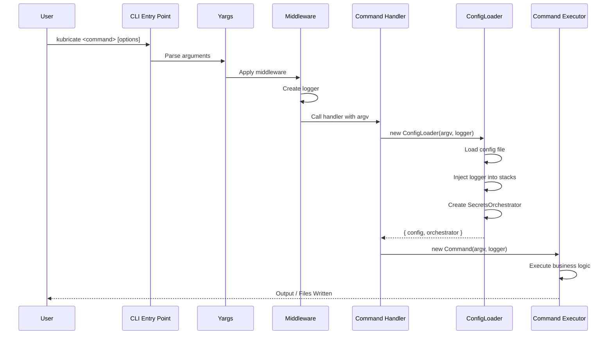
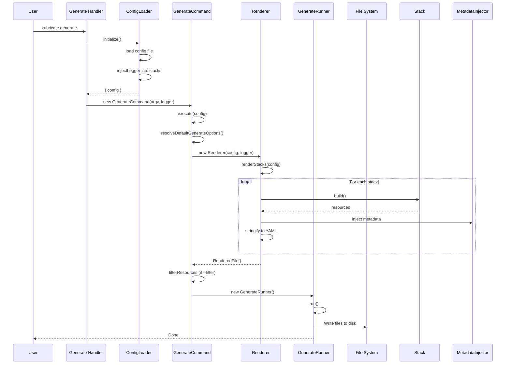
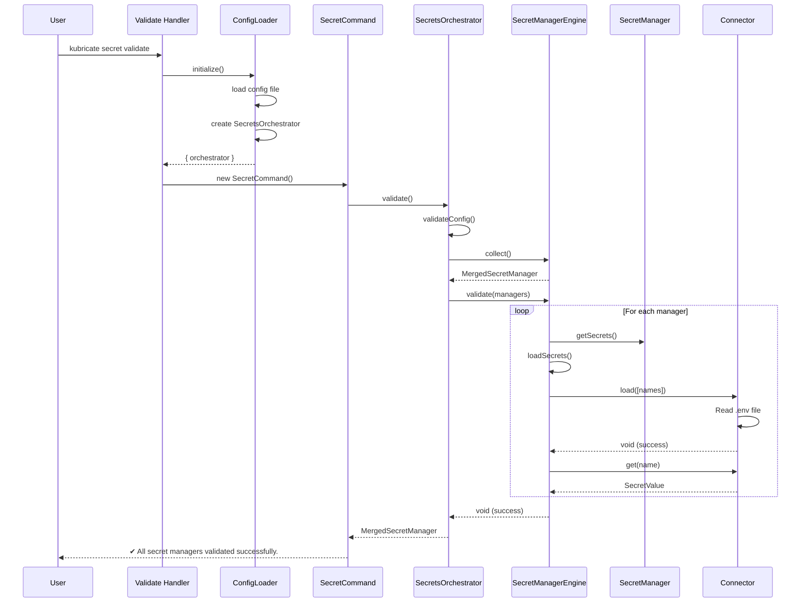
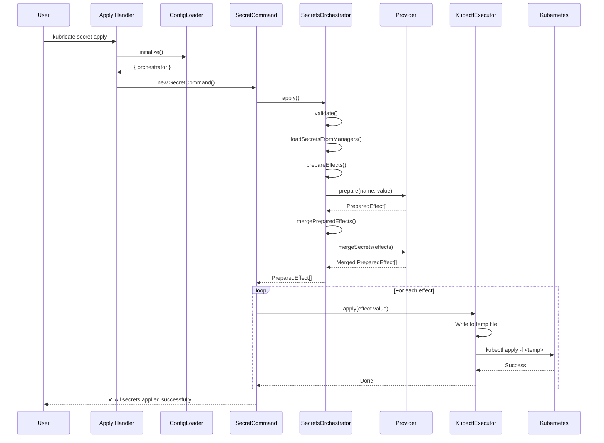
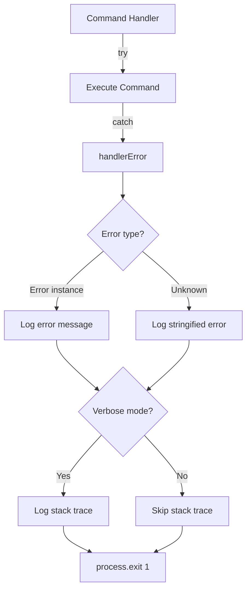

# ⚙️ Command Flows

This document explains how CLI commands are routed and executed in Kubricate, from user input to final output.

## Table of Contents

- [Overview](#overview)
- [CLI Architecture](#cli-architecture)
- [Command Execution Pipeline](#command-execution-pipeline)
- [Generate Command Flow](#generate-command-flow)
- [Secret Validate Flow](#secret-validate-flow)
- [Secret Apply Flow](#secret-apply-flow)
- [Configuration Loading](#configuration-loading)
- [Error Handling](#error-handling)
- [Logger Setup](#logger-setup)
- [Adding New Commands](#adding-new-commands)

## Overview

Kubricate uses **yargs** for CLI parsing and follows a layered command architecture:

```
User Input (CLI)
    ↓
Argument Parsing (yargs)
    ↓
Middleware (logger, options)
    ↓
Command Handler
    ↓
ConfigLoader
    ↓
Command Executor
    ↓
Output
```

**Key Components:**
- **CLI Entrypoint** (`cli.ts`): Main entry point and error handler
- **CLI Interfaces** (`cli-interfaces/`): Yargs command definitions
- **Commands** (`commands/`): Business logic implementations
- **Executors** (`executor/`): External tool wrappers (kubectl, etc.)

## CLI Architecture

### File Structure

```
packages/kubricate/src/
├── cli.ts                          # Main entry point
├── cli-interfaces/
│   ├── entrypoint.ts               # Yargs configuration
│   ├── generate.ts                 # Generate command interface
│   └── secret/
│       ├── secret.ts               # Secret command group
│       ├── validate.ts             # Secret validate interface
│       └── apply.ts                # Secret apply interface
├── commands/
│   ├── ConfigLoader.ts             # Configuration loader
│   ├── generate/
│   │   ├── GenerateCommand.ts      # Generate logic
│   │   ├── GenerateRunner.ts       # File writing logic
│   │   └── Renderer.ts             # YAML rendering logic
│   ├── SecretCommand.ts            # Secret command logic
│   └── MetadataInjector.ts         # Metadata injection
└── executor/
    ├── kubectl-executor.ts         # kubectl wrapper
    └── execa-executor.ts           # Command execution wrapper
```

### Entry Point

**Location:** `packages/kubricate/bin.mjs`

```javascript
#!/usr/bin/env node

await import('./dist/esm/cli.js')
```

**Location:** `packages/kubricate/src/cli.ts`

```typescript
import { cliEntryPoint } from './cli-interfaces/entrypoint.js';
import { handlerError } from './internal/error.js';
import { ConsoleLogger } from './internal/logger.js';
import { version } from './version.js';

cliEntryPoint(process.argv, {
  version,
  scriptName: 'kbr',  // Also supports 'kubricate' alias
}).catch(err => {
  handlerError(err, new ConsoleLogger('silent'), 99);
});
```

### Yargs Configuration

**Location:** `packages/kubricate/src/cli-interfaces/entrypoint.ts:40-83`

```typescript
export function cliEntryPoint(argv: string[], options: CliEntryPointOptions): Promise<void> {
  return new Promise((resolve, reject) => {
    yargs(hideBin(argv))
      .scriptName(options.scriptName)
      .usage('$0 <command>')
      .version(options.version)

      // Global options
      .option('root', { type: 'string', describe: 'Root directory' })
      .option('config', { type: 'string', describe: 'Config file path' })
      .option('verbose', { type: 'boolean', describe: 'Enable verbose output' })
      .option('silent', { type: 'boolean', describe: 'Suppress all output' })
      .option('dry-run', { type: 'boolean', describe: 'Dry run mode' })

      // Middleware: Setup logger
      .middleware(argv => {
        let level: LogLevel = 'info';
        if (argv.silent) level = 'silent';
        else if (argv.verbose) level = 'debug';

        argv.logger = new ConsoleLogger(level);
        argv.version = options.version;
      })

      // Register commands
      .command(generateCommand)
      .command(secretCommand)

      // Help & validation
      .help()
      .alias('h', 'help')
      .alias('v', 'version')
      .demandCommand(1, '')
      .fail((msg, err, yargs) => {
        // Custom error handling
        if (msg) return reject(new Error(errorHelper(msg, yargs)));
        if (err) return reject(err);
      })
      .strict()
      .parse();
  });
}
```

**Key features:**
- **Global options** available to all commands
- **Middleware** injects logger based on verbosity flags
- **Strict mode** catches unknown options
- **Promise-based** for async command execution

## Command Execution Pipeline

### Universal Flow



### Common Steps

All commands follow this pattern:

1. **Parse arguments** (yargs)
2. **Setup logger** (middleware)
3. **Call handler** (command interface)
4. **Load configuration** (ConfigLoader)
5. **Initialize orchestrator** (for secret-aware commands)
6. **Execute command** (Command class)
7. **Handle errors** (try/catch + handlerError)

## Generate Command Flow

### Command Interface

**Location:** `packages/kubricate/src/cli-interfaces/generate.ts:9-47`

```typescript
export const generateCommand: CommandModule<GlobalConfigOptions, GenerateCommandOptions> = {
  command: 'generate',
  describe: 'Generate a stack into yaml files',

  builder: yargs => yargs
    .option('outDir', {
      type: 'string',
      describe: 'Output directory',
      default: 'output',
    })
    .option('stdout', {
      type: 'boolean',
      describe: 'Output to stdout',
      default: false,
    })
    .option('filter', {
      type: 'string',
      describe: 'Filter stacks or resources by ID',
      array: true,
    }),

  handler: async (argv: ArgumentsCamelCase<GenerateCommandOptions>) => {
    const logger = argv.stdout ? new ConsoleLogger('silent') : (argv.logger ?? new ConsoleLogger('info'));

    try {
      // Load configuration
      const configLoader = new ConfigLoader(argv, logger);
      const { config } = await configLoader.initialize({
        commandOptions: argv,
        subject: 'generate',
      });

      // Execute command
      await new GenerateCommand(argv, logger).execute(config);
    } catch (error) {
      handlerError(error, logger);
    }
  },
};
```

### Execution Sequence



### Step-by-Step

**1. Initialize ConfigLoader**

```typescript
const configLoader = new ConfigLoader(argv, logger);
const { config } = await configLoader.initialize({
  commandOptions: argv,
  subject: 'generate',
});
```

**2. Create GenerateCommand**

```typescript
await new GenerateCommand(argv, logger).execute(config);
```

**3. Resolve Options**

**Location:** `packages/kubricate/src/commands/generate/GenerateCommand.ts:39-47`

```typescript
resolveDefaultGenerateOptions(config: KubricateConfig) {
  const defaultOptions: Required<ProjectGenerateOptions> = {
    outputDir: 'output',
    outputMode: 'stack',
    cleanOutputDir: true,
  };
  return merge({}, defaultOptions, config.generate);
}
```

**4. Render Stacks**

**Location:** `packages/kubricate/src/commands/generate/GenerateCommand.ts:64-86`

```typescript
getRenderedFiles(config: KubricateConfig, outputMode: ProjectGenerateOptions['outputMode']) {
  const renderer = new Renderer(config, this.logger);
  const rendered = renderer.renderStacks(config);

  const files: Record<string, string[]> = {};
  const renderedFiles: RenderedFile[] = [];

  // Group by output path based on mode
  for (const r of rendered) {
    const outPath = renderer.resolveOutputPath(r, outputMode, this.options.stdout);
    if (!files[outPath]) files[outPath] = [];
    files[outPath].push(r.content);
  }

  // Combine resources for each file
  for (const [filePath, contents] of Object.entries(files)) {
    renderedFiles.push({
      filePath: path.join(this.options.outDir, filePath),
      originalPath: filePath,
      content: contents.join('\n'),
    });
  }

  return renderedFiles;
}
```

**5. Write Files**

**Location:** `packages/kubricate/src/commands/generate/GenerateRunner.ts`

```typescript
async run() {
  if (this.options.stdout) {
    // Write to stdout
    for (const file of this.renderedFiles) {
      process.stdout.write(file.content + '\n');
    }
  } else {
    // Write to disk
    if (this.generateOptions.cleanOutputDir) {
      await rm(outputDir, { recursive: true, force: true });
    }

    for (const file of this.renderedFiles) {
      await mkdir(path.dirname(file.filePath), { recursive: true });
      await writeFile(file.filePath, file.content, 'utf8');
      this.logger.info(`  ✓ ${file.filePath}`);
    }
  }
}
```

### Example Output

**Command:**

```bash
kubricate generate --outDir=dist --verbose
```

**Output:**

```
kubricate v0.21.0

Generating stacks for Kubernetes...
Found 2 stacks in config:
  • SimpleApp (type: template)
      └─ Deployment (id: deployment)
      └─ Service (id: service)

  • Namespace (type: static)
      └─ Namespace (id: namespace)

  ✓ dist/vendorIntegrationApp.yml
  ✓ dist/namespace.yml
✔ Done!
```

## Secret Validate Flow

### Command Interface

**Location:** `packages/kubricate/src/cli-interfaces/secret/validate.ts`

```typescript
export const secretValidateCommand: CommandModule<GlobalConfigOptions> = {
  command: 'validate',
  describe: 'Validate secret configuration',

  handler: async (argv: ArgumentsCamelCase<GlobalConfigOptions>) => {
    const logger = argv.logger ?? new ConsoleLogger('info');

    try {
      const configLoader = new ConfigLoader(argv, logger);
      const { orchestrator } = await configLoader.initialize({
        commandOptions: argv,
        subject: 'secret validate',
      });

      await new SecretCommand(argv, logger, kubectlExecutor).validate(orchestrator);
    } catch (error) {
      handlerError(error, logger);
    }
  },
};
```

### Execution Sequence



### Step-by-Step

**1. Initialize & Create Orchestrator**

```typescript
const configLoader = new ConfigLoader(argv, logger);
const { orchestrator } = await configLoader.initialize({
  commandOptions: argv,
  subject: 'secret validate',
});
```

**ConfigLoader creates orchestrator:**

**Location:** `packages/kubricate/src/commands/ConfigLoader.ts:129-144`

```typescript
public async prepare(config: KubricateConfig) {
  this.injectLogger(config);

  const workingDir = this.options.root ? path.resolve(this.options.root) : undefined;
  const orchestrator = SecretsOrchestrator.create({
    config,
    logger: this.logger,
    effectOptions: { workingDir },
  });

  return orchestrator;
}
```

**2. Run Validation**

**Location:** `packages/kubricate/src/commands/SecretCommand.ts:20-24`

```typescript
async validate(orchestrator: SecretsOrchestrator) {
  this.logger.info('Validating secrets configuration...');
  await orchestrator.validate();
  this.logger.log(c.green`${MARK_CHECK} All secret managers validated successfully.`);
}
```

**3. Orchestrator Validation**

**Location:** `packages/kubricate/src/secret/orchestrator/SecretsOrchestrator.ts:85-93`

```typescript
async validate(): Promise<MergedSecretManager> {
  // 1. Validate config options
  this.validateConfig(this.engine.options.config);

  // 2. Collect managers
  const managers = this.engine.collect();

  // 3. Validate connectors and load secrets
  await this.engine.validate(managers);

  return managers;
}
```

**4. Engine Validation**

**Location:** `packages/kubricate/src/secret/orchestrator/SecretManagerEngine.ts:91-100`

```typescript
async validate(managers: MergedSecretManager): Promise<void> {
  this.logger.info('Validating secret managers...');

  for (const entry of Object.values(managers)) {
    const secrets = entry.secretManager.getSecrets();
    await this.loadSecrets(entry.secretManager, secrets);  // Throws if secret missing
  }

  this.logger.debug('Secret managers validated successfully');
}
```

### Example Output

**Command:**

```bash
kubricate secret validate
```

**Output (Success):**

```
kubricate v0.21.0

Validating secrets configuration...
Collecting secret managers...
Validating secret managers...
✔ All secret managers validated successfully.
```

**Output (Failure):**

```
kubricate v0.21.0

Validating secrets configuration...
Collecting secret managers...
Validating secret managers...

✖ Error: Missing environment variable: KUBRICATE_SECRET_API_KEY

Please ensure the required environment variables are set:
  KUBRICATE_SECRET_API_KEY
```

## Secret Apply Flow

### Command Interface

**Location:** `packages/kubricate/src/cli-interfaces/secret/apply.ts`

```typescript
export const secretApplyCommand: CommandModule<GlobalConfigOptions> = {
  command: 'apply',
  describe: 'Apply secrets to providers',

  handler: async (argv: ArgumentsCamelCase<GlobalConfigOptions>) => {
    const logger = argv.logger ?? new ConsoleLogger('info');

    try {
      const configLoader = new ConfigLoader(argv, logger);
      const { orchestrator } = await configLoader.initialize({
        commandOptions: argv,
        subject: 'secret apply',
      });

      const kubectlExecutor = new KubectlExecutor('kubectl', logger, new ExecaExecutor());
      await new SecretCommand(argv, logger, kubectlExecutor).apply(orchestrator);
    } catch (error) {
      handlerError(error, logger);
    }
  },
};
```

### Execution Sequence



### Step-by-Step

**1. Initialize Orchestrator**

Same as validate command.

**2. Create KubectlExecutor**

```typescript
const kubectlExecutor = new KubectlExecutor('kubectl', logger, new ExecaExecutor());
```

**3. Run Apply**

**Location:** `packages/kubricate/src/commands/SecretCommand.ts:26-50`

```typescript
async apply(orchestrator: SecretsOrchestrator) {
  await orchestrator.validate();

  const effects = await orchestrator.apply();

  if (effects.length === 0) {
    this.logger.warn(`No secrets to apply.`);
    return;
  }

  for (const effect of effects) {
    if (effect.type === 'kubectl') {
      const name = effect.value?.metadata?.name ?? 'unnamed';
      this.logger.info(`Applying secret: ${name}`);

      if (this.options.dryRun) {
        this.logger.log(c.yellow`${MARK_CHECK} [DRY RUN] Would apply: ${name}`);
      } else {
        await this.kubectl.apply(effect.value);
      }

      this.logger.log(c.green`${MARK_CHECK} Applied: ${name}`);
    }
  }

  this.logger.log(c.green`${MARK_CHECK} All secrets applied successfully.`);
}
```

**4. Orchestrator Apply**

**Location:** `packages/kubricate/src/secret/orchestrator/SecretsOrchestrator.ts:117-130`

```typescript
async apply(): Promise<PreparedEffect[]> {
  const managers = await this.validate();

  this.logOrchestratorContext(this.engine.options.config.secret);

  // 1. Load and resolve all secrets
  const resolvedSecrets = await this.loadSecretsFromManagers(managers);

  // 2. Prepare raw effects using each provider
  const rawEffects = this.prepareEffects(resolvedSecrets);

  // 3. Merge grouped effects by provider
  return this.mergePreparedEffects(rawEffects);
}
```

**5. kubectl apply**

**Location:** `packages/kubricate/src/executor/kubectl-executor.ts:18-30`

```typescript
async apply(resource: object) {
  const tempPath = this.createTempFilePath();  // /tmp/kubricate-secret-<uuid>.json
  await writeFile(tempPath, JSON.stringify(resource), 'utf8');

  this.logger.info(`Applying secret resource with kubectl: ${tempPath}`);

  try {
    await this.execa.run(this.kubectlPath, ['apply', '-f', tempPath]);
    this.logger.log('✅ Applied secret via kubectl');
  } catch (err) {
    this.logger.error(`❌ kubectl apply failed: ${(err as Error).message}`);
    throw err;
  }
}
```

**6. Kubernetes Resource Created**

```yaml
apiVersion: v1
kind: Secret
metadata:
  name: app-secret
  namespace: default
type: Opaque
data:
  DB_PASSWORD: <base64-encoded>
  API_KEY: <base64-encoded>
```

### Example Output

**Command:**

```bash
kubricate secret apply
```

**Output:**

```
kubricate v0.21.0

Validating secrets configuration...
Using merge strategies:
  - intraProvider: autoMerge
  - crossManager: error
  - crossProvider: error

Applying secret: app-secret
Applying secret resource with kubectl: /tmp/kubricate-secret-<uuid>.json
✅ Applied secret via kubectl
✔ Applied: app-secret

Applying secret: vendor-api-secret
Applying secret resource with kubectl: /tmp/kubricate-secret-<uuid>.json
✅ Applied secret via kubectl
✔ Applied: vendor-api-secret

✔ All secrets applied successfully.
```

## Configuration Loading

### ConfigLoader Responsibilities

**Location:** `packages/kubricate/src/commands/ConfigLoader.ts`

```typescript
export class ConfigLoader {
  // Load configuration file
  async load(): Promise<KubricateConfig>

  // Inject logger into stacks
  protected injectLogger(config: KubricateConfig): void

  // Validate stack IDs
  private validateStackId(config: KubricateConfig): void

  // Handle deprecated options
  protected handleDeprecatedOptions(config: KubricateConfig): KubricateConfig

  // Create SecretsOrchestrator
  async prepare(config: KubricateConfig): SecretsOrchestrator

  // Initialize everything
  async initialize<CommandOptions>(options: InitializeOptions<CommandOptions>): {
    config: KubricateConfig;
    orchestrator: SecretsOrchestrator;
  }
}
```

### Load Process

**Location:** `packages/kubricate/src/commands/ConfigLoader.ts:108-127`

```typescript
public async load(): Promise<KubricateConfig> {
  this.logger.debug('Loading configuration...');

  let config: KubricateConfig | undefined;
  config = await getConfig(this.options);  // Uses unconfig to load kubricate.config.ts
  config = this.handleDeprecatedOptions(config);

  if (!config) {
    this.logger.error(`No config file found matching '${getMatchConfigFile()}'`);
    this.logger.error(`Please ensure a config file exists in: ${this.options.root}`);
    throw new Error('No config file found');
  }

  this.validateStackId(config);
  this.logger.debug('Configuration loaded: ' + JSON.stringify(config, null, 2));

  return config;
}
```

### Config File Discovery

**Location:** `packages/kubricate/src/internal/load-config.ts`

```typescript
export function getMatchConfigFile(): string {
  return 'kubricate.config.{ts,mts,cts,js,mjs,cjs,json}';
}

export async function getConfig(options: GlobalConfigOptions): Promise<KubricateConfig | undefined> {
  // Uses unconfig library to load config file
  const result = await loadConfig<KubricateConfig>({
    sources: [
      {
        files: getMatchConfigFile(),
        cwd: options.root ?? process.cwd(),
      },
    ],
  });

  return result.config;
}
```

**Search order:**
1. `kubricate.config.ts`
2. `kubricate.config.mts`
3. `kubricate.config.cts`
4. `kubricate.config.js`
5. `kubricate.config.mjs`
6. `kubricate.config.cjs`
7. `kubricate.config.json`

## Error Handling

### Error Handler Function

**Location:** `packages/kubricate/src/internal/error.ts`

```typescript
export function handlerError(error: unknown, logger: BaseLogger, exitCode = 1): void {
  if (error instanceof Error) {
    logger.error(`\n✖ ${error.message}`);

    if (logger.level === 'debug') {
      logger.debug('\nStack trace:');
      logger.debug(error.stack ?? 'No stack trace available');
    }
  } else {
    logger.error('\n✖ An unknown error occurred');
    logger.error(String(error));
  }

  process.exit(exitCode);
}
```

### Error Flow



### Example Error Output

**Normal mode:**

```
✖ Missing environment variable: KUBRICATE_SECRET_API_KEY
```

**Verbose mode:**

```
✖ Missing environment variable: KUBRICATE_SECRET_API_KEY

Stack trace:
    at EnvConnector.load (/path/to/EnvConnector.ts:99:15)
    at SecretManagerEngine.loadSecrets (/path/to/SecretManagerEngine.ts:145:20)
    at SecretsOrchestrator.validate (/path/to/SecretsOrchestrator.ts:91:11)
    ...
```

## Logger Setup

### ConsoleLogger

**Location:** `packages/kubricate/src/internal/logger.ts`

```typescript
export class ConsoleLogger implements BaseLogger {
  constructor(public level: LogLevel = 'info') {}

  log(message: string): void {
    if (this.level === 'silent') return;
    console.log(message);
  }

  info(message: string): void {
    if (this.level === 'silent') return;
    console.info(c.blue('ℹ ') + message);
  }

  warn(message: string): void {
    if (this.level === 'silent') return;
    console.warn(c.yellow('⚠ ') + message);
  }

  error(message: string): void {
    if (this.level === 'silent') return;
    console.error(c.red('✖ ') + message);
  }

  debug(message: string): void {
    if (this.level !== 'debug') return;
    console.debug(c.gray('[debug] ') + message);
  }
}
```

### Log Levels

```typescript
type LogLevel = 'silent' | 'info' | 'debug';
```

**silent**: No output (except errors)
**info**: Normal output (default)
**debug**: Verbose output with debug messages

### Logger Injection

**Location:** `packages/kubricate/src/commands/ConfigLoader.ts:69-73`

```typescript
protected injectLogger(config: KubricateConfig) {
  for (const stack of Object.values(config.stacks ?? {})) {
    stack.injectLogger(this.logger);
  }
}
```

**Then propagated to all components:**

**Location:** `packages/kubricate/src/stack/BaseStack.ts:204-225`

```typescript
injectLogger(logger: BaseLogger) {
  this.logger = logger;

  // Inject into secret managers
  const managers = this.getSecretManagers();
  for (const secretManager of Object.values(managers)) {
    secretManager.logger = logger;

    // Inject into each connector
    for (const connector of Object.values(secretManager.getConnectors())) {
      connector.logger = logger;
    }

    // Inject into each provider
    for (const provider of Object.values(secretManager.getProviders())) {
      provider.logger = logger;
    }
  }
}
```

## Adding New Commands

### Step 1: Define Command Interface

**Location:** `packages/kubricate/src/cli-interfaces/my-command.ts`

```typescript
import type { ArgumentsCamelCase, CommandModule } from 'yargs';
import { ConfigLoader } from '../commands/ConfigLoader.js';
import { MyCommand, type MyCommandOptions } from '../commands/MyCommand.js';
import { handlerError } from '../internal/error.js';
import { ConsoleLogger } from '../internal/logger.js';
import type { GlobalConfigOptions } from '../internal/types.js';

export const myCommand: CommandModule<GlobalConfigOptions, MyCommandOptions> = {
  command: 'my-command',
  describe: 'Description of my command',

  builder: yargs => yargs
    .option('myOption', {
      type: 'string',
      describe: 'My custom option',
      default: 'default-value',
    }),

  handler: async (argv: ArgumentsCamelCase<MyCommandOptions>) => {
    const logger = argv.logger ?? new ConsoleLogger('info');

    try {
      const configLoader = new ConfigLoader(argv, logger);
      const { config, orchestrator } = await configLoader.initialize({
        commandOptions: argv,
        subject: 'my-command',
      });

      await new MyCommand(argv, logger).execute(config, orchestrator);
    } catch (error) {
      handlerError(error, logger);
    }
  },
};
```

### Step 2: Implement Command Class

**Location:** `packages/kubricate/src/commands/MyCommand.ts`

```typescript
import type { BaseLogger } from '@kubricate/core';
import type { GlobalConfigOptions } from '../internal/types.js';
import type { KubricateConfig } from '../types.js';
import type { SecretsOrchestrator } from '../secret/index.js';

export interface MyCommandOptions extends GlobalConfigOptions {
  myOption: string;
}

export class MyCommand {
  constructor(
    protected options: MyCommandOptions,
    protected logger: BaseLogger
  ) {}

  async execute(config: KubricateConfig, orchestrator: SecretsOrchestrator) {
    this.logger.info('Executing my command...');

    // Your command logic here
    const { myOption } = this.options;
    this.logger.debug(`Using option: ${myOption}`);

    // Example: Validate secrets
    await orchestrator.validate();

    // Example: Process stacks
    for (const [stackId, stack] of Object.entries(config.stacks ?? {})) {
      this.logger.info(`Processing stack: ${stackId}`);
      const resources = stack.build();
      // Do something with resources
    }

    this.logger.log('✔ Command completed successfully!');
  }
}
```

### Step 3: Register Command

**Location:** `packages/kubricate/src/cli-interfaces/entrypoint.ts`

```typescript
import { myCommand } from './my-command.js';

export function cliEntryPoint(argv: string[], options: CliEntryPointOptions): Promise<void> {
  return new Promise((resolve, reject) => {
    yargs(hideBin(argv))
      // ... existing setup

      // Register commands
      .command(generateCommand)
      .command(secretCommand)
      .command(myCommand)  // <-- Add here

      // ... rest of setup
  });
}
```

### Step 4: Add Tests

**Location:** `packages/kubricate/src/commands/MyCommand.test.ts`

```typescript
import { describe, it, expect, beforeEach } from 'vitest';
import { MyCommand } from './MyCommand';
import { ConsoleLogger } from '../internal/logger';

describe('MyCommand', () => {
  let command: MyCommand;
  let logger: ConsoleLogger;

  beforeEach(() => {
    logger = new ConsoleLogger('silent');
    command = new MyCommand(
      { myOption: 'test-value', version: '0.0.0', dryRun: false },
      logger
    );
  });

  it('should execute successfully', async () => {
    const config = {
      stacks: {},
      secret: { secretSpec: mockSecretManager },
    };

    const orchestrator = SecretsOrchestrator.create({
      config,
      logger,
      effectOptions: {},
    });

    await expect(command.execute(config, orchestrator)).resolves.not.toThrow();
  });
});
```

## Best Practices

### 1. Command Design

✅ **Do:**
- Keep command handlers thin (delegate to command classes)
- Use ConfigLoader for initialization
- Follow error handling pattern with try/catch
- Provide clear command descriptions and option help text

❌ **Don't:**
- Put business logic in command handlers
- Skip error handling
- Forget to register commands in entrypoint

### 2. Option Naming

✅ **Do:**
```typescript
.option('outDir', { ... })      // camelCase
.option('dry-run', { ... })     // kebab-case in CLI
```

❌ **Don't:**
```typescript
.option('out-dir', { ... })     // ❌ Inconsistent casing
.option('OutDir', { ... })      // ❌ PascalCase
```

### 3. Logger Usage

✅ **Do:**
```typescript
logger.info('Starting process...');
logger.debug('Detailed debug information');
logger.warn('Potential issue detected');
logger.error('Operation failed');
logger.log('✔ Success!');
```

❌ **Don't:**
```typescript
console.log('Starting process...');  // ❌ Bypasses log level
console.error('Error');              // ❌ Not formatted
```

### 4. Error Messages

✅ **Do:**
```typescript
throw new Error('[MyCommand] Configuration missing required field "name"');
```

❌ **Don't:**
```typescript
throw new Error('Error');  // ❌ Not actionable
throw new Error('name is missing');  // ❌ No context
```

### 5. Command Options

✅ **Do:**
```typescript
interface MyCommandOptions extends GlobalConfigOptions {
  myOption: string;   // Typed options
}
```

❌ **Don't:**
```typescript
// Using untyped argv directly
async handler(argv: any) {  // ❌ No type safety
  const value = argv.myOption;
}
```

## Next Steps

- [Architecture Overview](./architecture-overview.md) - Review the big picture
- [Secret Management Deep Dive](./secret-management-deep-dive.md) - Learn the secrets system
- [Generate Workflow](./generate-workflow.md) - Understand stack generation
