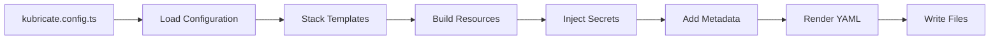
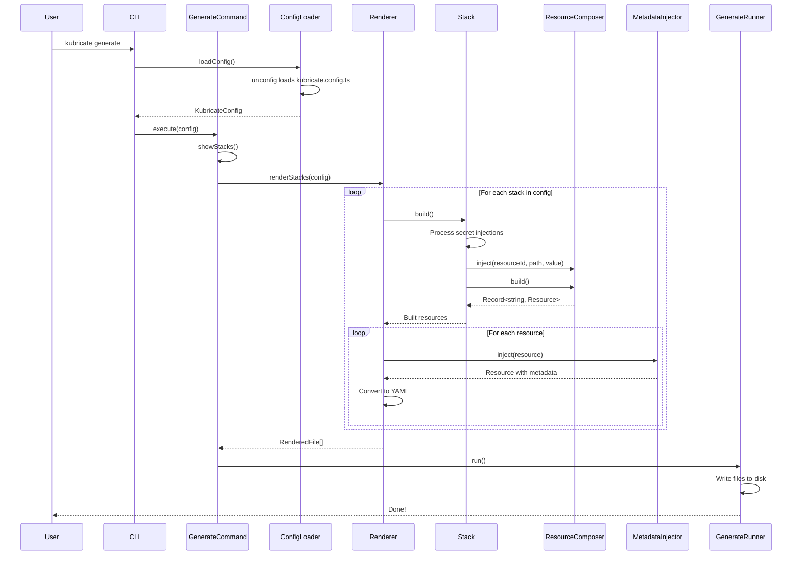

# 📦 Generate Workflow

This document explains how `kubricate generate` works internally, from stack templates to final YAML output.

## Table of Contents

- [Overview](#overview)
- [Command Flow](#command-flow)
- [Stack Architecture](#stack-architecture)
- [Template System](#template-system)
- [Resource Composition](#resource-composition)
- [Secret Injection](#secret-injection)
- [Metadata Injection](#metadata-injection)
- [YAML Rendering](#yaml-rendering)
- [Output Modes](#output-modes)
- [Creating Stack Templates](#creating-stack-templates)
- [Best Practices](#best-practices)

## Overview

The `kubricate generate` command transforms stack definitions into Kubernetes manifests through a multi-stage pipeline:



**Key concepts:**
- **Stack**: A composable unit representing one or more Kubernetes resources
- **Template**: A function that creates resource definitions from input data
- **ResourceComposer**: Manages resource entries and their configuration
- **Renderer**: Converts resources to YAML and handles output modes

## Command Flow

### High-Level Sequence



### Step-by-Step Execution

**Location:** `packages/kubricate/src/commands/generate/GenerateCommand.ts:49-62`

```typescript
async execute(config: KubricateConfig) {
  // 1. Resolve options
  const generateOptions = this.resolveDefaultGenerateOptions(config);

  // 2. Render stacks to YAML
  const renderedFiles = this.getRenderedFiles(config, generateOptions.outputMode);

  // 3. Create runner
  const runner = new GenerateRunner(this.options, generateOptions, renderedFiles, this.logger);

  // 4. Display stacks
  this.showStacks(config);

  // 5. Write files
  await runner.run();
}
```

## Stack Architecture

### Stack Class Hierarchy

```typescript
BaseStack              // Abstract base with secret injection
  └── Stack            // Runtime stack with template support
      ├── fromTemplate()  // Create from template + input
      └── fromStatic()    // Create from static resources
```

**Location:** `packages/kubricate/src/stack/Stack.ts`

### BaseStack Responsibilities

```typescript
export abstract class BaseStack<
  ConfigureComposerFunc,
  SecretManager
> {
  // Internal state
  _composer: ResourceComposer;           // Resource manager
  _secretManagers: Record<number, SecretManager>;  // Registered managers
  _targetInjects: ProviderInjection[];   // Pending injections
  _name: string;                         // Stack identifier

  // Core methods
  abstract from(data: unknown): unknown; // Configure with input
  useSecrets(manager, builder): this;    // Register secret injections
  build(): Record<string, Resource>;     // Build final resources
  override(data: Partial<...>): this;    // Override resource config
}
```

**Key features:**
1. **Secret Management**: Tracks registered secret managers and injections
2. **Composition**: Delegates to ResourceComposer for resource handling
3. **Logger Injection**: Propagates logger to all components
4. **Build Pipeline**: Coordinates injection → composition → output

### Stack Creation Patterns

#### Pattern 1: From Template

**Most common pattern** for reusable stacks.

```typescript
// Define template
const MyAppTemplate = defineStackTemplate('MyApp', (input: IMyAppInput) => {
  return {
    deployment: kubeModel(Deployment, { /* ... */ }),
    service: kubeModel(Service, { /* ... */ }),
  };
});

// Instantiate stack
const stack = Stack.fromTemplate(MyAppTemplate, {
  name: 'my-app',
  namespace: 'production',
  imageName: 'nginx:latest',
});
```

**Location:** `packages/kubricate/src/stack/Stack.ts:56-65`

#### Pattern 2: From Static Resources

**Used for simple, fixed configurations** like namespaces.

```typescript
const namespaceStack = Stack.fromStatic('DefaultNS', {
  namespace: {
    apiVersion: 'v1',
    kind: 'Namespace',
    metadata: { name: 'default' },
  },
});
```

**Location:** `packages/kubricate/src/stack/Stack.ts:93-101`

## Template System

### Template Definition

**Location:** `packages/core/src/types.ts`

```typescript
export interface StackTemplate<TInput, TResourceMap> {
  name: string;  // Stack name (used in metadata)
  create: (input: TInput) => TResourceMap;  // Builder function
}
```

### defineStackTemplate Helper

```typescript
export function defineStackTemplate<TInput, TResourceMap>(
  name: string,
  create: (input: TInput) => TResourceMap
): StackTemplate<TInput, TResourceMap> {
  return { name, create };
}
```

**Benefits:**
- Type-safe input → output mapping
- Reusable across projects
- Separates definition from instantiation
- Enables testing templates in isolation

### Example: SimpleApp Template

**Location:** `packages/stacks/src/simpleAppTemplate.ts:19-66`

```typescript
export interface ISimpleAppStack {
  name: string;
  namespace?: string;
  imageName: string;
  replicas?: number;
  imageRegistry?: string;
  port?: number;
  env?: IContainer['env'];
}

export const simpleAppTemplate = defineStackTemplate('SimpleApp', (data: ISimpleAppStack) => {
  const port = data.port ?? 80;
  const replicas = data.replicas ?? 1;
  const metadata = { name: data.name, namespace: data.namespace };
  const labels = { app: data.name };

  return {
    deployment: kubeModel(Deployment, {
      metadata,
      spec: {
        replicas,
        selector: { matchLabels: labels },
        template: {
          metadata: { labels },
          spec: {
            containers: [{
              image: data.imageName,
              name: data.name,
              ports: [{ containerPort: port }],
              env: data.env,
            }],
          },
        },
      },
    }),
    service: kubeModel(Service, {
      metadata,
      spec: {
        selector: labels,
        type: 'ClusterIP',
        ports: [{
          port,
          targetPort: port,
        }],
      },
    }),
  };
});
```

**Key patterns:**
- ✅ Default values for optional fields
- ✅ Consistent metadata across resources
- ✅ Type-safe container configuration
- ✅ Reusable label selectors

## Resource Composition

### ResourceComposer Class

**Location:** `packages/kubricate/src/stack/ResourceComposer.ts`

**Responsibility:** Manage resource entries and their configuration

```typescript
export class ResourceComposer<Entries extends Record<string, unknown> = {}> {
  _entries: Record<string, ResourceEntry>;  // Resource storage
  _override: Record<string, unknown>;       // User overrides

  // Add resources
  addClass<Id, T>(params: { id: Id; type: T; config: ... }): ResourceComposer<...>
  addObject<Id, T>(params: { id: Id; config: T }): ResourceComposer<...>

  // Modify resources
  inject(resourceId: string, path: string, value: unknown): void
  override(overrideResources: Partial<Entries>): this

  // Output
  build(): Record<string, Resource>
  findResourceIdsByKind(kind: string): string[]
}
```

### Resource Entry Types

```typescript
export interface ResourceEntry {
  type?: AnyClass;                       // Class constructor
  config: Record<string, unknown>;       // Resource configuration
  entryType: 'class' | 'object' | 'instance';  // Entry type
}
```

**Entry types:**
- `class`: Will be instantiated with config (e.g., `new Deployment(config)`)
- `object`: Used as-is, supports overrides
- `instance`: Used as-is, no overrides

### Injection Logic

**Location:** `packages/kubricate/src/stack/ResourceComposer.ts:24-63`

```typescript
inject(resourceId: string, path: string, value: unknown) {
  const composed = cloneDeep(this._entries[resourceId]);

  const existingValue = get(composed.config, path);

  if (existingValue === undefined) {
    // No value yet — safe to set directly
    set(composed.config, path, value);
    return;
  }

  if (Array.isArray(existingValue) && Array.isArray(value)) {
    // Append array elements (e.g. env vars)
    const mergedArray = [...existingValue, ...value];
    set(composed.config, path, mergedArray);
    return;
  }

  if (isPlainObject(existingValue) && isPlainObject(value)) {
    // Deep merge objects
    const mergedObject = merge({}, existingValue, value);
    set(composed.config, path, mergedObject);
    return;
  }

  // Conflict: cannot merge incompatible types
  throw new Error(`Cannot inject, resource "${resourceId}" already has incompatible value at path "${path}".`);
}
```

**Merge strategies:**
1. **Undefined → Set**: Direct assignment
2. **Array + Array → Append**: Concatenate arrays
3. **Object + Object → Merge**: Deep merge with lodash
4. **Else → Error**: Incompatible types

### Build Process

**Location:** `packages/kubricate/src/stack/ResourceComposer.ts:65-87`

```typescript
build(): Record<string, unknown> {
  const result: Record<string, unknown> = {};

  for (const resourceId of Object.keys(this._entries)) {
    const { type, entryType, config } = this._entries[resourceId];

    // Apply user overrides
    const mergedConfig = merge({}, config, this._override?.[resourceId]);

    if (entryType === 'instance') {
      result[resourceId] = config;  // Use as-is
    } else if (entryType === 'object') {
      result[resourceId] = mergedConfig;  // Use merged config
    } else if (entryType === 'class' && type) {
      result[resourceId] = new type(mergedConfig);  // Instantiate class
    }
  }

  return result;
}
```

## Secret Injection

### Injection Flow

```mermaid
graph TD
    A[useSecrets] --> B[SecretsInjectionContext]
    B --> C[secrets().forName().inject]
    C --> D[registerSecretInjection]
    D --> E[Store ProviderInjection]

    F[build] --> G[Group by providerId:resourceId:path]
    G --> H[provider.getInjectionPayload]
    H --> I[composer.inject]
    I --> J[Merge into resource]
```

### useSecrets API

**Location:** `packages/kubricate/src/stack/BaseStack.ts:50-65`

```typescript
stack.useSecrets(secretManager, builder => {
  // Builder receives SecretsInjectionContext
  builder
    .secrets('DB_PASSWORD')
    .forName('DATABASE_PASSWORD')
    .inject('env');
});
```

**What happens:**
1. Registers secret manager with unique ID
2. Creates `SecretsInjectionContext` for fluent API
3. Collects `ProviderInjection[]` during builder execution
4. Stores injections for processing during `build()`

### ProviderInjection Structure

**Location:** `packages/core/src/BaseProvider.ts:183-216`

```typescript
export interface ProviderInjection<
  ResourceId extends string = string,
  Path extends string = string
> {
  providerId: string;        // Provider identifier
  provider: BaseProvider;    // Provider instance
  resourceId: ResourceId;    // Target resource (e.g., 'deployment')
  path: Path;                // Target path (e.g., 'spec.template.spec.containers[0].env')
  meta?: {
    secretName: string;      // Original secret name
    targetName: string;      // Environment variable name
    strategy?: SecretInjectionStrategy;  // Injection method
  };
}
```

### Build-Time Injection

**Location:** `packages/kubricate/src/stack/BaseStack.ts:104-157`

```typescript
build() {
  // 1. Group injections by (providerId, resourceId, path)
  const injectGroups = new Map<InjectionKey, {
    providerId: string;
    provider: BaseProvider;
    resourceId: string;
    path: string;
    injects: ProviderInjection[];
  }>();

  for (const inject of this._targetInjects) {
    const key = `${inject.providerId}:${inject.resourceId}:${inject.path}`;
    // ... group logic
  }

  // 2. For each group, get payload and inject
  for (const { provider, resourceId, path, injects } of injectGroups.values()) {
    const payload = provider.getInjectionPayload(injects);
    this._composer.inject(resourceId, path, payload);
  }

  // 3. Build final resources
  return this._composer.build();
}
```

**Why group?**
- Multiple secrets → same path (e.g., multiple env vars)
- Provider returns combined payload in one call
- Ensures correct array merging

### Example Injection

**Input:**

```typescript
stack.useSecrets(secretManager, c => {
  c.secrets('DB_PASSWORD').forName('DATABASE_PASSWORD').inject('env');
  c.secrets('API_KEY').forName('API_KEY').inject('env');
});
```

**Grouped:**

```typescript
{
  'opaque:deployment:spec.template.spec.containers[0].env': {
    provider: OpaqueSecretProvider,
    resourceId: 'deployment',
    path: 'spec.template.spec.containers[0].env',
    injects: [
      { meta: { secretName: 'DB_PASSWORD', targetName: 'DATABASE_PASSWORD' } },
      { meta: { secretName: 'API_KEY', targetName: 'API_KEY' } },
    ]
  }
}
```

**Payload:**

```typescript
[
  {
    name: 'DATABASE_PASSWORD',
    valueFrom: { secretKeyRef: { name: 'app-secret', key: 'DB_PASSWORD' } },
  },
  {
    name: 'API_KEY',
    valueFrom: { secretKeyRef: { name: 'app-secret', key: 'API_KEY' } },
  },
]
```

**Injected:**

```yaml
spec:
  template:
    spec:
      containers:
        - name: app
          env:
            - name: DATABASE_PASSWORD
              valueFrom:
                secretKeyRef:
                  name: app-secret
                  key: DB_PASSWORD
            - name: API_KEY
              valueFrom:
                secretKeyRef:
                  name: app-secret
                  key: API_KEY
```

## Metadata Injection

### MetadataInjector Class

**Location:** `packages/kubricate/src/commands/MetadataInjector.ts`

**Responsibility:** Add Kubricate labels and annotations to resources

```typescript
export class MetadataInjector {
  inject(resource: Record<string, unknown>): Record<string, unknown> {
    const metadata = this.ensureMetadata(resource);

    // Always injected
    metadata.labels[LABELS.kubricate] = 'true';

    // Stack metadata
    if (this.options.type === 'stack') {
      metadata.labels[LABELS.stackId] = this.options.stackId;
      metadata.annotations[LABELS.stackName] = this.options.stackName;
      metadata.labels[LABELS.resourceId] = this.options.resourceId;
    }

    // Optional fields
    if (this.options.inject?.version) {
      metadata.annotations[LABELS.version] = this.options.kubricateVersion;
    }
    if (this.options.inject?.resourceHash) {
      metadata.annotations[LABELS.resourceHash] = this.calculateHash(resource);
    }
    if (this.options.inject?.managedAt) {
      metadata.annotations[LABELS.managedAt] = new Date().toISOString();
    }

    return resource;
  }
}
```

### Injected Labels

```yaml
metadata:
  labels:
    kubricate.thaitype.dev: "true"
    kubricate.thaitype.dev/stack-id: vendorIntegrationApp
    kubricate.thaitype.dev/resource-id: deployment
  annotations:
    kubricate.thaitype.dev/stack-name: SimpleApp
    kubricate.thaitype.dev/version: 0.21.0
    kubricate.thaitype.dev/resource-hash: 1bac464a5510ca162c2e61bd35d80c7f42eae5203593585f0b0bad21adee2218
    kubricate.thaitype.dev/managed-at: 2025-10-27T07:00:47.681Z
```

**Usage:**
- **Discovery**: Find all Kubricate-managed resources (`kubectl get all -l kubricate.thaitype.dev=true`)
- **Filtering**: Target specific stacks or resources
- **Tracking**: Monitor when resources were last updated
- **Drift detection**: Compare hash to detect manual changes

### Resource Hash Calculation

**Location:** `packages/kubricate/src/commands/MetadataInjector.ts:81-101`

```typescript
private calculateHash(resource: Record<string, unknown>): string {
  const cleaned = this.cleanForHash(resource);    // Remove runtime fields
  const sorted = this.sortKeysRecursively(cleaned);  // Ensure stable ordering
  const serialized = JSON.stringify(sorted);
  return createHash('sha256').update(serialized).digest('hex');
}

private cleanForHash(resource: Record<string, unknown>): Record<string, unknown> {
  const clone = cloneDeep(resource);
  if (clone.metadata) {
    const metadata = clone.metadata as Record<string, unknown>;
    // Remove fields that change on every apply
    delete metadata.creationTimestamp;
    delete metadata.resourceVersion;
    delete metadata.uid;
    delete metadata.selfLink;
    delete metadata.generation;
    delete metadata.managedFields;
  }
  return clone;
}
```

**Why hash?**
- Detect configuration drift
- Compare expected vs actual state
- Trigger updates only when needed

## YAML Rendering

### Renderer Class

**Location:** `packages/kubricate/src/commands/generate/Renderer.ts`

**Responsibility:** Convert resources to YAML strings

```typescript
export class Renderer {
  renderStacks(config: KubricateConfig): RenderedResource[] {
    const results: RenderedResource[] = [];

    for (const [stackId, stack] of Object.entries(config.stacks)) {
      // 1. Build stack resources
      const resources = stack.build();

      // 2. Inject metadata into each resource
      for (const [resourceId, resource] of Object.entries(resources)) {
        const injector = new MetadataInjector({
          type: 'stack',
          stackId,
          stackName: stack.getName(),
          resourceId,
          kubricateVersion: getKubricateVersion(),
        });
        const withMetadata = injector.inject(resource);

        // 3. Convert to YAML
        const yaml = stringify(withMetadata);

        results.push({
          stackId,
          stackName: stack.getName(),
          resourceId,
          content: yaml,
        });
      }
    }

    return results;
  }
}
```

### YAML Conversion

Kubricate uses the `yaml` library for serialization:

```typescript
import { stringify } from 'yaml';

const yamlString = stringify(resource, {
  indent: 2,
  lineWidth: 0,  // No line wrapping
  minContentWidth: 0,
});
```

### Example Output

**Input (JavaScript):**

```typescript
{
  apiVersion: 'v1',
  kind: 'Service',
  metadata: {
    name: 'my-app',
    namespace: 'production',
  },
  spec: {
    selector: { app: 'my-app' },
    ports: [{ port: 80, targetPort: 8080 }],
  },
}
```

**Output (YAML):**

```yaml
apiVersion: v1
kind: Service
metadata:
  name: my-app
  namespace: production
spec:
  selector:
    app: my-app
  ports:
    - port: 80
      targetPort: 8080
```

## Output Modes

### Mode: `stack`

**Default mode.** One file per stack, all resources combined.

**File structure:**

```
output/
├── vendorIntegrationApp.yml   # deployment + service
└── namespace.yml               # namespace
```

**Example (`vendorIntegrationApp.yml`):**

```yaml
apiVersion: apps/v1
kind: Deployment
metadata:
  name: vendor-integration
# ...
---

apiVersion: v1
kind: Service
metadata:
  name: vendor-integration
# ...
```

**Use when:**
- Deploying stacks as atomic units
- Using GitOps (one file = one app)
- Want simpler file management

### Mode: `resource`

One file per resource, named `<stackId>.<resourceId>.yml`.

**File structure:**

```
output/
├── vendorIntegrationApp.deployment.yml
├── vendorIntegrationApp.service.yml
└── namespace.namespace.yml
```

**Use when:**
- Need fine-grained control over resources
- Applying resources independently
- Splitting ownership across teams

### Mode: `kind`

One file per Kubernetes kind, all resources of that kind combined.

**File structure:**

```
output/
├── Deployment.yml    # All deployments
├── Service.yml       # All services
└── Namespace.yml     # All namespaces
```

**Use when:**
- Organizing by resource type
- Applying kinds in specific order (e.g., Namespace → ConfigMap → Deployment)

### Configuration

**Location:** `kubricate.config.ts`

```typescript
export default defineConfig({
  generate: {
    outputMode: 'stack',  // 'stack' | 'resource' | 'kind'
    outputDir: 'output',  // Relative to config file
    cleanOutputDir: true, // Delete existing files before generating
  },
  stacks: { /* ... */ },
});
```

### Filtering Output

**CLI flag:** `--filter`

```bash
# Generate only specific stack
kubricate generate --filter=myApp

# Generate only specific resource
kubricate generate --filter=myApp.deployment

# Multiple filters
kubricate generate --filter=stack1 --filter=stack2.service
```

**Implementation:** `packages/kubricate/src/commands/generate/GenerateCommand.ts:88-132`

## Creating Stack Templates

### Template Structure

```typescript
import { defineStackTemplate } from '@kubricate/core';
import { kubeModel } from '@kubricate/kubernetes-models';
import { Deployment } from 'kubernetes-models/apps/v1/Deployment';
import { Service } from 'kubernetes-models/v1/Service';

export interface IMyStackInput {
  name: string;
  namespace?: string;
  // ... other inputs
}

export const myStackTemplate = defineStackTemplate('MyStack', (input: IMyStackInput) => {
  // 1. Set defaults
  const namespace = input.namespace ?? 'default';

  // 2. Define common values
  const metadata = { name: input.name, namespace };
  const labels = { app: input.name };

  // 3. Return resource map
  return {
    deployment: kubeModel(Deployment, {
      metadata,
      spec: {
        selector: { matchLabels: labels },
        template: {
          metadata: { labels },
          spec: {
            containers: [{ /* ... */ }],
          },
        },
      },
    }),
    service: kubeModel(Service, {
      metadata,
      spec: {
        selector: labels,
        ports: [{ /* ... */ }],
      },
    }),
  };
});
```

### Template Best Practices

#### 1. Type-Safe Inputs

✅ **Do:**
```typescript
export interface IMyStackInput {
  name: string;              // Required
  namespace?: string;        // Optional with default
  replicas?: number;
}
```

❌ **Don't:**
```typescript
// Avoid using 'any' or untyped objects
function myTemplate(input: any) { /* ... */ }
```

#### 2. Consistent Defaults

✅ **Do:**
```typescript
const port = input.port ?? 80;
const replicas = input.replicas ?? 1;
```

❌ **Don't:**
```typescript
// Inconsistent defaulting
const port = input.port || 80;  // Fails for port: 0
const replicas = input.replicas ? input.replicas : 1;  // Verbose
```

#### 3. Shared Metadata

✅ **Do:**
```typescript
const metadata = { name: input.name, namespace: input.namespace };
const labels = { app: input.name, version: input.version };

return {
  deployment: kubeModel(Deployment, { metadata, spec: { /* ... */ } }),
  service: kubeModel(Service, { metadata, spec: { /* ... */ } }),
};
```

❌ **Don't:**
```typescript
// Duplicated metadata across resources
return {
  deployment: kubeModel(Deployment, {
    metadata: { name: input.name, namespace: input.namespace },
    // ...
  }),
  service: kubeModel(Service, {
    metadata: { name: input.name, namespace: input.namespace },  // ❌ Duplicated
    // ...
  }),
};
```

#### 4. Composable Resources

✅ **Do:**
```typescript
// Return well-structured resource map
return {
  deployment: createDeployment(input),
  service: createService(input),
  ingress: input.enableIngress ? createIngress(input) : undefined,
};
```

❌ **Don't:**
```typescript
// Return flat array (loses resource IDs)
return [deployment, service];
```

### Advanced Template Patterns

#### Pattern: Conditional Resources

```typescript
export const myStackTemplate = defineStackTemplate('MyStack', (input: IMyStackInput) => {
  const resources: Record<string, any> = {
    deployment: createDeployment(input),
    service: createService(input),
  };

  // Conditionally add ingress
  if (input.enableIngress) {
    resources.ingress = createIngress(input);
  }

  // Conditionally add HPA
  if (input.enableAutoscaling) {
    resources.hpa = createHPA(input);
  }

  return resources;
});
```

#### Pattern: Multi-Container Pods

```typescript
export const sidecarTemplate = defineStackTemplate('Sidecar', (input: ISidecarInput) => {
  return {
    deployment: kubeModel(Deployment, {
      metadata: { name: input.name },
      spec: {
        template: {
          spec: {
            containers: [
              // Main container
              {
                name: 'app',
                image: input.appImage,
                ports: [{ containerPort: 8080 }],
              },
              // Sidecar container
              {
                name: 'sidecar',
                image: input.sidecarImage,
                ports: [{ containerPort: 9090 }],
              },
            ],
          },
        },
      },
    }),
  };
});
```

#### Pattern: ConfigMap Generation

```typescript
export const configTemplate = defineStackTemplate('Config', (input: IConfigInput) => {
  return {
    configMap: kubeModel(ConfigMap, {
      metadata: { name: input.name },
      data: {
        'app.config': JSON.stringify(input.config),
        'feature-flags.json': JSON.stringify(input.features),
      },
    }),
    deployment: kubeModel(Deployment, {
      // ... mount configMap as volume
      spec: {
        template: {
          spec: {
            volumes: [{
              name: 'config',
              configMap: { name: input.name },
            }],
            containers: [{
              volumeMounts: [{
                name: 'config',
                mountPath: '/etc/config',
              }],
            }],
          },
        },
      },
    }),
  };
});
```

### Testing Templates

```typescript
import { describe, it, expect } from 'vitest';
import { Stack } from 'kubricate';
import { myStackTemplate } from './myStackTemplate';

describe('myStackTemplate', () => {
  it('should create deployment and service', () => {
    const stack = Stack.fromTemplate(myStackTemplate, {
      name: 'test-app',
      namespace: 'test',
      imageName: 'nginx:latest',
    });

    const resources = stack.build();

    expect(resources).toHaveProperty('deployment');
    expect(resources).toHaveProperty('service');
    expect(resources.deployment.metadata.name).toBe('test-app');
  });

  it('should use default values', () => {
    const stack = Stack.fromTemplate(myStackTemplate, {
      name: 'test-app',
      imageName: 'nginx:latest',
      // namespace not provided
    });

    const resources = stack.build();
    expect(resources.deployment.metadata.namespace).toBe('default');
  });

  it('should inject secrets correctly', () => {
    const stack = Stack.fromTemplate(myStackTemplate, {
      name: 'test-app',
      imageName: 'nginx:latest',
    }).useSecrets(secretManager, c => {
      c.secrets('PASSWORD').forName('DB_PASSWORD').inject('env');
    });

    const resources = stack.build();
    const env = resources.deployment.spec.template.spec.containers[0].env;

    expect(env).toContainEqual({
      name: 'DB_PASSWORD',
      valueFrom: {
        secretKeyRef: {
          name: expect.any(String),
          key: 'PASSWORD',
        },
      },
    });
  });
});
```

## Best Practices

### 1. Stack Design

✅ **Do:**
- Group related resources into stacks (e.g., Deployment + Service)
- Use templates for reusable patterns
- Keep stacks focused and cohesive
- Use `fromStatic` for truly static resources (Namespace, etc.)

❌ **Don't:**
- Create monolithic stacks with unrelated resources
- Duplicate logic across stacks
- Mix infrastructure and application concerns

### 2. Resource IDs

✅ **Do:**
```typescript
return {
  deployment: /* ... */,       // Clear, semantic ID
  service: /* ... */,
  ingressPublic: /* ... */,    // Descriptive for multiple of same kind
  ingressAdmin: /* ... */,
};
```

❌ **Don't:**
```typescript
return {
  d: /* ... */,                // ❌ Too short
  myDeployment123: /* ... */,  // ❌ Non-semantic
  resource1: /* ... */,        // ❌ Generic
};
```

### 3. Secret Injection

✅ **Do:**
```typescript
stack.useSecrets(secretManager, c => {
  // Clear, explicit injection
  c.secrets('DB_PASSWORD')
    .forName('DATABASE_PASSWORD')
    .inject('env');
});
```

❌ **Don't:**
```typescript
// Inject secrets manually in template
return {
  deployment: kubeModel(Deployment, {
    spec: {
      containers: [{
        env: [
          // ❌ Hardcoded, not managed by SecretManager
          { name: 'PASSWORD', value: process.env.PASSWORD },
        ],
      }],
    },
  }),
};
```

### 4. Overrides

✅ **Do:**
```typescript
const stack = Stack.fromTemplate(template, input)
  .override({
    deployment: {
      spec: {
        replicas: 5,  // Override specific field
      },
    },
  });
```

❌ **Don't:**
```typescript
// Modifying resources after build()
const resources = stack.build();
resources.deployment.spec.replicas = 5;  // ❌ Bypasses composition
```

### 5. Error Handling

✅ **Do:**
```typescript
export const myTemplate = defineStackTemplate('MyStack', (input: IMyInput) => {
  // Validate required fields
  if (!input.name) {
    throw new Error('[MyStack] "name" is required');
  }

  if (input.port && (input.port < 1 || input.port > 65535)) {
    throw new Error('[MyStack] "port" must be between 1 and 65535');
  }

  // Continue building...
});
```

❌ **Don't:**
```typescript
// Silent failures or invalid state
return {
  deployment: kubeModel(Deployment, {
    metadata: { name: input.name || 'unnamed' },  // ❌ Allows invalid state
  }),
};
```

## Next Steps

- [Command Flows](./command-flows.md) - See how CLI commands execute end-to-end
- [Secret Management Deep Dive](./secret-management-deep-dive.md) - Learn the secrets system
- [Architecture Overview](./architecture-overview.md) - Review the big picture
