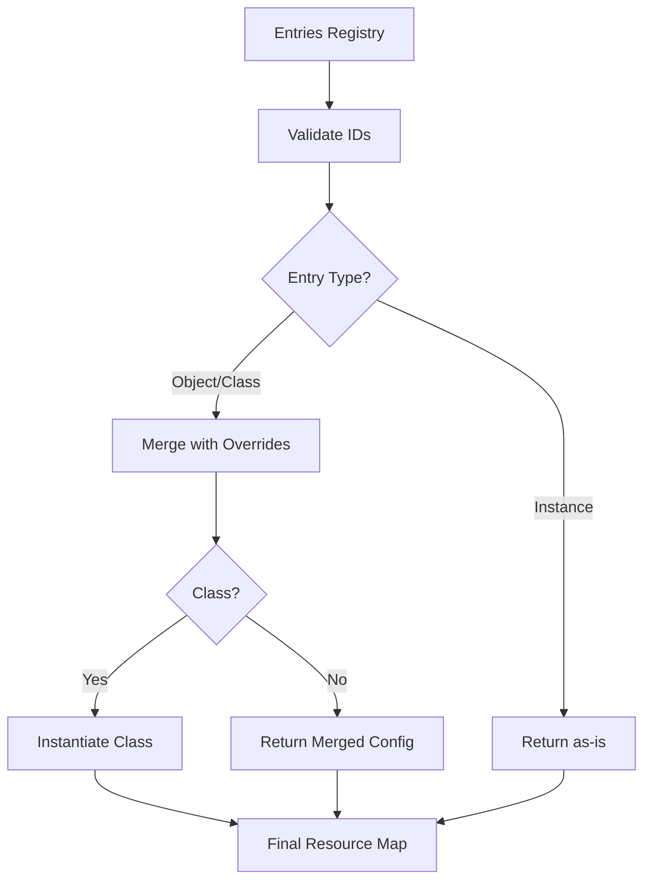

# Resource Composition & Overrides

ResourceComposer tracks resources, applies overrides, and produces the final resource map. It handles three entry types, merges safely, and enforces injection rules.

**Who this is for**: Developers extending or debugging stack behavior.

**You'll learn**: How resources are composed, merged, overridden, and injected — and when things fail.

**Prerequisites**: Understanding of [Stacks & Templates](./02-stacks-and-templates.md).

---

## What ResourceComposer Does

ResourceComposer is the registry that tracks resources within a stack and orchestrates their final build.

**Responsibilities**:
1. Store resource entries (class definitions, objects, instances)
2. Apply overrides via deep merge
3. Handle injections (secrets, config)
4. Instantiate classes and produce final resource map

**Key Insight**: ResourceComposer separates *definition* (what resources exist) from *build* (how they're materialized). This enables overrides and injections before instantiation.

---

## Entry Types

ResourceComposer supports three entry types, each with different instantiation behavior.

### 1. Class Entry

**Use Case**: Kubernetes models that need validation

```typescript
composer.addClass({
  id: 'deployment',
  type: Deployment,
  config: { metadata: { name: 'app' }, spec: { /* ... */ } },
});
```

**Build Behavior**:
```typescript
// Merges config with overrides
const mergedConfig = merge({}, config, overrides.deployment);

// Instantiates class
const resource = new Deployment(mergedConfig);
```

**Benefits**:
- Validation via class methods
- Type-safe construction
- Supports toJSON() serialization

### 2. Object Entry

**Use Case**: Plain objects that don't need class instantiation

```typescript
composer.addObject({
  id: 'configmap',
  config: {
    apiVersion: 'v1',
    kind: 'ConfigMap',
    metadata: { name: 'app-config' },
    data: { key: 'value' },
  },
});
```

**Build Behavior**:
```typescript
// Merges config with overrides
const mergedConfig = merge({}, config, overrides.configmap);

// Returns merged config as-is (no instantiation)
return mergedConfig;
```

**Benefits**:
- Simple and direct
- No class dependencies
- Supports overrides

### 3. Instance Entry

**Use Case**: Pre-built resources that shouldn't be modified

```typescript
const existingResource = { /* pre-configured */ };

composer.addInstance({
  id: 'prebuilt',
  config: existingResource,
});
```

**Build Behavior**:
```typescript
// Returns config as-is (no merge, no instantiation)
return config;
```

**Benefits**:
- Immutable (safe from overrides)
- Fast (no processing)

**Trade-off**: Cannot apply overrides or inject into instances.

---

## Merge & Injection Semantics

ResourceComposer uses different strategies based on value types. Understanding these rules prevents injection conflicts.

### Merge Rules

| Existing Value | New Value | Behavior | Example |
|----------------|-----------|----------|---------|
| undefined | any | **Set** | Initial value assignment |
| Array | Array | **Append** | Add env vars to existing list |
| Object | Object | **Deep merge** | Merge nested config properties |
| Other | Other | **Error** | Conflict: cannot overwrite primitives |

### Examples

**Set (undefined → value)**:
```typescript
// Before: spec.template.spec.containers[0].env = undefined
composer.inject('deployment', 'spec.template.spec.containers[0].env', [
  { name: 'API_KEY', value: 'secret' },
]);
// After: env = [{ name: 'API_KEY', value: 'secret' }]
```

**Append (Array + Array)**:
```typescript
// Before: env = [{ name: 'PORT', value: '8080' }]
composer.inject('deployment', 'spec.template.spec.containers[0].env', [
  { name: 'API_KEY', value: 'secret' },
]);
// After: env = [
//   { name: 'PORT', value: '8080' },
//   { name: 'API_KEY', value: 'secret' }
// ]
```

**Deep Merge (Object + Object)**:
```typescript
// Before: spec.template.spec.resources = { requests: { cpu: '100m' } }
composer.inject('deployment', 'spec.template.spec.resources', {
  limits: { memory: '256Mi' },
});
// After: resources = {
//   requests: { cpu: '100m' },
//   limits: { memory: '256Mi' }
// }
```

**Error (Primitive Conflict)**:
```typescript
// Before: spec.replicas = 3
composer.inject('deployment', 'spec.replicas', 5);
// Throws: Cannot inject, resource already has a value at path "spec.replicas"
```

---

## Override API

The override API allows runtime customization of template-generated resources.

### Basic Override

```typescript
const stack = Stack.fromTemplate(webAppTemplate, {
  name: 'app',
  image: 'nginx',
});

stack.override({
  deployment: {
    spec: {
      replicas: 5,  // Change from default 1
    },
  },
  service: {
    spec: {
      type: 'LoadBalancer',  // Change from default ClusterIP
    },
  },
});
```

**How It Works**: Overrides are stored and applied during the build phase via lodash's deep merge.

### Override Constraints

**Can Override**:
- ✓ Primitives (replicas, image, etc.)
- ✓ Objects (merge with existing)
- ✓ Arrays (replace, not append)

**Cannot Override**:
- ✗ Instance entries (immutable)
- ✗ Non-existent resource IDs (must exist first)

### Example: Environment-Specific Overrides

```typescript
const base = Stack.fromTemplate(appTemplate, {
  name: 'api',
  image: 'myregistry/api:v1.0.0',
});

if (process.env.NODE_ENV === 'production') {
  base.override({
    deployment: {
      spec: {
        replicas: 10,
        template: {
          spec: {
            resources: {
              requests: { cpu: '500m', memory: '512Mi' },
              limits: { cpu: '1000m', memory: '1Gi' },
            },
          },
        },
      },
    },
  });
}
```

---

## Build Flow

The build process transforms entries into final resources through a series of deterministic steps.

### Build Diagram



### Build Steps

1. **Validate IDs** — Ensure all resource IDs are valid (alphanumeric + `-` + `_`, max 63 chars)

2. **Process Each Entry**:
   ```typescript
   for (const resourceId of Object.keys(entries)) {
     const { type, entryType, config } = entries[resourceId];

     // Instance: return as-is
     if (entryType === 'instance') {
       result[resourceId] = config;
       continue;
     }

     // Merge with overrides
     const mergedConfig = merge({}, config, overrides[resourceId] ?? {});

     // Class: instantiate
     if (entryType === 'class' && type) {
       result[resourceId] = new type(mergedConfig);
     }
     // Object: return merged config
     else {
       result[resourceId] = mergedConfig;
     }
   }
   ```

3. **Return Final Map**:
   ```typescript
   // Example output
   {
     deployment: Deployment { /* instance */ },
     service: Service { /* instance */ },
     configmap: { /* plain object */ }
   }
   ```

---

## Testing Resource Composition

Unit tests should verify resource structure without cluster dependencies.

### Test Pattern: Snapshot Resource Maps

```typescript
import { describe, it, expect } from 'vitest';
import { Stack } from 'kubricate';
import { myTemplate } from './myTemplate';

describe('MyTemplate Stack', () => {
  it('produces correct resource structure', () => {
    const stack = Stack.fromTemplate(myTemplate, {
      name: 'test-app',
      image: 'nginx:1.21',
    });

    const resources = stack.build();

    // Snapshot entire structure
    expect(resources).toMatchSnapshot();
  });

  it('applies overrides correctly', () => {
    const stack = Stack.fromTemplate(myTemplate, {
      name: 'test-app',
      image: 'nginx:1.21',
    });

    stack.override({
      deployment: {
        spec: { replicas: 3 },
      },
    });

    const resources = stack.build();

    expect(resources.deployment.spec.replicas).toBe(3);
  });
});
```

### Test Pattern: Merge Behavior

```typescript
describe('ResourceComposer Injection', () => {
  it('appends arrays correctly', () => {
    const composer = new ResourceComposer();

    composer.addObject({
      id: 'deployment',
      config: {
        spec: {
          template: {
            spec: {
              containers: [{
                name: 'app',
                env: [{ name: 'PORT', value: '8080' }],
              }],
            },
          },
        },
      },
    });

    composer.inject(
      'deployment',
      'spec.template.spec.containers[0].env',
      [{ name: 'API_KEY', value: 'secret' }]
    );

    const resources = composer.build();
    const env = resources.deployment.spec.template.spec.containers[0].env;

    expect(env).toHaveLength(2);
    expect(env[0].name).toBe('PORT');
    expect(env[1].name).toBe('API_KEY');
  });
});
```

---

## Cross-Link

**Next: How secrets inject into this build process** — See [Secret Injection at Build-Time](./04-secret-injection-build.md) to understand how secret references merge into resources during stack.build().

**Further Reading**:
- [Stacks & Templates](./02-stacks-and-templates.md) — Defining reusable patterns
- [Generate Overview](./01-generate-overview.md) — Complete workflow
- [Testing Guide](../secrets/10-testing-best-practices.md) — Unit testing strategies
