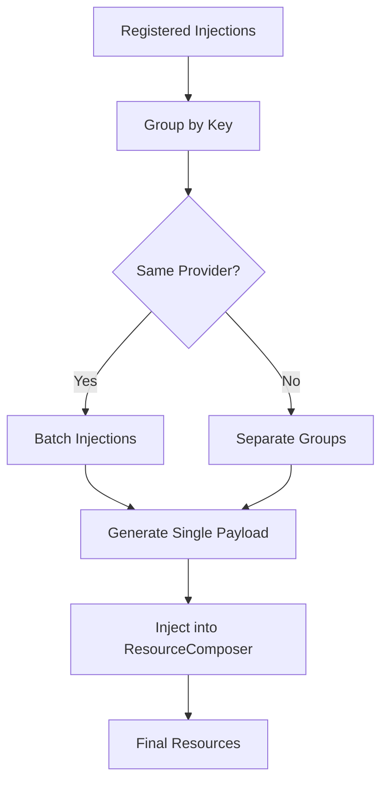

# Secret Injection at Build-Time

Build-time injection merges secret *references* into resources — not values. This separation keeps generation pure and defers value loading to deployment time.

**Who this is for**: Platform engineers wiring secrets into stacks.

**You'll learn**: How secret injections resolve during `stack.build()` and what happens vs. what doesn't.

**Prerequisites**: Understanding of [Resource Composition](./03-resource-composition.md).

---

## Concept: Build-Time Injection vs Cluster-Time Secrets

Kubricate separates secret management into two phases:

**Build-Time (generate)**:
- Inserts secret *references* (e.g., `secretKeyRef`)
- No secret values loaded
- Pure, deterministic YAML generation

**Cluster-Time (secret apply)**:
- Loads actual secret values from connectors
- Creates Kubernetes Secret resources
- Executes kubectl commands

### Example

**Generate Output** (build-time):
```yaml
apiVersion: apps/v1
kind: Deployment
spec:
  template:
    spec:
      containers:
      - name: app
        env:
        - name: API_KEY
          valueFrom:
            secretKeyRef:
              name: app-secret
              key: api_key
```

**Secret Apply Output** (cluster-time):
```yaml
apiVersion: v1
kind: Secret
metadata:
  name: app-secret
data:
  api_key: czNjcjN0  # Base64-encoded value
```

**Key Insight**: Generate creates references. Secret apply creates resources. Workloads consume both after deployment.

---

## `useSecrets()` Lifecycle

The `useSecrets()` method registers secret injections that execute during `stack.build()`.

### API Overview

```typescript
stack.useSecrets(secretManager, (injector) => {
  // Set default resource for all injections in this block
  injector.setDefaultResourceId('deployment');

  // Inject secret with custom name
  injector.secrets('MY_APP_KEY')
    .forName('ENV_APP_KEY')
    .inject('env', { containerIndex: 0 });

  // Auto-detect strategy if provider supports only one
  injector.secrets('DOCKER_SECRET')
    .inject();
});
```

### Lifecycle Steps

```
1. User calls .useSecrets(manager, builder)
      ↓
2. SecretsInjectionContext executes builder function
      ↓
3. Builder creates SecretInjectionBuilder instances
      ↓
4. Each builder resolves:
   - Provider (via secretManager.resolveProviderFor)
   - Resource ID (default or explicit)
   - Target path (via provider.getTargetPath)
      ↓
5. Builder registers injection in stack._targetInjects[]
      ↓
6. Later, stack.build() processes all injections
      ↓
7. Injections grouped by providerId:resourceId:path
      ↓
8. Provider generates payload
      ↓
9. ResourceComposer.inject() merges payload
      ↓
10. Final resource map includes secret references
```

---

## Grouping Logic

BaseStack groups injections by a composite key to optimize provider calls and prevent redundant injections.

### Grouping Key

```
providerId:resourceId:path
```

**Example**:
```
opaque:deployment:spec.template.spec.containers[0].env
```

### Why Grouping Matters

Multiple secrets targeting the same location batch into a single payload:

```typescript
injector.secrets('API_KEY').inject('env');
injector.secrets('DB_URL').inject('env');
injector.secrets('CACHE_URL').inject('env');

// Groups into single injection:
// Key: "opaque:deployment:spec.template.spec.containers[0].env"
// Payload: [
//   { name: 'API_KEY', valueFrom: { secretKeyRef: { ... } } },
//   { name: 'DB_URL', valueFrom: { secretKeyRef: { ... } } },
//   { name: 'CACHE_URL', valueFrom: { secretKeyRef: { ... } } }
// ]
```

### Injection Grouping Flow



---

## Provider Payload

Providers generate injection payloads based on registered injections and their own format requirements.

### Provider Interface

```typescript
interface BaseProvider {
  getInjectionPayload(injects: ProviderInjection[]): unknown;
  getTargetPath(strategy: SecretInjectionStrategy): string;
}
```

### Example: OpaqueSecretProvider

**Input (ProviderInjection[])**:
```typescript
[
  {
    provider: OpaqueSecretProvider,
    providerId: 'opaque',
    resourceId: 'deployment',
    path: 'spec.template.spec.containers[0].env',
    meta: {
      secretName: 'api_key',
      targetName: 'API_KEY',
      strategy: { kind: 'env', containerIndex: 0 }
    }
  },
  {
    provider: OpaqueSecretProvider,
    providerId: 'opaque',
    resourceId: 'deployment',
    path: 'spec.template.spec.containers[0].env',
    meta: {
      secretName: 'db_url',
      targetName: 'DATABASE_URL',
      strategy: { kind: 'env', containerIndex: 0 }
    }
  }
]
```

**Output (EnvVar[])**:
```typescript
[
  {
    name: 'API_KEY',
    valueFrom: {
      secretKeyRef: {
        name: 'app-secret',  // From provider config
        key: 'api_key'
      }
    }
  },
  {
    name: 'DATABASE_URL',
    valueFrom: {
      secretKeyRef: {
        name: 'app-secret',
        key: 'db_url'
      }
    }
  }
]
```

**Implementation**:
```typescript
getInjectionPayload(injects: ProviderInjection[]): EnvVar[] {
  return injects.map(inject => {
    const name = inject.meta?.targetName ?? inject.meta?.secretName;
    const key = inject.meta?.secretName;

    return {
      name,
      valueFrom: {
        secretKeyRef: {
          name: this.config.name,
          key,
        },
      },
    };
  });
}
```

---

## Pitfalls & Safety Checks

Common mistakes when wiring secrets into stacks and how Kubricate prevents them.

### 1. Duplicate Target Names

**Problem**: Two secrets map to the same environment variable name

```typescript
injector.secrets('api_key').forName('API_KEY').inject('env');
injector.secrets('other_key').forName('API_KEY').inject('env');
// Results in duplicate env var names
```

**Detection**: Kubernetes allows duplicate env names but uses the last value. This can cause silent errors.

**Solution**: Use unique target names or rely on default (secret name as target name).

### 2. Wrong Container Index

**Problem**: Injecting into non-existent container

```typescript
// Deployment has only 1 container (index 0)
injector.secrets('API_KEY')
  .inject('env', { containerIndex: 1 });  // ✗ Out of bounds
```

**Detection**: Injection succeeds but path doesn't exist. Results in no-op or error during build.

**Solution**: Verify container count in template. Use default `containerIndex: 0` unless multi-container Pod.

### 3. Unsupported Strategies

**Problem**: Using strategy not supported by provider

```typescript
const provider = new OpaqueSecretProvider({ name: 'app-secret' });
// OpaqueSecretProvider only supports 'env' and 'envFrom'

injector.secrets('TLS_CERT')
  .inject('volume');  // ✗ Not in supportedStrategies
```

**Detection**: TypeScript error if provider type is explicit. Runtime error otherwise.

**Solution**: Check `provider.supportedStrategies` before injection.

### 4. Missing Default Resource ID

**Problem**: No default set and no explicit resource specified

```typescript
stack.useSecrets(manager, (injector) => {
  // No setDefaultResourceId()
  injector.secrets('API_KEY').inject('env');
  // ✗ Error: Cannot determine target resource
});
```

**Solution**: Always call `setDefaultResourceId()` or use `.intoResource()` explicitly.

### 5. Resource Not in Composer

**Problem**: Targeting resource that doesn't exist

```typescript
injector.secrets('API_KEY')
  .intoResource('nonexistent')  // ✗ No resource with this ID
  .inject('env');
```

**Detection**: Throws error during `ResourceComposer.inject()`.

**Solution**: Verify resource IDs match template output keys.

---

## Testing Injection

Test secret injections by building stacks and asserting on the env array structure.

### Test Pattern: Verify References

```typescript
import { describe, it, expect } from 'vitest';
import { Stack } from 'kubricate';
import { SecretManager } from 'kubricate';
import { OpaqueSecretProvider } from '@kubricate/plugin-kubernetes';
import { myTemplate } from './myTemplate';

describe('Secret Injection', () => {
  it('injects secret references into deployment', () => {
    const manager = new SecretManager()
      .addConnector('env', new InMemoryConnector({ api_key: 'test' }))
      .addProvider('opaque', new OpaqueSecretProvider({ name: 'app-secret' }))
      .addSecret('api_key');

    const stack = Stack.fromTemplate(myTemplate, {
      name: 'test-app',
      image: 'nginx',
    }).useSecrets(manager, (injector) => {
      injector.setDefaultResourceId('deployment');
      injector.secrets('api_key').forName('API_KEY').inject('env');
    });

    const resources = stack.build();
    const env = resources.deployment.spec.template.spec.containers[0].env;

    expect(env).toHaveLength(1);
    expect(env[0]).toMatchObject({
      name: 'API_KEY',
      valueFrom: {
        secretKeyRef: {
          name: 'app-secret',
          key: 'api_key',
        },
      },
    });
  });
});
```

### Test Pattern: Multiple Injections

```typescript
it('batches multiple secrets into single env array', () => {
  const manager = new SecretManager()
    .addConnector('env', new InMemoryConnector({
      api_key: 'test',
      db_url: 'postgres://...',
    }))
    .addProvider('opaque', new OpaqueSecretProvider({ name: 'app-secret' }))
    .addSecret('api_key')
    .addSecret('db_url');

  const stack = Stack.fromTemplate(myTemplate, { /* ... */ })
    .useSecrets(manager, (injector) => {
      injector.setDefaultResourceId('deployment');
      injector.secrets('api_key').inject('env');
      injector.secrets('db_url').inject('env');
    });

  const resources = stack.build();
  const env = resources.deployment.spec.template.spec.containers[0].env;

  expect(env).toHaveLength(2);
  expect(env.map(e => e.name)).toEqual(['api_key', 'db_url']);
});
```

---

## Cross-Link

**Next: Metadata & determinism in rendered output** — See [Metadata & Determinism](./05-metadata-and-determinism.md) to understand how Kubricate makes generated resources identifiable and traceable.

**Further Reading**:
- [Resource Composition](./03-resource-composition.md) — How injection merges into resources
- [Secrets Overview](../big-picture/03-secrets-overview.md) — Connector-provider architecture
- [Testing Guide](../secrets/10-testing-best-practices.md) — Testing patterns
