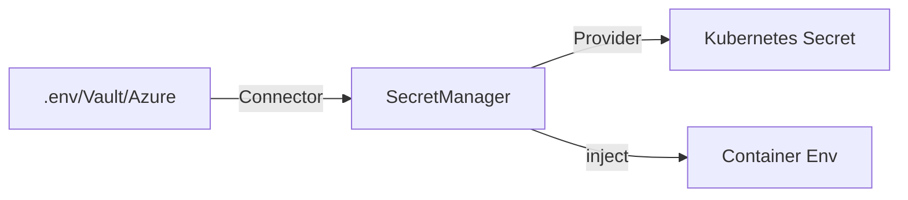
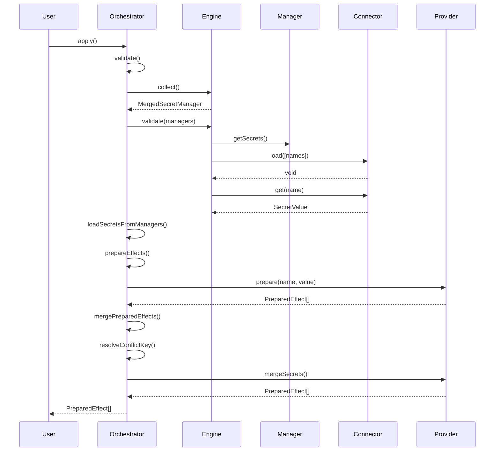
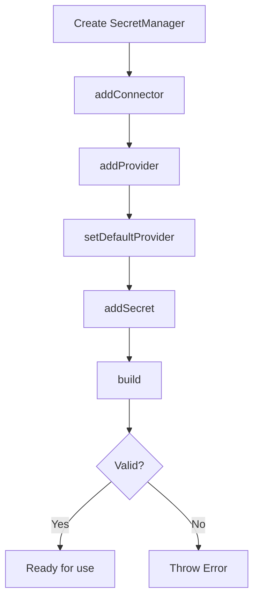
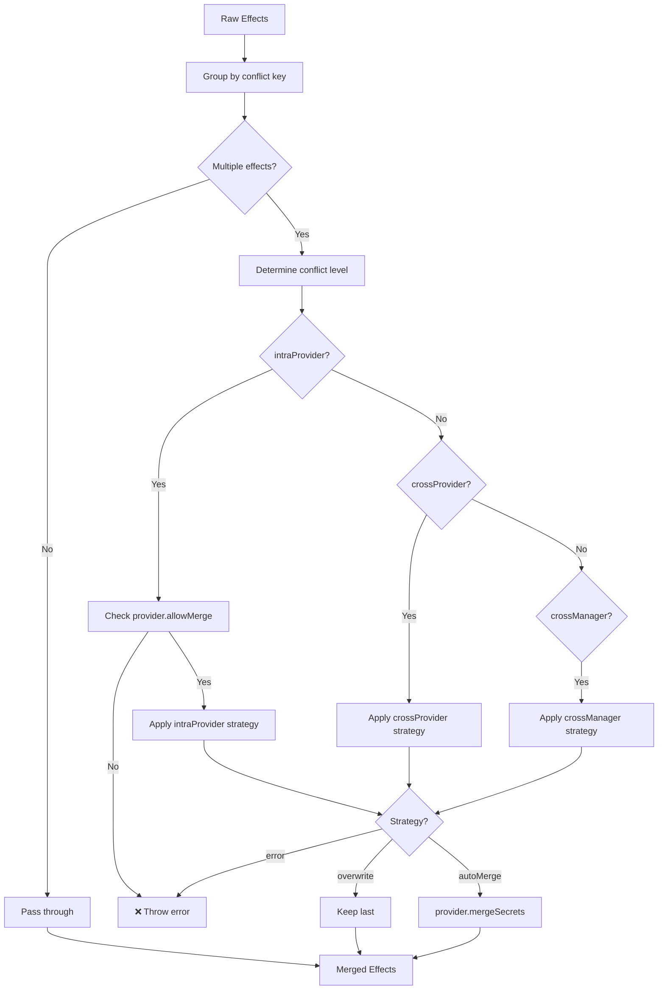

# 🔐 Secret Management Deep Dive

This document provides an in-depth look at how Kubricate handles secrets from source to deployment.

## Table of Contents

- [Overview](#overview)
- [Core Components](#core-components)
- [Connector vs Provider](#connector-vs-provider)
- [SecretManager Orchestration](#secretmanager-orchestration)
- [Secret Lifecycle](#secret-lifecycle)
- [Validation Levels](#validation-levels)
- [Conflict Resolution & Merging](#conflict-resolution--merging)
- [Injection Strategies](#injection-strategies)
- [Creating Custom Components](#creating-custom-components)
- [Testing Strategies](#testing-strategies)

## Overview

Kubricate's secret management system follows a **separation of concerns** architecture:



**Key principles:**
- **Connectors** load secret values (read-only)
- **Providers** format and deliver secrets (Kubernetes-aware)
- **SecretManager** orchestrates the flow
- **SecretsOrchestrator** handles validation, merging, and conflict resolution

## Core Components

### 1. BaseConnector

**Location:** `packages/core/src/BaseConnector.ts`

**Responsibility:** Load secret values from external sources

```typescript
export interface BaseConnector<Config extends object = object> {
  config: Config;
  logger?: BaseLogger;

  // Pre-load and validate secret names
  load(names: string[]): Promise<void>;

  // Return a previously loaded secret
  get(name: string): SecretValue;

  // Optional: Set working directory for file-based connectors
  setWorkingDir?(path: string | undefined): void;
  getWorkingDir?(): string | undefined;
}
```

**Key points:**
- `load()` must be called before `get()`
- Throws if a required secret is missing
- Stateful: caches loaded secrets internally
- Read-only: does not persist data

**Example: EnvConnector** (`packages/plugin-env/src/EnvConnector.ts:43-144`)

```typescript
class EnvConnector implements BaseConnector<EnvConnectorConfig> {
  private secrets = new Map<string, SecretValue>();

  async load(names: string[]): Promise<void> {
    // Load .env file if enabled
    if (this.config.allowDotEnv ?? true) {
      loadDotenv({ path: this.getEnvFilePath() });
    }

    for (const name of names) {
      const expectedKey = this.prefix + name;
      if (!process.env[expectedKey]) {
        throw new Error(`Missing environment variable: ${expectedKey}`);
      }
      this.secrets.set(name, this.tryParseSecretValue(process.env[expectedKey]));
    }
  }

  get(name: string): SecretValue {
    if (!this.secrets.has(name)) {
      throw new Error(`Secret '${name}' not loaded. Did you call load()?`);
    }
    return this.secrets.get(name)!;
  }
}
```

### 2. BaseProvider

**Location:** `packages/core/src/BaseProvider.ts`

**Responsibility:** Convert secret values into Kubernetes resources or injection strategies

```typescript
export interface BaseProvider<
  Config extends object = object,
  SupportedStrategies extends SecretInjectionStrategy['kind'] = SecretInjectionStrategy['kind'],
  SupportedEnvKeys extends string = string
> {
  name: string | undefined;
  config: Config;
  logger?: BaseLogger;

  // Target resource kind (e.g., 'Deployment')
  readonly targetKind: string;

  // Supported injection strategies (e.g., ['env', 'envFrom'])
  readonly supportedStrategies: SupportedStrategies[];

  // Optional: Supported environment keys
  readonly supportedEnvKeys?: SupportedEnvKeys[];

  // Whether this provider allows merging
  readonly allowMerge?: boolean;

  // Prepare secret for kubectl apply
  prepare(name: string, value: SecretValue): PreparedEffect[];

  // Get injection payload for manifest generation
  getInjectionPayload(injectes: ProviderInjection[]): unknown;

  // Return target path in resource for injection
  getTargetPath(strategy: SecretInjectionStrategy): string;

  // Optional: Merge multiple effects into one
  mergeSecrets?(effects: PreparedEffect[]): PreparedEffect[];

  // Optional: Unique identifier for conflict detection
  getEffectIdentifier?(effect: PreparedEffect): string;
}
```

**Key points:**
- `prepare()` creates effects for `kubricate secret apply`
- `getInjectionPayload()` returns runtime values for `kubricate generate`
- `getInjectionPayload()` must be pure (no side effects)
- `mergeSecrets()` handles deduplication when `allowMerge = true`

**Example: OpaqueSecretProvider** (`packages/plugin-kubernetes/src/OpaqueSecretProvider.ts:36-116`)

```typescript
class OpaqueSecretProvider implements BaseProvider<OpaqueSecretProviderConfig, 'env'> {
  readonly allowMerge = true;
  readonly targetKind = 'Deployment';
  readonly supportedStrategies = ['env'];

  prepare(name: string, value: string): PreparedEffect[] {
    return [{
      type: 'kubectl',
      secretName: name,
      providerName: this.name,
      value: {
        apiVersion: 'v1',
        kind: 'Secret',
        metadata: {
          name: this.config.name,
          namespace: this.config.namespace ?? 'default',
        },
        type: 'Opaque',
        data: {
          [name]: Base64.encode(value),
        },
      },
    }];
  }

  getInjectionPayload(injectes: ProviderInjection[]): EnvVar[] {
    return injectes.map(inject => ({
      name: inject.meta?.targetName ?? inject.meta?.secretName,
      valueFrom: {
        secretKeyRef: {
          name: this.config.name,
          key: inject.meta?.secretName,
        },
      },
    }));
  }

  mergeSecrets(effects: PreparedEffect[]): PreparedEffect[] {
    // Merge multiple effects into a single Kubernetes Secret
    const merge = createKubernetesMergeHandler();
    return merge(effects);
  }
}
```

### 3. SecretManager

**Location:** `packages/kubricate/src/secret/SecretManager.ts`

**Responsibility:** Type-safe registry for connectors, providers, and secrets

```typescript
class SecretManager<
  ConnectorInstances,
  ProviderInstances,
  SecretEntries,
  DefaultProvider
> {
  // Register connector
  addConnector<K>(name: K, instance: BaseConnector): SecretManager<...>

  // Register provider
  addProvider<K>(name: K, instance: BaseProvider): SecretManager<...>

  // Set defaults
  setDefaultConnector(name: keyof ConnectorInstances): SecretManager<...>
  setDefaultProvider(name: keyof ProviderInstances): SecretManager<...>

  // Add secret
  addSecret<N>(options: SecretOptions<N>): SecretManager<...>

  // Resolve instances
  resolveConnector(name?: string): BaseConnector
  resolveProvider(name?: string): BaseProvider
}
```

**Key features:**
- **Type-safe:** TypeScript tracks registered connectors/providers
- **Fluent API:** Method chaining for configuration
- **Auto-defaults:** Sets default if only one connector/provider registered
- **Validation:** `build()` ensures configuration is valid

**Usage example:**

```typescript
const secretManager = new SecretManager()
  .addConnector('env', new EnvConnector())
  .addProvider('opaque', new OpaqueSecretProvider({ name: 'my-secret' }))
  .addSecret({ name: 'DB_PASSWORD' })
  .addSecret({ name: 'API_KEY', provider: 'opaque' });
```

### 4. SecretsOrchestrator

**Location:** `packages/kubricate/src/secret/orchestrator/SecretsOrchestrator.ts`

**Responsibility:** Central orchestration engine for secret lifecycle



**Key methods:**
- `validate()`: Validates config and loads all secrets
- `apply()`: Full orchestration lifecycle (validate → load → prepare → merge)
- `mergePreparedEffects()`: Handles conflict resolution

## Connector vs Provider

### Comparison Table

| Aspect | Connector | Provider |
|--------|-----------|----------|
| **Purpose** | Load secret values | Format and deliver secrets |
| **Reads from** | External sources (.env, Vault, AWS) | Connector outputs |
| **Writes to** | In-memory cache | Kubernetes (via effects) |
| **Validation** | Existence check | Format validation |
| **Kubernetes aware** | No | Yes |
| **Side effects** | None (read-only) | Yes (kubectl apply) |
| **Examples** | `EnvConnector`, `VaultConnector` | `OpaqueSecretProvider`, `TlsSecretProvider` |

### When to Use Each

**Use a Connector when:**
- Loading secrets from an external source
- No Kubernetes-specific logic is needed
- Multiple providers might consume the same source

**Use a Provider when:**
- Converting secrets to Kubernetes resources
- Implementing injection strategies
- Handling Kubernetes-specific validation (e.g., TLS cert format)

### Example Flow

```typescript
// 1. Connector loads secret from .env
const connector = new EnvConnector();
await connector.load(['TLS_CERT', 'TLS_KEY']);
const cert = connector.get('TLS_CERT'); // { cert: '...', key: '...' }

// 2. Provider formats as Kubernetes TLS Secret
const provider = new TlsSecretProvider({ name: 'tls-secret' });
const effects = provider.prepare('TLS_CERT', cert);
// effects = [{
//   type: 'kubectl',
//   value: {
//     apiVersion: 'v1',
//     kind: 'Secret',
//     type: 'kubernetes.io/tls',
//     data: { 'tls.crt': '...', 'tls.key': '...' }
//   }
// }]

// 3. Inject into Deployment
const payload = provider.getInjectionPayload([...]);
// payload = [{ name: 'tls-volume', secret: { secretName: 'tls-secret' } }]
```

## SecretManager Orchestration

### Registration Flow



### Validation Rules

**During `build()`:**

1. ✓ At least one connector must be registered
2. ✓ At least one provider must be registered
3. ✓ At least one secret must be declared
4. ✓ If multiple connectors exist, a default must be set
5. ✓ If multiple providers exist, a default must be set
6. ✓ All secrets must have a provider (uses default if not specified)
7. ✓ All secrets must have a connector (uses default if not specified)

**Location:** `packages/kubricate/src/secret/SecretManager.ts:278-305`

### Type Safety

SecretManager uses advanced TypeScript to track registered instances:

```typescript
// Type changes with each registration
const manager = new SecretManager()
  // SecretManager<{}, {}, {}, never>
  .addConnector('env', new EnvConnector())
  // SecretManager<{ env: string }, {}, {}, never>
  .addProvider('opaque', new OpaqueSecretProvider({ name: 'test' }))
  // SecretManager<{ env: string }, { opaque: OpaqueSecretProvider }, {}, 'opaque'>
  .addSecret({ name: 'PASSWORD' });
  // SecretManager<..., { PASSWORD: { provider: 'opaque' } }, 'opaque'>

// TypeScript enforces valid provider names
manager.addSecret({ provider: 'invalid' }); // ❌ Type error
manager.addSecret({ provider: 'opaque' });  // ✓ OK
```

## Secret Lifecycle

### Full Lifecycle Diagram

```mermaid
graph TB
    subgraph "1. Configuration Phase"
        Config[kubricate.config.ts]
        Config -->|defines| SM[SecretManager]
        SM -->|registers| Conn[Connectors]
        SM -->|registers| Prov[Providers]
        SM -->|declares| Secrets[Secrets]
    end

    subgraph "2. Validation Phase"
        Orch[SecretsOrchestrator]
        Orch -->|collect| Managers[MergedSecretManager]
        Managers -->|validate| Load[Load all secrets]
        Load -->|check existence| Conn
    end

    subgraph "3. Preparation Phase"
        Load --> Resolve[Resolve secret values]
        Resolve --> PrepEff[Prepare effects]
        PrepEff --> Prov
        Prov --> RawEff[Raw PreparedEffect[]]
    end

    subgraph "4. Merging Phase"
        RawEff --> Group[Group by conflict key]
        Group --> DetectConflict[Detect conflicts]
        DetectConflict --> Strategy{Strategy?}
        Strategy -->|error| Throw[Throw error]
        Strategy -->|overwrite| Keep[Keep last]
        Strategy -->|autoMerge| Merge[Merge effects]
        Merge --> Final[Final PreparedEffect[]]
    end

    subgraph "5. Execution Phase"
        Final --> Apply[kubectl apply]
        Final --> Inject[Inject into resources]
    end

    Config --> Orch
    Throw --> User[User sees error]
    Keep --> Apply
    Apply --> K8s[Kubernetes Cluster]
    Inject --> Manifest[Generated YAML]
```

### Phase Breakdown

#### Phase 1: Configuration

**File:** `kubricate.config.ts`

```typescript
import { defineConfig } from 'kubricate';
import { EnvConnector } from '@kubricate/plugin-env';
import { OpaqueSecretProvider } from '@kubricate/plugin-kubernetes';

const secretManager = new SecretManager()
  .addConnector('env', new EnvConnector())
  .addProvider('opaque', new OpaqueSecretProvider({ name: 'app-secret' }))
  .addSecret({ name: 'DB_PASSWORD' })
  .addSecret({ name: 'API_KEY' });

export default defineConfig({
  secret: {
    secretSpec: secretManager,
  },
  stacks: { /* ... */ },
});
```

#### Phase 2: Validation

**Command:** `kubricate secret validate`

**Location:** `packages/kubricate/src/secret/orchestrator/SecretsOrchestrator.ts:85-93`

```typescript
async validate(): Promise<MergedSecretManager> {
  // 1. Validate config options
  this.validateConfig(this.engine.options.config);

  // 2. Collect managers
  const managers = this.engine.collect();

  // 3. Validate connectors and load secrets
  await this.engine.validate(managers);

  return managers;
}
```

**What happens:**
1. ✓ Config is structurally valid
2. ✓ All secret managers are collected
3. ✓ All connectors can load their secrets
4. ✓ No missing environment variables

#### Phase 3: Preparation

**Command:** `kubricate secret apply`

**Location:** `packages/kubricate/src/secret/orchestrator/SecretsOrchestrator.ts:160-173`

```typescript
private prepareEffects(resolvedSecrets: ResolvedSecret[]): PreparedEffectWithMeta[] {
  return resolvedSecrets.flatMap(secret => {
    const provider = this.resolveProviderByName(secret.providerName, secret.managerName);
    const effects = provider.prepare(secret.key, secret.value);

    return effects.map(effect => ({
      ...effect,
      managerName: secret.managerName,
      providerName: provider.name!,
      secretType: provider.secretType ?? provider.constructor.name,
      identifier: provider.getEffectIdentifier?.(effect),
    }));
  });
}
```

**What happens:**
1. Iterate through resolved secrets
2. Call `provider.prepare(name, value)` for each
3. Attach metadata (managerName, providerName, identifier)
4. Return array of effects ready for merging

#### Phase 4: Merging & Conflict Resolution

**Location:** `packages/kubricate/src/secret/orchestrator/SecretsOrchestrator.ts:218-286`

See [Conflict Resolution & Merging](#conflict-resolution--merging) for details.

#### Phase 5: Execution

**For `kubectl apply`:**

```typescript
for (const effect of effects) {
  if (effect.type === 'kubectl') {
    await kubectl.apply(effect.value);
  }
}
```

**For `kubricate generate`:**

Secrets are injected into resources via `Stack.useSecrets()`:

```typescript
stack.useSecrets(secretManager, c => {
  c.secrets('DB_PASSWORD').forName('DATABASE_PASSWORD').inject('env');
});
```

## Validation Levels

Kubricate has **three validation levels**:

### Level 1: Configuration Validation

**When:** During `SecretsOrchestrator.validate()`
**Location:** `packages/kubricate/src/secret/orchestrator/SecretsOrchestrator.ts:355-378`

**Validates:**
- ✓ SecretManager is defined
- ✓ Conflict strategies are consistent
- ✓ Strict mode rules are enforced

**Example errors:**

```typescript
// Error: No secret manager found
export default defineConfig({
  secret: {}, // ❌ Missing secretSpec
});

// Error: Strict mode violation
export default defineConfig({
  secret: {
    secretSpec: manager,
    conflict: {
      strict: true,
      strategies: {
        intraProvider: 'autoMerge', // ❌ Must be 'error' in strict mode
      },
    },
  },
});
```

### Level 2: Connector Validation

**When:** During `connector.load()`
**Location:** Connector implementations (e.g., `EnvConnector.load()`)

**Validates:**
- ✓ Secret exists in source
- ✓ Secret is not empty
- ✓ Secret format is readable

**Example errors:**

```typescript
// Error: Missing .env variable
await connector.load(['DB_PASSWORD']);
// ❌ Missing environment variable: KUBRICATE_SECRET_DB_PASSWORD

// Error: Invalid .env file
// ❌ ENOENT: no such file or directory, open '/path/to/.env'
```

### Level 3: Provider Validation

**When:** During `provider.prepare()`
**Location:** Provider implementations (e.g., `CustomTypeSecretProvider.prepare()`)

**Validates:**
- ✓ Secret value has correct format
- ✓ Required keys are present
- ✓ Values meet provider-specific rules

**Example errors:**

```typescript
// Error: Invalid keys
const provider = new CustomTypeSecretProvider({
  allowedKeys: ['api_key', 'endpoint'],
});

provider.prepare('VENDOR_API', { invalid_key: 'value' });
// ❌ Invalid keys provided: invalid_key. Allowed keys are: api_key, endpoint.

// Error: Invalid TLS cert format
const tlsProvider = new TlsSecretProvider({ name: 'tls' });
tlsProvider.prepare('TLS', { cert: 'invalid', key: 'invalid' });
// ❌ Invalid TLS certificate format
```

## Conflict Resolution & Merging

### Conflict Levels

Kubricate detects conflicts at three levels:

```typescript
type ConflictLevel =
  | 'intraProvider'  // Same provider, same manager
  | 'crossProvider'  // Different providers, same manager
  | 'crossManager';  // Different managers
```

### Conflict Strategies

```typescript
type ConflictStrategy =
  | 'error'      // Throw error on conflict
  | 'overwrite'  // Keep last, drop earlier
  | 'autoMerge'; // Merge effects together
```

### Default Strategies

**Normal mode:**
```typescript
{
  intraProvider: 'autoMerge',  // ✓ Allow merging within same provider
  crossProvider: 'error',       // ❌ Prevent cross-provider conflicts
  crossManager: 'error',        // ❌ Prevent cross-manager conflicts
}
```

**Strict mode:**
```typescript
{
  intraProvider: 'error',  // ❌ No merging at all
  crossProvider: 'error',
  crossManager: 'error',
}
```

### Conflict Detection

**Location:** `packages/kubricate/src/secret/orchestrator/SecretsOrchestrator.ts:214-216`

```typescript
private resolveConflictKey(effect: PreparedEffectWithMeta): string {
  return `${effect.secretType}:${effect.identifier}`;
}
```

**Example conflict keys:**

```typescript
// OpaqueSecretProvider creates secrets in "default/app-secret"
'Kubernetes.Secret.Opaque:default/app-secret'

// CustomTypeSecretProvider creates secrets in "production/vendor-api"
'Kubernetes.Secret.CustomType:production/vendor-api'
```

### Merging Flow



### Example: Merging Opaque Secrets

**Configuration:**

```typescript
const manager1 = new SecretManager()
  .addConnector('env', new EnvConnector())
  .addProvider('opaque', new OpaqueSecretProvider({ name: 'app-secret' }))
  .addSecret({ name: 'DB_PASSWORD' })
  .addSecret({ name: 'API_KEY' });
```

**What happens:**

1. `DB_PASSWORD` → effect with identifier `default/app-secret`
2. `API_KEY` → effect with identifier `default/app-secret`
3. Grouped together (same conflict key)
4. Conflict level: `intraProvider` (same provider, same manager)
5. Strategy: `autoMerge` (default)
6. Merged into single Kubernetes Secret:

```yaml
apiVersion: v1
kind: Secret
metadata:
  name: app-secret
  namespace: default
type: Opaque
data:
  DB_PASSWORD: ...
  API_KEY: ...
```

### Example: Cross-Provider Conflict

**Configuration:**

```typescript
const manager = new SecretManager()
  .addConnector('env', new EnvConnector())
  .addProvider('opaque', new OpaqueSecretProvider({ name: 'app-secret' }))
  .addProvider('basic', new BasicAuthSecretProvider({ name: 'app-secret' })) // ❌ Same name
  .addSecret({ name: 'PASSWORD', provider: 'opaque' })
  .addSecret({ name: 'CREDS', provider: 'basic' });
```

**Result:**

```
[conflict:error:crossProvider] Duplicate resource identifier "default/app-secret" detected in:
  - SecretManager: default, Provider: opaque, Keys: [PASSWORD]
  - SecretManager: default, Provider: basic, Keys: [CREDS]
```

### Configuration Examples

**Allow cross-manager merging:**

```typescript
export default defineConfig({
  secret: {
    secretSpec: registry,
    conflict: {
      strategies: {
        crossManager: 'autoMerge', // ✓ Allow merging across managers
      },
    },
  },
});
```

**Use overwrite strategy:**

```typescript
export default defineConfig({
  secret: {
    secretSpec: manager,
    conflict: {
      strategies: {
        intraProvider: 'overwrite', // Keep last, drop earlier
      },
    },
  },
});
```

## Injection Strategies

Providers support multiple injection strategies for different use cases.

### Strategy Types

```typescript
type SecretInjectionStrategy =
  | { kind: 'env'; key?: string; targetPath?: string; containerIndex?: number }
  | { kind: 'envFrom'; prefix?: string; targetPath?: string; containerIndex?: number }
  | { kind: 'imagePullSecret'; targetPath?: string }
  | { kind: 'volume'; mountPath?: string; targetPath?: string }
  | { kind: 'annotation'; targetPath?: string }
  | { kind: 'plugin'; targetPath?: string };
```

### Supported Strategies by Provider

| Provider | `env` | `envFrom` | `imagePullSecret` | `volume` |
|----------|-------|-----------|-------------------|----------|
| `OpaqueSecretProvider` | ✓ | ❌ | ❌ | ❌ |
| `CustomTypeSecretProvider` | ✓ | ✓ | ❌ | ❌ |
| `BasicAuthSecretProvider` | ✓ | ✓ | ❌ | ❌ |
| `TlsSecretProvider` | ❌ | ❌ | ❌ | ✓ |
| `DockerConfigSecretProvider` | ❌ | ❌ | ✓ | ❌ |

### Strategy: `env`

**Purpose:** Inject individual keys as environment variables

**Example:**

```typescript
stack.useSecrets(secretManager, c => {
  c.secrets('DB_PASSWORD').forName('DATABASE_PASSWORD').inject('env');
});
```

**Generated YAML:**

```yaml
spec:
  template:
    spec:
      containers:
        - name: app
          env:
            - name: DATABASE_PASSWORD
              valueFrom:
                secretKeyRef:
                  name: app-secret
                  key: DB_PASSWORD
```

### Strategy: `envFrom`

**Purpose:** Inject all keys from a secret as environment variables

**Example:**

```typescript
stack.useSecrets(secretManager, c => {
  c.secrets('VENDOR_API')
    .inject('envFrom', { prefix: 'VENDOR_' });
});
```

**Generated YAML:**

```yaml
spec:
  template:
    spec:
      containers:
        - name: app
          envFrom:
            - prefix: VENDOR_
              secretRef:
                name: vendor-api-secret
```

### Strategy: `env` with Custom Key

**Purpose:** Map specific keys from structured secrets

**Example:**

```typescript
// Secret value: { api_key: '...', endpoint: '...' }
stack.useSecrets(secretManager, c => {
  c.secrets('VENDOR_API')
    .forName('VENDOR_API_KEY')
    .inject('env', { key: 'api_key' });

  c.secrets('VENDOR_API')
    .forName('VENDOR_API_ENDPOINT')
    .inject('env', { key: 'api_endpoint' });
});
```

**Generated YAML:**

```yaml
spec:
  template:
    spec:
      containers:
        - name: app
          env:
            - name: VENDOR_API_KEY
              valueFrom:
                secretKeyRef:
                  name: vendor-api-secret
                  key: api_key
            - name: VENDOR_API_ENDPOINT
              valueFrom:
                secretKeyRef:
                  name: vendor-api-secret
                  key: api_endpoint
```

### Strategy: `imagePullSecret`

**Purpose:** Inject Docker registry credentials

**Example:**

```typescript
const dockerProvider = new DockerConfigSecretProvider({
  name: 'docker-registry-secret',
});

stack.useSecrets(secretManager, c => {
  c.secrets('DOCKER_CONFIG').inject('imagePullSecret');
});
```

**Generated YAML:**

```yaml
spec:
  template:
    spec:
      imagePullSecrets:
        - name: docker-registry-secret
```

## Creating Custom Components

### Creating a Custom Connector

**Example: Vault Connector**

```typescript
import type { BaseConnector, SecretValue } from '@kubricate/core';
import VaultClient from 'node-vault';

export interface VaultConnectorConfig {
  endpoint: string;
  token: string;
  path: string;
}

export class VaultConnector implements BaseConnector<VaultConnectorConfig> {
  private client: VaultClient;
  private secrets = new Map<string, SecretValue>();

  constructor(public config: VaultConnectorConfig) {
    this.client = VaultClient({
      endpoint: config.endpoint,
      token: config.token,
    });
  }

  async load(names: string[]): Promise<void> {
    for (const name of names) {
      const path = `${this.config.path}/${name}`;

      try {
        const response = await this.client.read(path);
        this.secrets.set(name, response.data);
      } catch (error) {
        throw new Error(`Failed to load secret "${name}" from Vault: ${error.message}`);
      }
    }
  }

  get(name: string): SecretValue {
    if (!this.secrets.has(name)) {
      throw new Error(`Secret "${name}" not loaded. Did you call load()?`);
    }
    return this.secrets.get(name)!;
  }
}
```

**Usage:**

```typescript
const secretManager = new SecretManager()
  .addConnector('vault', new VaultConnector({
    endpoint: 'https://vault.example.com',
    token: process.env.VAULT_TOKEN!,
    path: 'secret/data/myapp',
  }))
  .addProvider('opaque', new OpaqueSecretProvider({ name: 'app-secret' }))
  .setDefaultConnector('vault')
  .addSecret({ name: 'DB_PASSWORD' });
```

### Creating a Custom Provider

**Example: JWT Secret Provider**

```typescript
import { Base64 } from 'js-base64';
import type {
  BaseProvider,
  PreparedEffect,
  ProviderInjection,
  SecretInjectionStrategy,
} from '@kubricate/core';

export interface JwtSecretProviderConfig {
  name: string;
  namespace?: string;
}

export class JwtSecretProvider implements BaseProvider<JwtSecretProviderConfig, 'env'> {
  readonly allowMerge = true;
  readonly targetKind = 'Deployment';
  readonly supportedStrategies = ['env'] as const;
  readonly supportedEnvKeys = ['token', 'publicKey'] as const;

  name: string | undefined;

  constructor(public config: JwtSecretProviderConfig) {}

  getTargetPath(strategy: SecretInjectionStrategy): string {
    if (strategy.kind === 'env') {
      const index = strategy.containerIndex ?? 0;
      return `spec.template.spec.containers[${index}].env`;
    }
    throw new Error(`Unsupported strategy: ${strategy.kind}`);
  }

  getEffectIdentifier(effect: PreparedEffect): string {
    const meta = effect.value?.metadata ?? {};
    return `${meta.namespace ?? 'default'}/${meta.name}`;
  }

  prepare(name: string, value: { token: string; publicKey: string }): PreparedEffect[] {
    // Validate JWT format
    if (!value.token || !value.publicKey) {
      throw new Error('JWT secret must contain "token" and "publicKey"');
    }

    return [{
      type: 'kubectl',
      secretName: name,
      providerName: this.name,
      value: {
        apiVersion: 'v1',
        kind: 'Secret',
        metadata: {
          name: this.config.name,
          namespace: this.config.namespace ?? 'default',
        },
        type: 'Opaque',
        data: {
          token: Base64.encode(value.token),
          publicKey: Base64.encode(value.publicKey),
        },
      },
    }];
  }

  getInjectionPayload(injectes: ProviderInjection[]): Array<{
    name: string;
    valueFrom: { secretKeyRef: { name: string; key: string } };
  }> {
    return injectes.map(inject => {
      const name = inject.meta?.targetName ?? inject.meta?.secretName;
      const strategy = inject.meta?.strategy;
      const key = strategy?.kind === 'env' ? strategy.key : undefined;

      if (!key || !['token', 'publicKey'].includes(key)) {
        throw new Error(`Invalid key for JWT secret: ${key}`);
      }

      return {
        name,
        valueFrom: {
          secretKeyRef: {
            name: this.config.name,
            key,
          },
        },
      };
    });
  }

  mergeSecrets(effects: PreparedEffect[]): PreparedEffect[] {
    // Merge multiple JWT secrets into one
    const merged: Record<string, string> = {};

    for (const effect of effects) {
      const data = effect.value?.data ?? {};
      Object.assign(merged, data);
    }

    return [{
      ...effects[0],
      value: {
        ...effects[0].value,
        data: merged,
      },
    }];
  }
}
```

**Usage:**

```typescript
const secretManager = new SecretManager()
  .addConnector('env', new EnvConnector())
  .addProvider('jwt', new JwtSecretProvider({ name: 'jwt-secret' }))
  .addSecret({ name: 'AUTH_JWT', provider: 'jwt' });

// In stack
stack.useSecrets(secretManager, c => {
  c.secrets('AUTH_JWT')
    .forName('JWT_TOKEN')
    .inject('env', { key: 'token' });

  c.secrets('AUTH_JWT')
    .forName('JWT_PUBLIC_KEY')
    .inject('env', { key: 'publicKey' });
});
```

## Testing Strategies

### Unit Testing Connectors

```typescript
import { describe, it, expect, beforeEach } from 'vitest';
import { VaultConnector } from './VaultConnector';

describe('VaultConnector', () => {
  let connector: VaultConnector;

  beforeEach(() => {
    connector = new VaultConnector({
      endpoint: 'http://vault.local',
      token: 'test-token',
      path: 'secret/data/test',
    });
  });

  it('should load secret from Vault', async () => {
    await connector.load(['PASSWORD']);
    const value = connector.get('PASSWORD');
    expect(value).toBe('secret-value');
  });

  it('should throw if secret does not exist', async () => {
    await expect(connector.load(['MISSING'])).rejects.toThrow(
      'Failed to load secret "MISSING" from Vault'
    );
  });

  it('should throw if get() called before load()', () => {
    expect(() => connector.get('PASSWORD')).toThrow(
      'Secret "PASSWORD" not loaded. Did you call load()?'
    );
  });
});
```

### Unit Testing Providers

```typescript
import { describe, it, expect } from 'vitest';
import { JwtSecretProvider } from './JwtSecretProvider';

describe('JwtSecretProvider', () => {
  it('should prepare JWT secret', () => {
    const provider = new JwtSecretProvider({ name: 'jwt-secret' });
    const effects = provider.prepare('AUTH_JWT', {
      token: 'eyJ...',
      publicKey: '-----BEGIN PUBLIC KEY-----',
    });

    expect(effects).toHaveLength(1);
    expect(effects[0].type).toBe('kubectl');
    expect(effects[0].value.kind).toBe('Secret');
    expect(effects[0].value.data).toHaveProperty('token');
    expect(effects[0].value.data).toHaveProperty('publicKey');
  });

  it('should throw if JWT format is invalid', () => {
    const provider = new JwtSecretProvider({ name: 'jwt-secret' });
    expect(() => provider.prepare('AUTH_JWT', { invalid: 'data' })).toThrow(
      'JWT secret must contain "token" and "publicKey"'
    );
  });

  it('should generate correct injection payload', () => {
    const provider = new JwtSecretProvider({ name: 'jwt-secret' });
    const payload = provider.getInjectionPayload([
      {
        providerId: 'jwt',
        provider,
        resourceId: 'deployment',
        path: 'spec.template.spec.containers[0].env',
        meta: {
          secretName: 'AUTH_JWT',
          targetName: 'JWT_TOKEN',
          strategy: { kind: 'env', key: 'token' },
        },
      },
    ]);

    expect(payload).toEqual([
      {
        name: 'JWT_TOKEN',
        valueFrom: {
          secretKeyRef: {
            name: 'jwt-secret',
            key: 'token',
          },
        },
      },
    ]);
  });
});
```

### Integration Testing

```typescript
import { describe, it, expect } from 'vitest';
import { SecretManager } from 'kubricate';
import { EnvConnector } from '@kubricate/plugin-env';
import { JwtSecretProvider } from './JwtSecretProvider';

describe('JWT Secret Integration', () => {
  it('should load from env and prepare JWT secret', async () => {
    process.env.KUBRICATE_SECRET_AUTH_JWT = JSON.stringify({
      token: 'eyJ...',
      publicKey: '-----BEGIN PUBLIC KEY-----',
    });

    const manager = new SecretManager()
      .addConnector('env', new EnvConnector())
      .addProvider('jwt', new JwtSecretProvider({ name: 'jwt-secret' }))
      .addSecret({ name: 'AUTH_JWT' });

    const effects = await manager.prepare();

    expect(effects).toHaveLength(1);
    expect(effects[0].name).toBe('AUTH_JWT');
    expect(effects[0].effects[0].value.kind).toBe('Secret');
  });
});
```

## Best Practices

### 1. Connector Design

✅ **Do:**
- Keep connectors simple and focused on loading
- Cache loaded secrets internally
- Throw descriptive errors for missing secrets
- Support working directory for file-based sources

❌ **Don't:**
- Perform Kubernetes-specific validation
- Write or modify secrets (read-only)
- Mix concerns (loading + formatting)

### 2. Provider Design

✅ **Do:**
- Implement `allowMerge` if your provider can safely merge
- Provide clear `getEffectIdentifier()` for conflict detection
- Validate secret format in `prepare()`
- Support multiple injection strategies when possible

❌ **Don't:**
- Perform side effects in `getInjectionPayload()`
- Assume secrets are always strings (use `SecretValue`)
- Skip validation (fail fast)

### 3. Error Handling

✅ **Do:**
- Throw errors early (fail-fast)
- Provide actionable error messages
- Include context (secret name, provider, manager)

❌ **Don't:**
- Swallow errors silently
- Return undefined or null
- Log and continue (throw instead)

### 4. Testing

✅ **Do:**
- Test connectors and providers in isolation
- Mock external dependencies (Vault, AWS, etc.)
- Test error paths
- Verify merge behavior

❌ **Don't:**
- Test against real external services
- Skip edge cases
- Assume happy path only

### 5. Type Safety

✅ **Do:**
- Use TypeScript generics for config
- Define supported strategies explicitly
- Leverage SecretManager type tracking

❌ **Don't:**
- Use `any` types
- Skip type annotations
- Ignore TypeScript errors

## Next Steps

- [Generate Workflow](./generate-workflow.md) - Learn how stacks and resources are composed
- [Command Flows](./command-flows.md) - Understand CLI command execution
- [Architecture Overview](./architecture-overview.md) - Review the big picture
