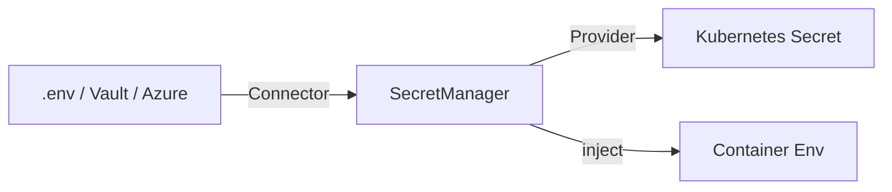

# Vision & Overview

Secret management in Kubernetes often feels fragile. Kubricate makes it declarative, type-safe, and repeatable.

## The Problem

Managing secrets for Kubernetes typically involves:

- **YAML sprawl** — Secret manifests scattered across multiple files, hard to audit
- **Unsafe .env files** — Secrets committed to repos or manually copied between environments
- **Configuration drift** — Production secrets diverge from what's documented or validated
- **No type safety** — Typos in secret names or keys only surface at runtime
- **Manual coordination** — Developers must remember which secrets go where, in what format

These issues slow teams down and increase the risk of security incidents.

## What Kubricate Provides

Kubricate's secret management system offers three core guarantees:

### 1. Type Safety

Register secrets once. TypeScript validates that every reference exists and matches the expected format.

```typescript
const manager = new SecretManager()
  .addConnector('env', new EnvConnector())
  .addProvider('opaque', new OpaqueSecretProvider({ name: 'app-secret' }))
  .addSecret({ name: 'DB_PASSWORD' });

// TypeScript catches typos at compile time
manager.addSecret({ provider: 'invalid' }); // ❌ Type error
```

### 2. Repeatability

The same configuration produces identical Kubernetes resources every time. No manual steps, no drift.

```typescript
// kubricate.config.ts defines your source of truth
export default defineConfig({
  secrets: {
    secretSpec: manager,
  },
});
```

Run `kubricate secret apply` in any environment. The outcome is predictable.

### 3. Pluggability

Need secrets from Azure Key Vault? HashiCorp Vault? 1Password? Implement a Connector. Need a custom Secret type? Implement a Provider.

The system extends without modifying core code.

## How It Works



**Flow:**
1. **Connectors** load secret values from external sources
2. **SecretManager** registers connectors, providers, and secret declarations
3. **Providers** format secrets as Kubernetes resources or injection payloads
4. **SecretsOrchestrator** validates, merges, and applies effects

This separation ensures each component has a single responsibility.

## Who This Documentation Serves

### For Deployers

You want to add secrets to your stacks without worrying about format or merge conflicts.

**Read:**
- End-to-End Lifecycle (02)
- Injection Strategies (06)
- Validation (07)

### For Integrators

You need to wire your organization's secret backend (Vault, AWS, Azure) into Kubricate.

**Read:**
- Core Concepts (03)
- Connectors (04)
- Providers (05)
- Extensibility (09)

### For Core Contributors

You're extending the orchestration engine or adding new validation rules.

**Read:**
- System Architecture (01)
- Conflicts & Merging (08)
- Testing & Best Practices (10)

## Design Principles

Kubricate's secret management follows these rules:

| Principle | Why |
|-----------|-----|
| **Explicit over implicit** | You declare every secret upfront. No surprises at runtime. |
| **Fail fast** | Validation happens before deployment, not after. |
| **Composable** | Connectors and Providers are independent. Mix and match as needed. |
| **Auditable** | Your config file is the source of truth. Version it, review it, diff it. |
| **Safe by default** | Strict mode and conflict detection prevent accidental overwrites. |

## What's Next

This guide walks through the secret lifecycle from top to bottom. Start with the architecture overview to see how all pieces fit together.

**Next →** [System Architecture](./01-architecture-big-picture.md)

**Related:**
- [Architecture Overview](../architecture-overview.md) — Full system context
- [Secret Management Deep Dive](../secret-management-deep-dive.md) — Implementation details
