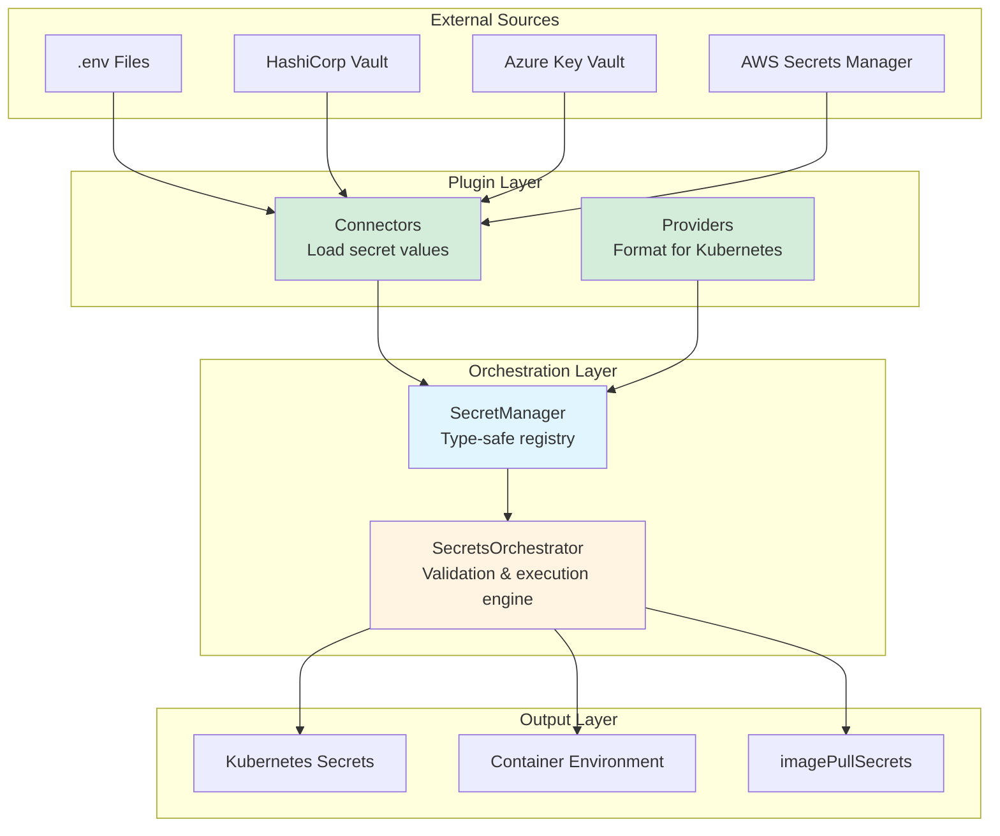

# System Architecture

Kubricate's secret management separates concerns across four layers. Each layer has a clear responsibility and well-defined interfaces.

## The Four Layers



### Layer 1: External Sources

**Purpose:** Where secret values live today.

**Examples:**
- `.env` files for local development
- HashiCorp Vault for production secrets
- Cloud providers (Azure Key Vault, AWS Secrets Manager)
- 1Password, Bitwarden, or other password managers

**Responsibility:**
- Store secret values securely
- Provide access APIs (HTTP, CLI, SDK)

### Layer 2: Plugin Layer

**Purpose:** Bridge external sources to Kubricate's type system.

**Components:**
- **Connectors** — Read-only loaders that fetch secret values from sources
- **Providers** — Format secrets as Kubernetes-native resources or injection strategies

**Responsibility:**
- Abstract away source-specific details (Vault API, AWS SDK, .env parsing)
- Validate secret format before use
- Define how secrets appear in Kubernetes manifests

**Packages:**
- `@kubricate/plugin-env` — EnvConnector for environment variables
- `@kubricate/plugin-kubernetes` — OpaqueSecretProvider, DockerConfigSecretProvider, CustomTypeSecretProvider
- `@kubricate/core` — BaseConnector and BaseProvider interfaces

### Layer 3: Orchestration Layer

**Purpose:** Coordinate the secret lifecycle with type safety and conflict resolution.

**Components:**
- **SecretManager** — Type-safe registry for connectors, providers, and secret declarations
- **SecretsOrchestrator** — Execution engine that validates, loads, prepares, and merges effects

**Responsibility:**
- Maintain a registry of connectors, providers, and secrets
- Enforce type safety (TypeScript validates secret names and provider references)
- Validate configuration before deployment
- Load secrets from connectors
- Prepare effects from providers
- Detect and resolve conflicts (merge, overwrite, or error)

**Packages:**
- `kubricate` — SecretManager and SecretsOrchestrator implementations

### Layer 4: Output Layer

**Purpose:** Deliver secrets to Kubernetes.

**Outputs:**
- **Kubernetes Secrets** — `kubectl apply` manifests (Opaque, TLS, Docker Config)
- **Container Environment** — `env` and `envFrom` injection into Pods
- **Image Pull Secrets** — Docker registry credentials
- **Volume Mounts** — Future support for file-based secrets

**Responsibility:**
- Generate correct YAML for `kubricate generate`
- Apply resources via `kubectl` for `kubricate secret apply`

## Responsibilities at a Glance

| Layer | Who | What | Output |
|-------|-----|------|--------|
| **External Sources** | Vault, AWS, .env | Store secret values | Raw strings or JSON |
| **Plugin Layer** | Connectors & Providers | Load and format secrets | PreparedEffects |
| **Orchestration** | SecretManager & Orchestrator | Validate, load, merge | Finalized effects |
| **Output** | CLI Commands | Generate or apply | Kubernetes resources |

## How Components Interact

```typescript
// 1. User defines configuration (Plugin Layer + Orchestration)
const manager = new SecretManager()
  .addConnector('env', new EnvConnector())           // Plugin: Connector
  .addProvider('opaque', new OpaqueSecretProvider()) // Plugin: Provider
  .addSecret({ name: 'DB_PASSWORD' });               // Orchestration: Registry

// 2. CLI invokes orchestrator (Orchestration Layer)
const orchestrator = new SecretsOrchestrator({ managers: [manager] });

// 3. Orchestrator coordinates lifecycle
await orchestrator.validate();  // Load from EnvConnector (External Source)
const effects = await orchestrator.apply(); // Prepare via OpaqueSecretProvider

// 4. Effects applied to cluster (Output Layer)
// effects = [{ type: 'kubectl', value: { kind: 'Secret', data: {...} } }]
```

Each layer operates independently. Replace EnvConnector with VaultConnector without changing the orchestration logic.

## Package Structure

```
packages/
├── core/
│   ├── BaseConnector.ts          # Connector interface
│   ├── BaseProvider.ts           # Provider interface
│   └── types.ts                  # SecretValue, InjectionStrategy
│
├── plugin-env/
│   └── EnvConnector.ts           # Load from process.env and .env files
│
├── plugin-kubernetes/
│   ├── OpaqueSecretProvider.ts   # Standard K8s secrets
│   ├── DockerConfigSecretProvider.ts # Registry credentials
│   └── CustomTypeSecretProvider.ts   # Flexible custom types
│
└── kubricate/
    ├── secret/
    │   ├── SecretManager.ts      # Type-safe registry
    │   └── orchestrator/
    │       └── SecretsOrchestrator.ts # Execution engine
    └── commands/
        ├── secret-validate.ts    # CLI: kubricate secret validate
        └── secret-apply.ts       # CLI: kubricate secret apply
```

## How This Maps to Later Pages

| Component | Covered In |
|-----------|------------|
| Connectors (loading secrets) | [04 — Connectors](./04-connectors.md) |
| Providers (formatting secrets) | [05 — Providers](./05-providers.md) |
| SecretManager (registry) | [03 — Core Concepts](./03-core-concepts.md) |
| SecretsOrchestrator (engine) | [03 — Core Concepts](./03-core-concepts.md) |
| Validation flow | [07 — Validation](./07-validation.md) |
| Conflict resolution | [08 — Conflicts & Merging](./08-conflicts-merging.md) |
| Injection strategies | [06 — Injection Strategies](./06-injection-strategies.md) |
| Writing custom plugins | [09 — Extensibility](./09-extensibility.md) |

## Design Benefits

This layered architecture provides:

- **Testability** — Mock connectors and providers for unit tests
- **Extensibility** — Add new sources or formats without changing core logic
- **Type Safety** — SecretManager tracks types; TypeScript validates usage
- **Composability** — Mix connectors and providers as needed
- **Auditability** — Clear boundaries make it easy to trace secret flow

## What's Next

Now that you see the system from above, let's follow a secret through its full lifecycle.

**Next →** [End-to-End Lifecycle](./02-lifecycle.md)

**Related:**
- [Core Concepts](./03-core-concepts.md) — Deep dive into SecretManager and Orchestrator
- [Connectors](./04-connectors.md) — How secrets are loaded
- [Providers](./05-providers.md) — How secrets are formatted
