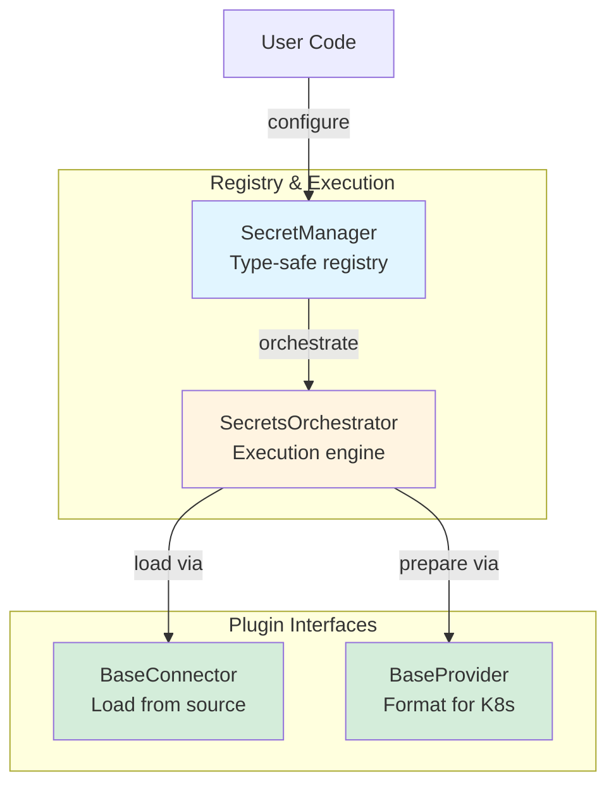
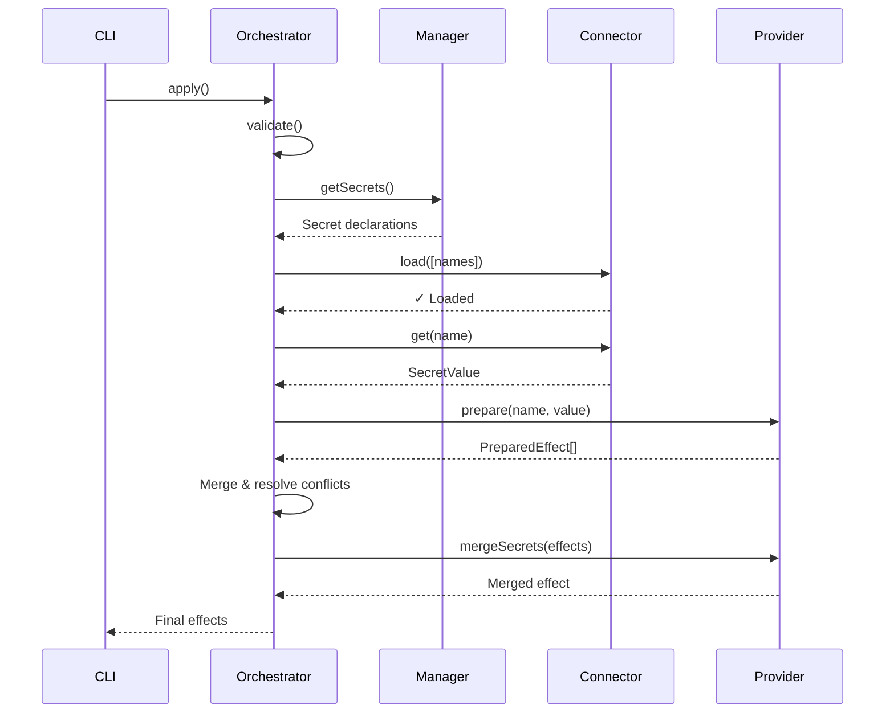

# Core Concepts

Kubricate's secret system is built on four building blocks. Master these and you understand the entire architecture.

## Glossary

Before diving in, here are the key terms:

| Term | Definition |
|------|------------|
| **Connector** | Interface for loading secrets from external sources |
| **Provider** | Interface for formatting secrets as Kubernetes resources |
| **SecretManager** | Type-safe registry that tracks connectors, providers, and secret declarations |
| **SecretsOrchestrator** | Execution engine that validates, loads, prepares, and merges effects |
| **PreparedEffect** | A prepared action (kubectl apply, custom handler) ready for execution |
| **SecretValue** | Primitive (string, number) or flat object of key-value pairs |
| **Injection Strategy** | How a secret appears in Pods (env, envFrom, volume, imagePullSecret) |

## The Four Building Blocks



## 1. Connector

**Purpose:** Load secret values from external sources (read-only).

**Package:** `@kubricate/core`

**Interface:**
```typescript
interface BaseConnector<Config extends object = object> {
  config: Config;
  logger?: BaseLogger;

  load(names: string[]): Promise<void>;  // Pre-load all requested secrets
  get(name: string): SecretValue;         // Return a loaded secret
}
```

**Key behaviors:**
- `load()` must be called before `get()`
- Throws if a required secret is missing
- Caches loaded secrets internally
- Read-only — does not persist changes

**Example:**
```typescript
const connector = new EnvConnector({ prefix: 'APP_SECRET_' });

await connector.load(['DB_PASSWORD', 'API_KEY']);

const dbPass = connector.get('DB_PASSWORD');
// dbPass = "postgres://localhost/mydb"
```

**When to use:**
- You need to load secrets from a new source (Vault, AWS, Azure)
- No Kubernetes-specific logic is required
- Multiple providers might consume the same source

**Learn more:** [Connectors Deep Dive](./04-connectors.md)

## 2. Provider

**Purpose:** Format secret values as Kubernetes-native resources or injection strategies.

**Package:** `@kubricate/core`

**Interface:**
```typescript
interface BaseProvider<Config, SupportedStrategies, SupportedEnvKeys> {
  name: string | undefined;
  config: Config;
  logger?: BaseLogger;

  readonly targetKind: string;  // e.g., 'Deployment'
  readonly supportedStrategies: SupportedStrategies[];
  readonly supportedEnvKeys?: SupportedEnvKeys[];
  readonly allowMerge?: boolean;

  prepare(name: string, value: SecretValue): PreparedEffect[];
  getInjectionPayload(injectes: ProviderInjection[]): unknown;
  getTargetPath(strategy: SecretInjectionStrategy): string;

  mergeSecrets?(effects: PreparedEffect[]): PreparedEffect[];
  getEffectIdentifier?(effect: PreparedEffect): string;
}
```

**Key behaviors:**
- `prepare()` creates effects for `kubectl apply`
- `getInjectionPayload()` returns runtime values for `kubricate generate`
- `getInjectionPayload()` must be pure (no side effects)
- `mergeSecrets()` combines multiple effects when `allowMerge = true`

**Example:**
```typescript
const provider = new OpaqueSecretProvider({
  name: 'app-secret',
  namespace: 'production',
});

const effects = provider.prepare('DB_PASSWORD', 'postgres://...');
// effects = [{
//   type: 'kubectl',
//   value: {
//     apiVersion: 'v1',
//     kind: 'Secret',
//     metadata: { name: 'app-secret', namespace: 'production' },
//     type: 'Opaque',
//     data: { DB_PASSWORD: 'cG9zdGdyZXM6Ly8uLi4=' }
//   }
// }]
```

**When to use:**
- You need to create a custom Kubernetes Secret type
- You want to implement a new injection strategy
- You need provider-specific validation (TLS cert format, Docker config structure)

**Learn more:** [Providers Deep Dive](./05-providers.md)

## 3. SecretManager

**Purpose:** Type-safe registry for connectors, providers, and secret declarations.

**Package:** `kubricate`

**Core methods:**
```typescript
class SecretManager {
  addConnector<Name>(name: Name, instance: BaseConnector): SecretManager;
  setDefaultConnector(name: string): SecretManager;

  addProvider<Name, Instance>(name: Name, instance: Instance): SecretManager;
  setDefaultProvider(name: string): SecretManager;

  addSecret(options: SecretOptions): SecretManager;

  getSecrets(): Record<string, SecretOptions>;
  getConnector(key: string): BaseConnector;
  getProvider(key: string): BaseProvider;
}
```

**Key behaviors:**
- Fluent API — method chaining for configuration
- Type-safe — TypeScript tracks registered connectors/providers
- Auto-defaults — sets default if only one connector/provider exists
- Validation — ensures all secrets have a provider and connector

**Example:**
```typescript
const manager = new SecretManager()
  .addConnector('env', new EnvConnector())
  .addProvider('opaque', new OpaqueSecretProvider({ name: 'app-secret' }))
  .addSecret({ name: 'DB_PASSWORD' });

// TypeScript catches errors at compile time:
manager.addSecret({ provider: 'invalid' }); // ❌ Type error
manager.addSecret({ provider: 'opaque' });  // ✓ OK
```

**Validation rules:**
- At least one connector must be registered
- At least one provider must be registered
- At least one secret must be declared
- If multiple connectors exist, a default must be set
- If multiple providers exist, a default must be set

**When to use:**
- Always — this is the primary API for configuring secrets
- One SecretManager per logical group (app, team, environment)

## 4. SecretsOrchestrator

**Purpose:** Central orchestration engine for the secret lifecycle.

**Package:** `kubricate`

**Core methods:**
```typescript
class SecretsOrchestrator {
  static create(options: SecretsOrchestratorOptions): SecretsOrchestrator;

  async validate(): Promise<MergedSecretManager>;
  async apply(): Promise<PreparedEffect[]>;
}
```

**Key behaviors:**
- Validates configuration (conflict strategies, secret declarations)
- Loads secrets from connectors
- Prepares effects from providers
- Detects and resolves conflicts
- Returns finalized effects ready for execution

**Orchestration flow:**


**Example:**
```typescript
const orchestrator = SecretsOrchestrator.create({
  managers: [secretManager],
  config: {
    conflict: {
      strategies: {
        intraProvider: 'autoMerge',
        crossProvider: 'error',
      },
    },
  },
});

await orchestrator.validate();  // Check all secrets exist
const effects = await orchestrator.apply(); // Load, prepare, merge

// effects = [{ type: 'kubectl', value: { kind: 'Secret', ... } }]
```

**When to use:**
- Internally — CLI commands invoke this automatically
- Testing — mock orchestrator for integration tests

**Learn more:** [Conflicts & Merging](./08-conflicts-merging.md)

## When to Use What

| Task | Use |
|------|-----|
| Load secrets from a new source | Implement `BaseConnector` |
| Create a custom Kubernetes Secret type | Implement `BaseProvider` |
| Register connectors, providers, secrets | Use `SecretManager` |
| Execute the secret lifecycle | Use `SecretsOrchestrator` (via CLI) |
| Inject secrets into Stacks | Call `stack.useSecrets(manager, ...)` |

## Comparison: Connector vs Provider

| Aspect | Connector | Provider |
|--------|-----------|----------|
| **Reads from** | External sources | Connector outputs |
| **Writes to** | In-memory cache | Kubernetes (via effects) |
| **Kubernetes aware** | No | Yes |
| **Side effects** | None (read-only) | Yes (kubectl apply) |
| **Validation** | Existence check | Format validation |
| **Examples** | EnvConnector, VaultConnector | OpaqueSecretProvider, TlsSecretProvider |

## Example Flow

Here's how all four components work together:

```typescript
// 1. Create connector (loads from .env)
const connector = new EnvConnector();

// 2. Create provider (formats as Kubernetes Secret)
const provider = new OpaqueSecretProvider({ name: 'app-secret' });

// 3. Register in SecretManager
const manager = new SecretManager()
  .addConnector('env', connector)
  .addProvider('opaque', provider)
  .addSecret({ name: 'DB_PASSWORD' });

// 4. Orchestrator coordinates lifecycle
const orchestrator = SecretsOrchestrator.create({ managers: [manager] });

// Validate: connector.load(['DB_PASSWORD'])
await orchestrator.validate();

// Apply: provider.prepare('DB_PASSWORD', connector.get('DB_PASSWORD'))
const effects = await orchestrator.apply();

// Execute: kubectl apply effects[0].value
```

## What's Next

Now that you know the core concepts, let's explore Connectors in detail.

**Next →** [Connectors Deep Dive](./04-connectors.md)

**Related:**
- [Providers Deep Dive](./05-providers.md)
- [Validation](./07-validation.md)
- [Conflicts & Merging](./08-conflicts-merging.md)
