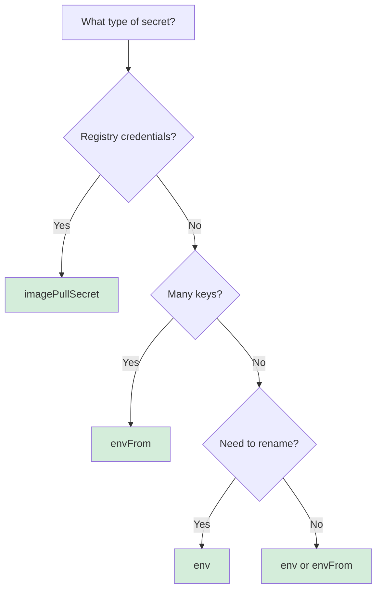

# Injection Strategies

Injection strategies define how secrets appear in Kubernetes Pods. Each strategy has a specific use case and YAML pattern.

## Available Strategies

```typescript
type SecretInjectionStrategy =
  | { kind: 'env'; key?: string; targetPath?: string; containerIndex?: number }
  | { kind: 'envFrom'; prefix?: string; targetPath?: string; containerIndex?: number }
  | { kind: 'imagePullSecret'; targetPath?: string }
  | { kind: 'volume'; mountPath?: string; targetPath?: string }
  | { kind: 'annotation'; targetPath?: string }
  | { kind: 'plugin'; targetPath?: string };
```

## Strategy Matrix

| Strategy | Purpose | Supported By |
|----------|---------|--------------|
| `env` | Individual environment variable | OpaqueSecretProvider, CustomTypeSecretProvider |
| `envFrom` | Bulk environment variables from all keys | CustomTypeSecretProvider |
| `imagePullSecret` | Docker registry credentials | DockerConfigSecretProvider |
| `volume` | Mount secret as file | (Planned) |
| `annotation` | Pod/resource annotation | (Planned) |
| `plugin` | Custom provider-defined injection | (Experimental) |

## Strategy: env

**Purpose:** Inject individual secret keys as environment variables.

**Use when:**
- You need precise control over variable names
- Secret values are strings or primitives
- You want to rename keys for container consumption

### Example: Simple Injection

```typescript
stack.useSecrets(secretManager, c => {
  c.secrets('DB_PASSWORD')
    .forName('DATABASE_PASSWORD')
    .inject('env');
});
```

**Generated YAML:**
```yaml
spec:
  template:
    spec:
      containers:
        - name: app
          env:
            - name: DATABASE_PASSWORD
              valueFrom:
                secretKeyRef:
                  name: app-secret
                  key: DB_PASSWORD
```

### Example: Key Selection

For structured secrets (objects), select specific keys:

```typescript
// Secret value: { api_key: '...', endpoint: '...' }
stack.useSecrets(secretManager, c => {
  c.secrets('VENDOR_API')
    .forName('VENDOR_API_KEY')
    .inject('env', { key: 'api_key' });

  c.secrets('VENDOR_API')
    .forName('VENDOR_ENDPOINT')
    .inject('env', { key: 'endpoint' });
});
```

**Generated YAML:**
```yaml
env:
  - name: VENDOR_API_KEY
    valueFrom:
      secretKeyRef:
        name: vendor-api-secret
        key: api_key
  - name: VENDOR_ENDPOINT
    valueFrom:
      secretKeyRef:
        name: vendor-api-secret
        key: endpoint
```

### Example: Container Index

Inject into a specific container (default: first container):

```typescript
c.secrets('DB_PASSWORD')
  .forName('DATABASE_PASSWORD')
  .inject('env', { containerIndex: 1 }); // Second container
```

**Generated YAML:**
```yaml
spec:
  template:
    spec:
      containers:
        - name: app
          # ...
        - name: sidecar
          env:
            - name: DATABASE_PASSWORD
              valueFrom:
                secretKeyRef:
                  name: app-secret
                  key: DB_PASSWORD
```

## Strategy: envFrom

**Purpose:** Inject all keys from a secret as environment variables.

**Use when:**
- Secret contains multiple keys
- All keys should become environment variables
- You want to add a prefix to all variables

### Example: Bulk Injection

```typescript
stack.useSecrets(secretManager, c => {
  c.secrets('VENDOR_API')
    .inject('envFrom');
});
```

**Generated YAML:**
```yaml
spec:
  template:
    spec:
      containers:
        - name: app
          envFrom:
            - secretRef:
                name: vendor-api-secret
```

If secret contains `{ api_key: '...', endpoint: '...' }`, container sees:
```bash
api_key=...
endpoint=...
```

### Example: With Prefix

Add a prefix to all injected variables:

```typescript
c.secrets('VENDOR_API')
  .inject('envFrom', { prefix: 'VENDOR_' });
```

**Generated YAML:**
```yaml
envFrom:
  - prefix: VENDOR_
    secretRef:
      name: vendor-api-secret
```

Container sees:
```bash
VENDOR_api_key=...
VENDOR_endpoint=...
```

## Strategy: imagePullSecret

**Purpose:** Inject Docker registry credentials for pulling private images.

**Use when:**
- Pulling images from private registries
- Need per-namespace registry auth

### Example

```typescript
const manager = new SecretManager()
  .addConnector('env', new EnvConnector())
  .addProvider('docker', new DockerConfigSecretProvider({
    name: 'docker-registry-secret',
  }))
  .addSecret({ name: 'DOCKER_CONFIG', provider: 'docker' });

stack.useSecrets(manager, c => {
  c.secrets('DOCKER_CONFIG').inject('imagePullSecret');
});
```

**Generated YAML:**
```yaml
spec:
  template:
    spec:
      imagePullSecrets:
        - name: docker-registry-secret
      containers:
        - name: app
          image: ghcr.io/myorg/myapp:latest
```

## Strategy: volume (Planned)

**Purpose:** Mount secret as file in container filesystem.

**Use when:**
- Application reads secrets from files (TLS certs, SSH keys)
- Need read-only file access to secrets

### Planned Example

```typescript
c.secrets('TLS_CERT')
  .inject('volume', { mountPath: '/etc/tls' });
```

**Expected YAML:**
```yaml
spec:
  template:
    spec:
      containers:
        - name: app
          volumeMounts:
            - name: tls-volume
              mountPath: /etc/tls
              readOnly: true
      volumes:
        - name: tls-volume
          secret:
            secretName: tls-secret
```

## Strategy Comparison

| Strategy | Scope | Best For | Drawback |
|----------|-------|----------|----------|
| `env` | Per-key | Precise control, renaming | Verbose for many keys |
| `envFrom` | All keys | Bulk injection, less config | No renaming, prefix only |
| `imagePullSecret` | Registry auth | Private image pulls | Single purpose |
| `volume` | File mount | TLS certs, config files | Not yet implemented |

## Choosing the Right Strategy



### Decision Table

| Scenario | Strategy | Why |
|----------|----------|-----|
| Single database password | `env` | Simple, clear variable name |
| API with 10+ config keys | `envFrom` | Less verbose, prefix available |
| Docker registry auth | `imagePullSecret` | Standard Kubernetes pattern |
| TLS certificate | `volume` (planned) | Apps expect files, not env vars |
| One key from multi-key secret | `env` with `key` | Select specific key |

## Common Patterns

### Pattern: Database Connection

```typescript
// Single connection string
c.secrets('DB_PASSWORD')
  .forName('DATABASE_URL')
  .inject('env');
```

### Pattern: Vendor API

```typescript
// Multiple related keys
c.secrets('VENDOR_API')
  .inject('envFrom', { prefix: 'VENDOR_' });
```

### Pattern: Mixed Keys

```typescript
// Some keys renamed, others bulk
c.secrets('APP_CONFIG')
  .forName('LOG_LEVEL')
  .inject('env', { key: 'log_level' });

c.secrets('APP_CONFIG')
  .inject('envFrom', { prefix: 'APP_' });
```

### Pattern: Multi-Container

```typescript
// Main container
c.secrets('DB_PASSWORD')
  .forName('DATABASE_URL')
  .inject('env', { containerIndex: 0 });

// Sidecar container
c.secrets('METRICS_KEY')
  .forName('METRICS_API_KEY')
  .inject('env', { containerIndex: 1 });
```

## Advanced: Target Path

The `targetPath` option overrides the default injection location:

```typescript
c.secrets('DB_PASSWORD')
  .forName('DATABASE_PASSWORD')
  .inject('env', { targetPath: 'spec.template.spec.initContainers[0].env' });
```

This injects into an init container instead of the main container.

## Do's and Don'ts

| ✅ Do | ❌ Don't |
|-------|----------|
| Use `env` for single values | Use `env` for 10+ keys (use `envFrom`) |
| Use `envFrom` with prefix for clarity | Mix `envFrom` without prefix (name collisions) |
| Use `imagePullSecret` for registry auth | Inject registry creds via `env` (insecure) |
| Choose strategy based on use case | Default to `env` for everything |

## Validation

Strategies are validated at injection time:

```typescript
// ❌ Error: Provider does not support 'imagePullSecret'
c.secrets('DB_PASSWORD')
  .inject('imagePullSecret'); // OpaqueSecretProvider only supports 'env'
```

```typescript
// ❌ Error: All injections for this secret must use the same strategy kind
c.secrets('VENDOR_API').inject('env', { key: 'api_key' });
c.secrets('VENDOR_API').inject('envFrom'); // Different kind!
```

## What's Next

Injection strategies rely on validation at multiple levels. Let's explore validation next.

**Next →** [Validation](./07-validation.md)

**Related:**
- [Providers](./05-providers.md) — Which strategies each provider supports
- [Extensibility](./09-extensibility.md) — Implementing custom strategies
- [Core Concepts](./03-core-concepts.md) — SecretInjectionStrategy type definition
