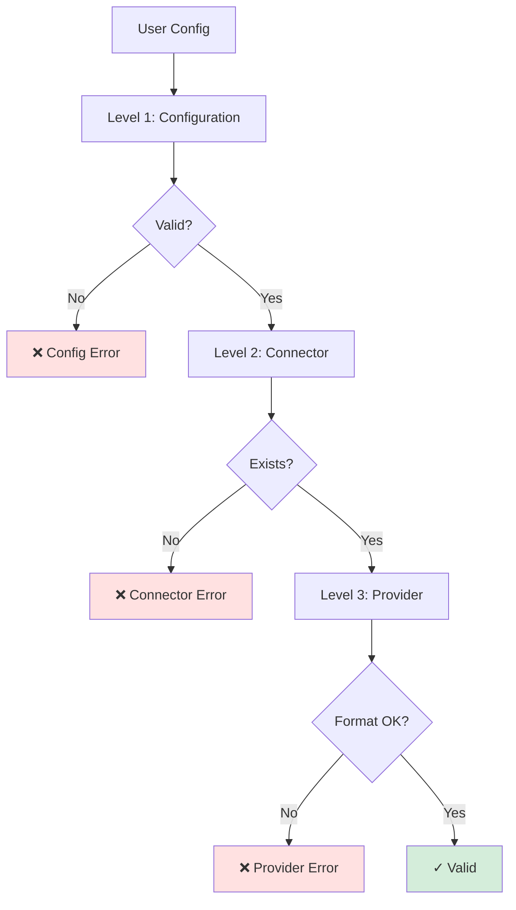
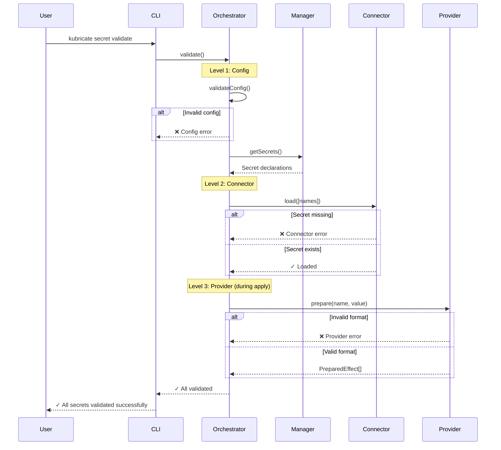

# Validation

Kubricate validates secrets at three levels: configuration, connector, and provider. Each level catches different classes of errors before deployment.

## The Three Levels



## Level 1: Configuration Validation

**When:** During `SecretsOrchestrator.validate()`

**What's checked:**
- SecretManager is defined
- Conflict strategies are consistent
- Strict mode rules are enforced

### Example: Missing SecretManager

```typescript
export default defineConfig({
  secrets: {}, // ❌ Missing secretSpec
});
```

**Error:**
```
❌ No secret manager found in configuration
```

### Example: Strict Mode Violation

```typescript
export default defineConfig({
  secrets: {
    secretSpec: manager,
    conflict: {
      strict: true,
      strategies: {
        intraProvider: 'autoMerge', // ❌ Must be 'error' in strict mode
      },
    },
  },
});
```

**Error:**
```
❌ Strict mode requires all conflict strategies to be 'error'
```

### Example: Invalid Conflict Strategy

```typescript
export default defineConfig({
  secrets: {
    secretSpec: manager,
    conflict: {
      strategies: {
        intraProvider: 'invalid', // ❌ Not a valid strategy
      },
    },
  },
});
```

**Error:**
```
❌ Invalid conflict strategy: 'invalid'. Must be 'error', 'overwrite', or 'autoMerge'
```

## Level 2: Connector Validation

**When:** During `connector.load()`

**What's checked:**
- Secret exists in source
- Secret is not empty
- Secret format is readable

### Example: Missing Environment Variable

```typescript
const connector = new EnvConnector();
await connector.load(['MISSING_SECRET']);
```

**Error:**
```
❌ Missing environment variable: KUBRICATE_SECRET_MISSING_SECRET
```

**Fix:**
```bash
export KUBRICATE_SECRET_MISSING_SECRET="value"
```

### Example: Missing .env File

```typescript
const connector = new EnvConnector({ workingDir: '/nonexistent' });
await connector.load(['DB_PASSWORD']);
```

**Error:**
```
❌ ENOENT: no such file or directory, open '/nonexistent/.env'
```

**Fix:**
- Create `.env` file in working directory
- Or set `allowDotEnv: false` in connector config

### Example: Get Before Load

```typescript
const connector = new EnvConnector();
const value = connector.get('DB_PASSWORD'); // Called before load()
```

**Error:**
```
❌ Secret 'DB_PASSWORD' not loaded. Did you call load()?
```

**Fix:**
```typescript
await connector.load(['DB_PASSWORD']);
const value = connector.get('DB_PASSWORD'); // ✓ OK
```

## Level 3: Provider Validation

**When:** During `provider.prepare()`

**What's checked:**
- Secret value has correct format
- Required keys are present
- Values meet provider-specific rules

### Example: Invalid Keys (CustomTypeSecretProvider)

```typescript
const provider = new CustomTypeSecretProvider({
  name: 'vendor-secret',
  allowedKeys: ['api_key', 'endpoint'],
});

provider.prepare('VENDOR_API', {
  invalid_key: 'value', // ❌ Not in allowedKeys
});
```

**Error:**
```
❌ Invalid keys provided: invalid_key. Allowed keys are: api_key, endpoint.
```

**Fix:**
```typescript
provider.prepare('VENDOR_API', {
  api_key: 'value',
  endpoint: 'https://...',
}); // ✓ OK
```

### Example: Invalid Docker Config

```typescript
const provider = new DockerConfigSecretProvider({
  name: 'docker-secret',
});

provider.prepare('DOCKER_CONFIG', {
  username: 'user',
  // ❌ Missing required keys: password, registry
});
```

**Error:**
```
❌ Invalid Docker config: missing required field 'password'
```

**Fix:**
```typescript
provider.prepare('DOCKER_CONFIG', {
  username: 'user',
  password: 'pass',
  registry: 'ghcr.io',
}); // ✓ OK
```

### Example: Unsupported Strategy

```typescript
const provider = new OpaqueSecretProvider({ name: 'app-secret' });

// OpaqueSecretProvider only supports 'env', not 'imagePullSecret'
stack.useSecrets(manager, c => {
  c.secrets('DB_PASSWORD').inject('imagePullSecret'); // ❌
});
```

**Error:**
```
❌ Provider 'opaque' does not support injection strategy 'imagePullSecret'
Supported strategies: env
```

**Fix:**
Use a provider that supports the strategy:
```typescript
const dockerProvider = new DockerConfigSecretProvider({ name: 'docker' });
// ... register dockerProvider ...
c.secrets('DOCKER_CONFIG').inject('imagePullSecret'); // ✓ OK
```

## Strict Mode

Strict mode enforces the most restrictive validation rules:

```typescript
export default defineConfig({
  secrets: {
    secretSpec: manager,
    conflict: {
      strict: true, // All strategies become 'error'
    },
  },
});
```

**Effects:**
- All conflict strategies default to `'error'`
- No automatic merging
- Cross-provider conflicts always fail
- Cross-manager conflicts always fail

**Use when:**
- High-security environments
- Testing for determinism
- Debugging unexpected merges

## Top 10 Error Messages

| Error | Cause | Fix |
|-------|-------|-----|
| Missing environment variable: X | Variable not set | Export variable or add to .env |
| Secret 'X' not loaded | `get()` before `load()` | Call `load()` first |
| No secret manager found | Missing `secretSpec` | Add `secretSpec: manager` to config |
| Invalid keys provided: X | Key not in `allowedKeys` | Use only allowed keys |
| Provider does not support strategy | Unsupported injection | Use correct provider for strategy |
| Duplicate resource identifier | Conflict detected | Use conflict strategy or rename |
| Invalid Docker config | Missing required field | Provide username, password, registry |
| All injections must use same kind | Mixed strategies | Use consistent strategy kind |
| Strict mode requires 'error' | autoMerge in strict mode | Remove strict mode or use 'error' |
| ENOENT: .env file not found | Missing .env file | Create file or disable allowDotEnv |

## Validation Flow



## CLI Validation Commands

### `kubricate secret validate`

Runs Level 1 (config) and Level 2 (connector) validation:

```bash
$ kubricate secret validate
✓ Configuration valid
✓ Connector 'env': Loaded 3 secrets
✓ All secrets validated successfully
```

### `kubricate secret apply`

Runs all three levels:

```bash
$ kubricate secret apply
✓ Configuration valid
✓ Connector 'env': Loaded 3 secrets
✓ Provider 'opaque': Prepared 3 effects
✓ Merged 3 effects into 1
✓ Applied Secret default/app-secret
```

### `kubricate generate`

Runs validation before manifest generation:

```bash
$ kubricate generate
✓ Validating secrets...
✓ Generating manifests...
```

## Do's and Don'ts

| ✅ Do | ❌ Don't |
|-------|----------|
| Run `validate` before `apply` | Skip validation in CI |
| Provide clear error messages | Return generic errors |
| Fail fast on missing secrets | Continue with partial data |
| Validate in multiple levels | Defer all validation to runtime |
| Use strict mode for testing | Use strict mode without understanding conflicts |

## Debugging Validation Errors

### Enable Logger

```typescript
import { ConsoleLogger } from '@kubricate/core';

const connector = new EnvConnector({
  logger: new ConsoleLogger('debug'),
});

const provider = new OpaqueSecretProvider({
  name: 'app-secret',
  logger: new ConsoleLogger('debug'),
});
```

### Check Secret Values

```typescript
const connector = new EnvConnector();
await connector.load(['DB_PASSWORD']);

console.log(connector.get('DB_PASSWORD'));
// Verify loaded value matches expectation
```

### Validate Conflict Configuration

```typescript
const orchestrator = SecretsOrchestrator.create({
  managers: [manager],
  config: {
    conflict: {
      strategies: {
        intraProvider: 'autoMerge',
        crossProvider: 'error',
        crossManager: 'error',
      },
    },
  },
});

console.log(orchestrator.getConflictStrategies());
// Verify strategies match expectations
```

## What's Next

Validation prevents errors. When conflicts occur, merging strategies resolve them. Let's explore conflict resolution.

**Next →** [Conflicts & Merging](./08-conflicts-merging.md)

**Related:**
- [Connectors](./04-connectors.md) — Level 2 validation details
- [Providers](./05-providers.md) — Level 3 validation details
- [Testing & Best Practices](./10-testing-best-practices.md) — Testing validation logic
