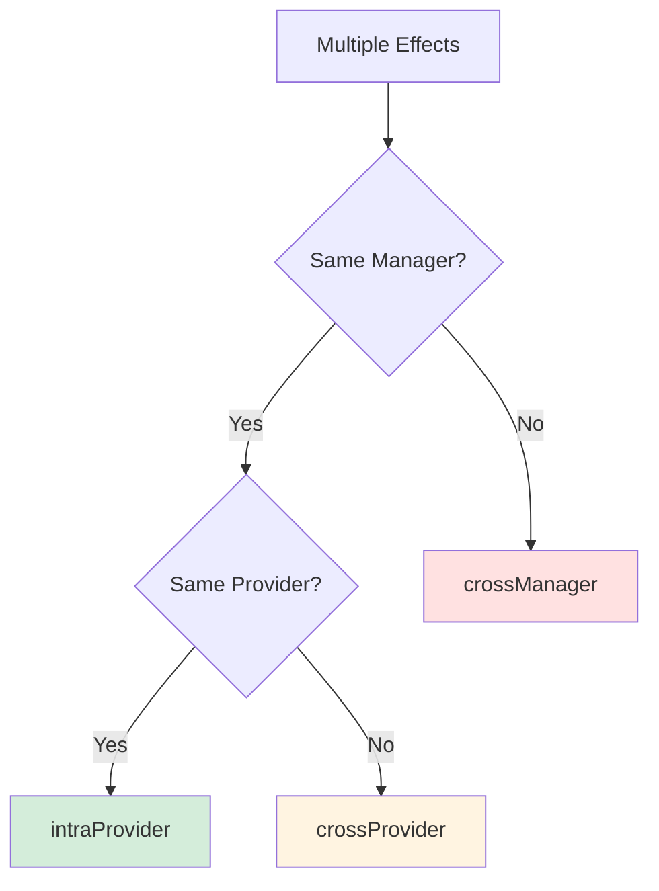
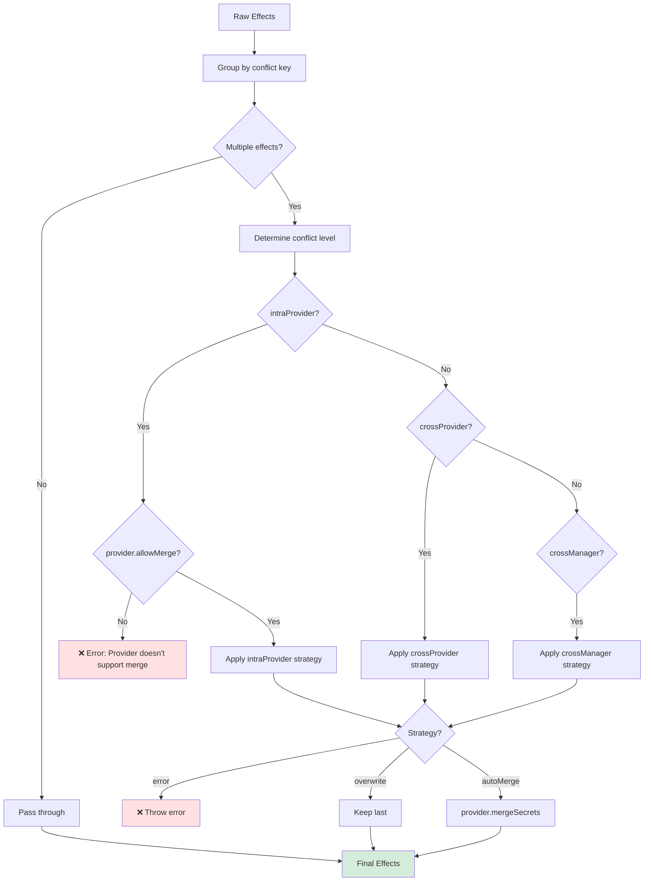

# Conflicts & Merging

When multiple secrets target the same Kubernetes resource, Kubricate detects conflicts and applies resolution strategies. This page explains how conflicts are detected, categorized, and resolved.

## What is a Conflict?

A conflict occurs when two or more PreparedEffects have the same conflict key.

**Conflict key format:**
```
{secretType}:{identifier}
```

**Examples:**
- `Kubernetes.Secret.Opaque:default/app-secret`
- `Kubernetes.Secret.CustomType:production/vendor-api`

If two effects share a key, they target the same resource and must be merged or resolved.

## The Three Conflict Levels



### Level 1: intraProvider

**Definition:** Multiple secrets in the same SecretManager using the same provider instance.

**Example:**
```typescript
const manager = new SecretManager()
  .addProvider('opaque', new OpaqueSecretProvider({ name: 'app-secret' }))
  .addSecret({ name: 'DB_PASSWORD', provider: 'opaque' })
  .addSecret({ name: 'API_KEY', provider: 'opaque' });
```

**Conflict key:** Both secrets create `Kubernetes.Secret.Opaque:default/app-secret`

**Default strategy:** `autoMerge`

**Why:** Multiple keys in one Kubernetes Secret is the expected behavior.

### Level 2: crossProvider

**Definition:** Different providers in the same SecretManager creating the same resource identifier.

**Example:**
```typescript
const manager = new SecretManager()
  .addProvider('opaque', new OpaqueSecretProvider({ name: 'app-secret' }))
  .addProvider('basic', new BasicAuthSecretProvider({ name: 'app-secret' })) // ❌ Same name
  .addSecret({ name: 'PASSWORD', provider: 'opaque' })
  .addSecret({ name: 'CREDS', provider: 'basic' });
```

**Conflict key:** Both create `default/app-secret`

**Default strategy:** `error`

**Why:** Two different Secret types cannot coexist with the same name.

### Level 3: crossManager

**Definition:** Different SecretManagers creating the same resource identifier.

**Example:**
```typescript
const manager1 = new SecretManager()
  .addProvider('opaque', new OpaqueSecretProvider({ name: 'app-secret' }))
  .addSecret({ name: 'DB_PASSWORD' });

const manager2 = new SecretManager()
  .addProvider('opaque', new OpaqueSecretProvider({ name: 'app-secret' }))
  .addSecret({ name: 'API_KEY' });

const orchestrator = SecretsOrchestrator.create({
  managers: [manager1, manager2],
});
```

**Conflict key:** Both create `Kubernetes.Secret.Opaque:default/app-secret`

**Default strategy:** `error`

**Why:** Cross-manager conflicts suggest accidental duplication.

## Conflict Strategies

Three strategies determine how conflicts are resolved:

### Strategy: error

**Behavior:** Throw an error immediately when a conflict is detected.

**Use when:**
- You want strict validation
- Conflicts are always mistakes
- Testing for determinism

**Example error:**
```
❌ [conflict:error:crossProvider] Duplicate resource identifier "default/app-secret" detected in:
  - SecretManager: default, Provider: opaque, Keys: [DB_PASSWORD]
  - SecretManager: default, Provider: basic, Keys: [CREDS]
```

### Strategy: overwrite

**Behavior:** Keep the last effect, drop earlier effects.

**Use when:**
- You have intentional precedence rules
- Later declarations override earlier ones
- Debugging merge issues

**Example:**
```typescript
// Effect 1: { data: { DB_PASSWORD: 'old' } }
// Effect 2: { data: { DB_PASSWORD: 'new' } }
// Result:   { data: { DB_PASSWORD: 'new' } } // Effect 1 dropped
```

**Warning:** Dropped effects are logged but not applied.

### Strategy: autoMerge

**Behavior:** Merge effects using `provider.mergeSecrets()`.

**Use when:**
- Provider supports merging (`allowMerge = true`)
- Multiple secrets should combine into one resource
- Expected behavior for same-provider conflicts

**Example:**
```typescript
// Effect 1: { data: { DB_PASSWORD: '...' } }
// Effect 2: { data: { API_KEY: '...' } }
// Result:   { data: { DB_PASSWORD: '...', API_KEY: '...' } }
```

**Requirement:** Provider must implement `mergeSecrets()` and set `allowMerge = true`.

## Default Strategies

### Normal Mode

```typescript
{
  intraProvider: 'autoMerge',  // ✓ Expected behavior
  crossProvider: 'error',       // ❌ Prevent accidents
  crossManager: 'error',        // ❌ Prevent accidents
}
```

### Strict Mode

```typescript
{
  strict: true,
  // All strategies become 'error'
}
```

**Effect:**
- No automatic merging
- All conflicts must be resolved manually
- Useful for high-security environments

## Configuring Conflict Strategies

### Override Default Strategies

```typescript
export default defineConfig({
  secrets: {
    secretSpec: manager,
    conflict: {
      strategies: {
        intraProvider: 'error',       // No auto-merge
        crossProvider: 'overwrite',   // Last wins
        crossManager: 'autoMerge',    // Merge across managers
      },
    },
  },
});
```

### Enable Strict Mode

```typescript
export default defineConfig({
  secrets: {
    secretSpec: manager,
    conflict: {
      strict: true, // Forces all to 'error'
    },
  },
});
```

## Merging Flow



## Example: Successful Merge (intraProvider)

**Configuration:**
```typescript
const manager = new SecretManager()
  .addProvider('opaque', new OpaqueSecretProvider({ name: 'app-secret' }))
  .addSecret({ name: 'DB_PASSWORD' })
  .addSecret({ name: 'API_KEY' });
```

**Before merge:**
```
Effect 1:
  secretType: Kubernetes.Secret.Opaque
  identifier: default/app-secret
  data: { DB_PASSWORD: '...' }

Effect 2:
  secretType: Kubernetes.Secret.Opaque
  identifier: default/app-secret
  data: { API_KEY: '...' }
```

**Conflict detection:**
- Same conflict key: `Kubernetes.Secret.Opaque:default/app-secret`
- Same manager, same provider → `intraProvider`
- Strategy: `autoMerge` (default)

**After merge:**
```
Effect:
  secretType: Kubernetes.Secret.Opaque
  identifier: default/app-secret
  data: { DB_PASSWORD: '...', API_KEY: '...' }
```

**Result:** Single Kubernetes Secret with both keys.

## Example: Conflict Error (crossProvider)

**Configuration:**
```typescript
const manager = new SecretManager()
  .addProvider('opaque', new OpaqueSecretProvider({ name: 'app-secret' }))
  .addProvider('basic', new BasicAuthSecretProvider({ name: 'app-secret' }))
  .addSecret({ name: 'PASSWORD', provider: 'opaque' })
  .addSecret({ name: 'CREDS', provider: 'basic' });
```

**Conflict detection:**
- Same conflict key: `default/app-secret`
- Different providers → `crossProvider`
- Strategy: `error` (default)

**Error:**
```
❌ [conflict:error:crossProvider] Duplicate resource identifier "default/app-secret" detected in:
  - SecretManager: default, Provider: opaque, Keys: [PASSWORD]
  - SecretManager: default, Provider: basic, Keys: [CREDS]

Possible fixes:
1. Rename one of the secrets to avoid collision
2. Use different namespaces
3. Change conflict strategy to 'overwrite' or 'autoMerge' (not recommended)
```

**Fix:** Rename one provider's resource:
```typescript
const manager = new SecretManager()
  .addProvider('opaque', new OpaqueSecretProvider({ name: 'app-secret' }))
  .addProvider('basic', new BasicAuthSecretProvider({ name: 'basic-auth-secret' })) // ✓ Different name
  .addSecret({ name: 'PASSWORD', provider: 'opaque' })
  .addSecret({ name: 'CREDS', provider: 'basic' });
```

## Example: Cross-Manager Merge

**Configuration:**
```typescript
const manager1 = new SecretManager()
  .addProvider('opaque', new OpaqueSecretProvider({ name: 'app-secret' }))
  .addSecret({ name: 'DB_PASSWORD' });

const manager2 = new SecretManager()
  .addProvider('opaque', new OpaqueSecretProvider({ name: 'app-secret' }))
  .addSecret({ name: 'API_KEY' });

export default defineConfig({
  secrets: {
    secretSpec: [manager1, manager2],
    conflict: {
      strategies: {
        crossManager: 'autoMerge', // ✓ Allow cross-manager merge
      },
    },
  },
});
```

**Result:** Both secrets merge into one Kubernetes Secret.

**Use case:** Logical separation of secrets (database, API) while deploying to the same resource.

## Provider Merge Requirements

For `autoMerge` to work, providers must:

1. **Set `allowMerge = true`**
   ```typescript
   readonly allowMerge = true;
   ```

2. **Implement `mergeSecrets()`**
   ```typescript
   mergeSecrets(effects: PreparedEffect[]): PreparedEffect[] {
     const merged: Record<string, string> = {};
     for (const effect of effects) {
       Object.assign(merged, effect.value.data);
     }
     return [{
       ...effects[0],
       value: { ...effects[0].value, data: merged },
     }];
   }
   ```

3. **Implement `getEffectIdentifier()`**
   ```typescript
   getEffectIdentifier(effect: PreparedEffect): string {
     const meta = effect.value?.metadata ?? {};
     return `${meta.namespace ?? 'default'}/${meta.name}`;
   }
   ```

## Do's and Don'ts

| ✅ Do | ❌ Don't |
|-------|----------|
| Use default strategies for safety | Blindly set all to `autoMerge` |
| Understand conflict levels | Ignore conflict errors |
| Test merge behavior | Assume merge always works |
| Provide clear provider names | Use generic names ('provider1', 'provider2') |
| Use namespaces to avoid collisions | Put everything in 'default' namespace |

## Debugging Conflicts

### Log Conflict Keys

```typescript
const orchestrator = SecretsOrchestrator.create({
  managers: [manager],
  config: {
    conflict: {
      strategies: { intraProvider: 'autoMerge' },
    },
  },
});

const effects = await orchestrator.apply();
effects.forEach(effect => {
  console.log(`Conflict key: ${effect.secretType}:${effect.identifier}`);
});
```

### Test Merge Behavior

```typescript
const provider = new OpaqueSecretProvider({ name: 'test-secret' });

const effect1 = provider.prepare('DB_PASSWORD', 'pass1')[0];
const effect2 = provider.prepare('API_KEY', 'key1')[0];

const merged = provider.mergeSecrets([effect1, effect2]);
console.log(merged[0].value.data);
// { DB_PASSWORD: '...', API_KEY: '...' }
```

### Verify Strategy Configuration

```typescript
const orchestrator = SecretsOrchestrator.create({
  managers: [manager],
  config: {
    conflict: {
      strategies: {
        intraProvider: 'autoMerge',
        crossProvider: 'error',
        crossManager: 'error',
      },
    },
  },
});

console.log(orchestrator.getConflictStrategies());
// { intraProvider: 'autoMerge', crossProvider: 'error', crossManager: 'error' }
```

## What's Next

Now that you understand conflict resolution, let's explore how to extend Kubricate with custom connectors and providers.

**Next →** [Extensibility](./09-extensibility.md)

**Related:**
- [Providers](./05-providers.md) — Implementing `mergeSecrets()` and `allowMerge`
- [Validation](./07-validation.md) — Where conflicts are detected
- [Core Concepts](./03-core-concepts.md) — SecretManager and SecretsOrchestrator
